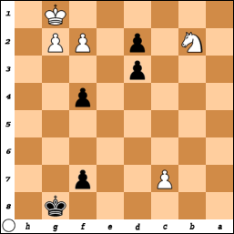
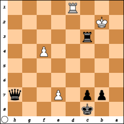
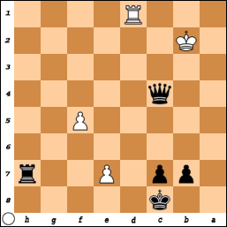

# Endgames

It makes sense to begin your study of chess with endgames. The total number of 
possible chess games is finite, but it is a large enough number to discourage an 
exhaustive study.

But when we get to the endgame, the seemingly infinite possibilities have been 
whittled down to a manageable few, and the game seems simpler. Certainly the way 
to a checkmate is much clearer than it was at the beginning or even at 
middlegame.

Maybe the most satisfying checkmates are those in which you recognize an unusual 
opportunity for checkmate and you take advantage of it. Most of the time, 
though, you will achieve checkmate by gradually restricting the movements of the 
opponent king, until eventually he can't stay, he can't move anywhere and he 
can't be rescued.

However, make sure to allow your opponent to make some move while setting up the 
checkmate. If the opponent king can stay safe by staying put and there's no 
possible valid move for your opponent, that's stalemate, which is perhaps more 
disappointing than defeat.

Of course it can also be very disappointing if you fail to notice that your 
opponent is preparing a checkmate against you. If you're aware that that's the 
case, your best option might be to keep up the pressure with a check on every 
move, even if it means that it takes you longer to set up the checkmate.

And you also have to be careful about draw by repetition.

This document is written from the perspective of Black trying to achieve 
checkmate against White. But the principles are the same for White trying to 
achieve checkmate against Black, however much the middlegame might have 
differed.

## Pawns only

Pawns can certainly participate in checkmates, but that often involves more 
powerful pieces. I believe it's possible to achieve checkmate with only pawns, 
but I doubt that's something that ever comes up in a game with two players who 
are both trying to win.

Don't forget about pawn promotion. If you only have pawns, your best bet is to 
get two of them promoted to more powerful pieces. Your opponent will probably 
try to prevent that, if they have the means.

## Two knights

[FINISH WRITING]

## Knight and a bishop

[FINISH WRITING]

## Two bishops

Presumably you only have your original bishops, one for the light squares and 
one for the dark squares.

Theoretically you can have two bishops on the same color spaces through pawn 
promotion, but most players choose a queen even in cases where underpromotion 
would be advisable. But underpromotion to bishop is certainly inadvisable if 
then you have two bishops on the same color spaces, because then the opponent 
king can evade your bishops by simply moving to squares your bishops can't move 
to.

Regardless, the opponent king can certainly try to capture one of your bishops.

[FINISH WRITING]

## Rook and a knight

[FINISH WRITING]

## Rook and a bishop

[FINISH WRITING]

## Two rooks

[FINISH WRITING]

## Queen and a knight

[FINISH WRITING]

## Queen and a bishop

[FINISH WRITING]

## Queen and a rook

The opponent king might try to capture your rook by diagonal approach.

For that reason, as much as you can, keep your queen close to the opponent king 
and your rook far away.

[FINISH WRITING]

## Two queens

[FINISH WRITING]

## Three queens

This is kind of overkill.