# Endgames

It makes sense to begin your study of chess with endgames. The total number of 
possible chess games is finite, but it is a large enough number to discourage an 
exhaustive study.

But when we get to the endgame, the seemingly infinite possibilities have been 
whittled down to a manageable few, and the game seems simpler. Certainly the way 
to a checkmate is much clearer than it was at the beginning or even at 
middlegame.

Maybe the most satisfying checkmates are those in which you recognize an unusual 
opportunity for checkmate and you take advantage of it. Most of the time, 
though, you will achieve checkmate by gradually restricting the movements of the 
opponent king, until eventually he can't stay, he can't move anywhere and he 
can't be rescued.

However, make sure to allow your opponent to make some move while setting up the 
checkmate. If the opponent king can stay safe by staying put and there's no 
possible valid move for your opponent, that's stalemate, which is perhaps more 
disappointing than defeat.

Of course it can also be very disappointing if you fail to notice that your 
opponent is preparing a checkmate against you. If you're aware that that's the 
case, your best option might be to keep up the pressure with a check on every 
move, even if it means that it takes you longer to set up the checkmate.

And you also have to be careful about draw by repetition.

This document is written from the perspective of Black trying to achieve 
checkmate against White. But the principles are the same for White trying to 
achieve checkmate against Black, however much the middlegame might have 
differed.

## Pawns only

Pawns can certainly participate in checkmates, but that often involves more 
powerful pieces helping the pawns. I believe it's possible to achieve checkmate 
with only pawns, but I doubt that's something that ever comes up in a game with 
two players who are both trying to win.

Don't forget about pawn promotion. If you only have pawns, your best bet is to 
get two of them promoted to more powerful pieces. Your opponent will probably 
try to prevent that, if they have the means.

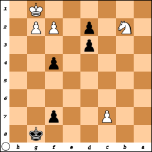

## Involving the knight

### One knight

The king will have to help out on this one. Actually, no, checkmate is 
impossible for you. And if your opponent is similarly bereft, it's a stalemate.

### Two knights

Theoretically, it's possible to checkmate with just two knights.

[DIAGRAM PLACEHOLDER]

In practice, however, the king will have to help out. The unlikely scenario in 
the board shown above does suggest a way for a lone opponent king to evade your 
two knights: stay as close as possible to the center of the board.

[DIAGRAM PLACEHOLDER]

As the diagram shows, when the king is not on an edge square, he has eight 
possible squares to move to, and your two knights can at most forbid only four 
of them.

Your strategy, therefore, is to get the opponent king as close as possible to 
the edge of the board, if not to the corners.

[DIAGRAM PLACEHOLDER]

[DIAGRAM PLACEHOLDER]

[FINISH WRITING]

## Involving the bishop

### Bishop and a knight

I'm starting to think that a king's assistance is needed for any checkmate 
involving a knight. Without the king's help, it's difficult to restrict the 
opponent king to a corner or at least an edge.

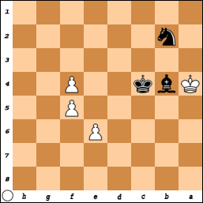

[FINISH WRITING]

### Two bishops

Presumably you only have your original bishops, one for the light squares and 
one for the dark squares.

Theoretically you can have two bishops on the same color spaces through pawn 
promotion, but most players choose a queen even in cases where underpromotion 
would be advisable. But underpromotion to bishop is certainly inadvisable if 
then you have two bishops on the same color spaces, because then the opponent 
king can evade your bishops by simply moving to squares your bishops can't move 
to.

Regardless, the opponent king can certainly try to capture one of your bishops.

[FINISH WRITING]

avoid stalemate, try to back the opponent king into a corner, or close to a corner

### Three bishops

Players are extremely unlikely to promote a pawn to a bishop as it is, and even 
more so if they still have both of their original bishops. Though it might at 
least be entertaining to practice this unlikely scenario.

Obviously you will have two if not all three bishops on the same color squares 
(though having all three on the same color is highly unlikely in competitive 
play).

Your opponent will probably try to take your bishops. If your opponent captures 
one of your bishops so that your remaining two bishops are on squares of the 
same color, it might be stalemate.

## Involving the rook

### Rook and a knight

If you havea rook, a knight and pawns, you should probably try to get one of 
those pawns promoted.

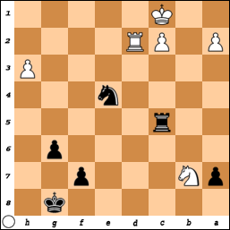

FEN: 6k1/pN3p2/6p1/2r5/4n3/7P/P1PR4/2K5 b - - 0 1

Getting a checkmate is doable with a rook and a knight, but it's crucial for 
your king to help corner the opponent king, literally in most cases.

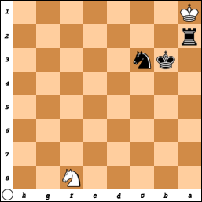

FEN: 5N2/8/8/8/8/1kn5/r7/K7 w - - 38 57

Depending on how well your opponent evades you might be able to pull off a 
checkmate without having the pieces so close.

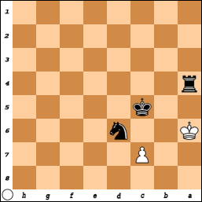

FEN: 8/2P5/K2n4/2k5/r7/8/8/8 w - - 3 20

### Rook and a bishop

[FINISH WRITING]

### Two rooks

[FINISH WRITING]

### Three rooks

Unlikely, but let's ponder it anyway

[FINISH WRITING]

## Involving the queen

### One queen

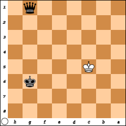

The king will have to help out with this one. There's a lot of potential for 
stalemate here. The strategy is to gradually restrict the opponent king's 
movements to the edge of the board, keeping this important rule in mind: if 
you're not going to put the opponent king in check on the next move, make sure 
the opponent king can still make a move.

One way of accomplishing the checkmate is to get your king as close to the 
opponent king as you can. On a board as empty as this one, you can quickly get 
your queen where you need her, but make sure that any sudden approach of your 
queen puts the opponent king in check.

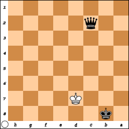

### Queen and a knight

[FINISH WRITING]

### Queen and two knights

Looks like you might be able to pull this one off without the king's help. The 
name of the game is backing the opponent king into a corner.

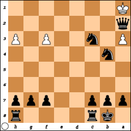

### Queen and a bishop

[FINISH WRITING]

### Queen and two bishops

[FINISH WRITING]

### Queen and a rook

The opponent king might try to capture your rook by diagonal approach.

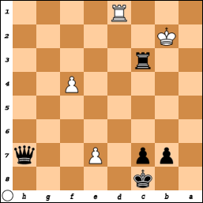

Given the board shown in the diagram above, assume it's Black's turn. The best 
move might be to move the Black queen to the corner nearby, so that the Black 
rook is protected by her from capture by the White king, and also she capture 
any pawn promotion White might opt for.

Assume instead it's White's turn. The best move would be definitely be to 
promote the pawn that's currently at e7, either a new queen or a new rook will 
do. That would be an agonizing defeat for Black.

Because kings can capture rooks, you should, as much as you can, keep your queen 
close to the opponent king and your rook far away.

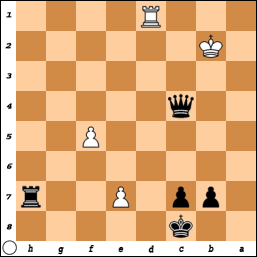

For the situation shown in the diagram above, Black needs to keep constant 
pressure on White, until the opportunities arise to capture the White rook and 
the White pawn that's too close to promotion. Though that won't matter if Black 
can pull off a checkmate first.

[FINISH WRITING]

### Two queens

Obviously one of your two queens must have been a pawn promotion, though it's 
not a given that the other one was original.

The technique here is much like with a queen and a rook, except the opponent 
king is unable to capture either of your queens.

[FINISH WRITING]

### Three queens

This is kind of overkill.

## Don't forget about your other pieces

If you're trying to do a queen and rook checkmate, odds are good you also have 
other pieces available to you, not as powerful but extremely useful at times.

In this one game against an easy bot (I was playing White), I was very intent in 
restricting the opponent king on file h. I completely failed to notice that with 
a simple move of the bishop from all the way on file a, I could've had checkmate 
right at that point.

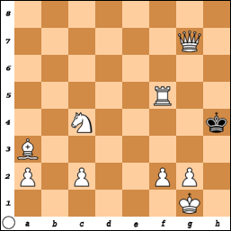

Earlier in that same game, my remaining knight could have protected my queen as 
she delivered the coup de gr&acirc;ce.

I suggest the following strategy: if the piece hanging out on the other side 
can't immediately put the opponent king in check, don't risk a stalemate while 
trying to position it for a check. But also keep an eye out for when that piece 
can be brought in to check. You might be pleasantly surprised to find that it's 
checkmate.