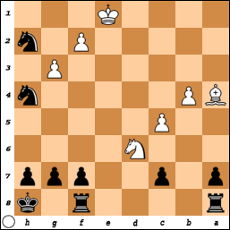

# Notation of chess games

Chess games are usually notated in two columns, each column having a number, a 
notation for White's move and a notation for Black's move (except the last 
column if White wins or causes a stalemate). Since White always goes first, 
there's no need to label the columns.

1. [notation for White's first move] [notation for Black's first move]
2. [notation for White's second move] [notation for Black's second move]
3. [notation for White's third move] [notation for Black's third move]
4. etc.

The "officer" pieces are each represented by a single letter. It varies from 
language to language, but since English has become the de facto lingua franca of 
chess, the English words for the pieces inform the most commonly used letter 
assignments:

 * K for king
 * Q for queen
 * B for bishop
 * N for knight (because K is already taken by the king, and the K in "knight" 
 is silent anyway)
 * R for rook

Because kingside castling and queenside castling are special moves, they get 
special notations: O-O for kingside castling and O-O-O for queenside castling.

As for the pawns, that depends on which system of notation we're using.

## Algebraic notation

As someone who's studied algebraic number theory, I don't see what's so 
"algebraic" about chess algebraic notation. So-called algebraic notation has 
become so standard it is often called just "notation," and occasionally 
"standard notation" to distinguish it from other notations.

On the very first move, no capture is possible. This means that a pawn on a 
player's very first move can only move forward one or two spaces. Therefore, in 
algebraic notation, we write what file the pawn started on ('a' through 'h') and 
what rank that pawn ends on (3 or 4 for White, 6 or 5 for Black).

For example, if White opens with the king's pawn forward two spaces and Black 
responds with the queen's pawn forward two spaces, that would be notated

1. e4 d5

If Black instead responded with the kingside bishop's pawn, that would be 
notated

1. e4 f5

Either way, a capture is possible for White on the next move. That would be 
notated with the file the capturing pawn was on, followed by the lowercase 
letter 'x', then the file and rank of the captured piece. Our game transcript 
thus far would be either

1. e4 d5
2. exd5

or 

1. e4 d5
2. exf5

[FINISH WRITING]

As the game progresses, situations arise in which the notation could become 
ambiguous if we're careless in our transcription. Consider for example this 
Black to play scenario at move 47.

If Black chooses to move one of the rooks to put the White king in check, the 
notation 

47. ... Re8+

doesn't tell us which rook Black moved. Since both rooks are on their home rank, 
we would need to also specify if Black moved the rook from a8 or the rook from 
f8. The latter would properly be notated as 

47. ... Rfe8+

Either rook would be a bad choice at this particular juncture in the game. White 
would likely respond

48. Nxe8

Black could compound the earlier blunder with 

48. ... Rxe8+

Notice there's no ambiguity now that Black is down to one rook, which with this 
move White is likely to now capture also.

In this particular scenario, it would be much better for Black to move a knight 
to f3 to put the White king in check intead of either rook. Since they're both 
on file 'h', notating the move as 

47. ... Nf3+

would be unclear. We would have to include the starting rank in our notation to 
clarify which knight to move. Thus, we should write either 

47. ... N2f3+

or

47. ... N4f3+

Notational ambiguities can occur with queens or bishops, but that requires at 
least one promotion. Since players almost always promote pawns to queens, 
notational ambiguities with bishops are very rare.

Pawn promotions are notated with the pawn move as usual followed by an equals 
sign and then the letter for the chosen piece, one of Q, B, N or R for the 
queen, bishop, knight or rook respectively in regular chess, or also K for king 
in a variant of chess like antichess. In the example game, Black might get a 
pawn over to b1 and choose to promote to a queen.

60. ... b1 = Q

[FINISH WRITING]

[FINISH WRITING]

## Descriptive notation

An older notation seen in older books and articles. [FINISH WRITING]

[FINISH WRITING]
