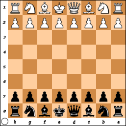
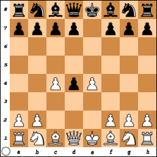
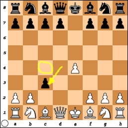
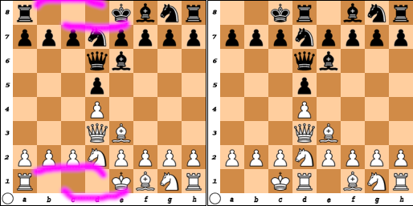
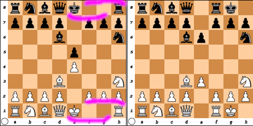
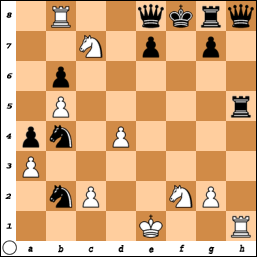
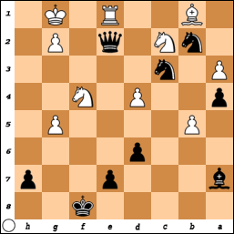
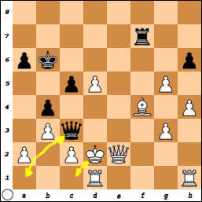

# The Rules of Chess

// TODO: Choose official reference for game rules

In this document I will write the rules of the game of chess as I understand 
them, as concisely and completely as I can. This document should not be 
regarded as binding. If it's found to contradict the official reference, this 
document should be amended to be in agreement with the official reference.

There will be occasional mentions of strategy, mostly to explain what the 
motivation might be for a particular type of move, but the focus here is on what 
makes a move valid, not whether it's the best move at any given moment in the 
game. This document is not meant for an in-depth discussion of strategy.

The diagrams in this document are to illustrate moves a player may make, not 
to advise on what the best move may be in any particular situation.

In this document, the terms "piece" and "pieces" will be understood to include a 
pawn or pawns. When it is necessary to distinguish between pawns and pieces that 
are not pawns, the distinction will be made abundantly clear.

## Generalities

There are two sides, White and Black. White always goes first, which 
theoretically gives Black a slight advantage. The two sides take turns. No side 
may skip a turn, but either side may concede the game.

The game is played on an 8 &times; 8 checkerboard. The checkerboard is placed so 
that White has a light-colored corner square at his or her right hand, and the 
same is also true for Black.

Each side gets sixteen pieces: one each of a king and a queen, two each of 
bishops, knights and rooks, and eight each of pawns. The initial placement of 
these will be illustrated in the next section.

The objective of the game is to trap your opponent's king so that there's no 
escape: if he stays put, he's captured; if he moves, he's captured; and no other 
piece can rescue him. Of course your opponent is trying to trap your king 
likewise.

There can only be one piece on a space at a time. Centering the pieces is a 
preference, not a requirement: the important thing is that the placement of the 
pieces be unambiguous, by making sure the base of a piece is strictly within a 
light- or dark-colored square, and not straddling a square of the opposite 
color.

It is an actual rule that once you touch a piece you're committed to moving that 
piece that turn, and must make a valid move with that piece even if it is 
strategically disadvantageous. This rule is generally enforced even in an 
informal context, though it may be relaxed for coaching.

When not capturing an opponent's piece, a player may only move one piece (except 
in the special case of castling, in which case he or she moves two pieces of his 
or her own side).

When capturing an opponent's piece, a player may only move two pieces: the 
captured piece, which is then moved off the board, and their own piece, which 
then takes the place of the captured piece (except in the case of en passant, 
which will be explained later on in this document).

Under no circumstance can a player legally change the position of more than two 
pieces in a single turn. I'm not aware of any chess variants in which this is 
not the case.

In an informal context, a player may request to take back a move, and the 
opponent may grant that request.

## Initial board state

At the beginning of the game, the pieces are arranged in a specific manner, with
each sides' pieces arrayed on opposite ends of the board. Horizontally,

* Black's "officer" pieces start out on rank 8.
* Black's pawns start out on rank 7.
* White's pawns start out on rank 2.
* White's "officer" pieces start out on rank 1.

And vertically,

* Kings start out on file 'e'. White's king starts out on a dark-colored square just 
to the right of the board's central vertical line from White's perspective, and 
Black's king starts out on a light-colored square just to the left of the 
board's central vertical line from Black's perspective.
* Queens start out on file 'd'. White's queen starts out on a light-colored 
square just to the left of the board's central vertical line from White's 
perspective, and Black's queen starts out on a dark-colored square just to the 
right of the board's central vertical line from Black's perspective.
* Bishops start out on files 'c' and 'f'.
* Knights start out on files 'b' and 'g'.
* Rooks start out on files 'a' and 'h'.

The diagram is usually rotated 180&deg; for Black's viewpoint. For example, if 
White begins with the king's pawn opening, the board should look like this for 
Black:

## Moving and capturing

The pieces move in specific ways when not capturing opposing pieces:
 
 * A king may only move to an immediately neighboring square that is not 
 already occupied, except when castling (which is not possible at the beginning 
 of the game, and which will be described later on).
 * A queen may move to any unoccupied spaces in a straight line, including 
 diagonals, provided all the spaces en route are also unoccupied. Essentially a 
 queen's moves combines the moves of a bishop and a rook. However, a queen may 
 not combine these capabilities in a single turn. That is to say, she may not 
 start moving like a rook and then switch to moving like a bishop in the same 
 turn, nor start moving like a bishop and then switch to moving like a rook in 
 the same turn.
 * A bishop may move to any unoccupied spaces in a diagonal line, provided the 
 spaces in between are also unoccupied. On account of the checkerboard, a side's 
 two bishops should be on differently colored spaces. If they are not, there was 
 very likely an invalid move at some point in the game (or, quite unlikely, a 
 pawn was promoted to a bishop).
 * A knight moves in a L-shape that may be described thus: two spaces forward 
 and then one space to the right or the left, or any reflection of either of 
 those combinations in 90-degree increments. The intervening spaces may be 
 occupied by pieces of either side. After each move, a knight is on a space of 
 the opposite color, so it's just as likely for a side's two knights to be on 
 spaces of the same color as it is for them to be on spaces of opposite colors.
 * A rook may move to any unoccupied spaces in a straight line (but not 
 diagonals). The only time a rook may jump over another piece is when castling, 
 * A pawn may initially move forward two spaces. Otherwise a pawn is limited to 
 one space forward. Upon reaching the opposing side's home row, a pawn must be 
 "promoted" to a queen, a bishop, a knight or a rook, and all the rules for that 
 other piece then apply. With a physical set, a previously captured rook may be 
 returned to the board upside down to represent a promoted queen. Since the 
 queen combines the abilities of the bishop and the rook, choosing to promote a 
 pawn to a bishop or a rook is generally considered a waste. And choosing to 
 promote to a knight is unlikely to be the best choice in the vast majority of 
 circumstances &mdash; but it is generally a better choice than a bishop or a 
 rook. To my knowledge, antichess is the only variant in which a pawn can 
 promote to a king. I don't know of any variants that allow pawns to decline 
 promotion.
 
Even though only knights may jump over other pieces, when playing on a physical 
board players are allowed to move any piece by lifting it off the board and 
setting it down on the destination space rather than dragging it across the 
board.
 
At the very beginning of the game, the only valid move for either side is to 
move a pawn (which has clear access to the way forward), or move a knight (which 
may jump over pawns). All the other pieces are blocked by pieces of their own 
side from the first move until such time as the way is cleared for them.

### Capturing
 
If the space to which a piece would be allowed to move to if it was unoccupied 
is instead occupied by piece of the opposing side, that piece may be captured. 

For example, if it's Black's turn and Black's queen is alone on rank 'a' except 
for one of White's rooks, the queen may capture that rook. Here we are not 
concerned with whether that's the best move or not. 

But if the capturing piece is a pawn, the piece to be captured must be one 
square diagonally forward to the left or right of the capturing pawn. Pawns are 
the only pieces that are allowed to capture on spaces they would not otherwise 
be allowed to proceed to).

#### En passant

However, there is a wrinkle to pawn capture that may occasionally occur under 
very specific circumstances. It's called "en passant," from the French for "in 
passing."

Each time an opportunity for en passant capture presents itself to a player, 
that player must either invoke that right and make that capture in that turn, or 
permanently forfeit the right to that particular en passant capture, even if the 
opponent does not again move the pawn that could have been captured en passant.

Even though you're unlikely to see it in normal game play, a computer program 
must be ready for it. That's why I'll spend a few paragraphs explaining it.

When a pawn is three ranks away from promotion, it might be close to capturing 
an opponent pawn that has not moved as much in the game so far. Specifically, an 
opponent pawn on the file to the left or the right of the pawn approaching 
promotion.

If the opponent moves such a pawn forward one space, it can be captured by the 
pawn nearing promotion. To avoid capture, the opponent might opt to move his or 
her pawn forward two spaces.

However, the player with the pawn approaching promotion may decide to invoke the 
en passant rule and capture the opponent pawn as if it had moved forward only 
one space instead of two.

Then the opponent pawn is removed from the board and placed with the other 
captured pieces, but the capturing pawn still ends up one rank closer to 
promotion. This is the only way in chess that a piece completes a capture in a 
space other than where the captured piece was.

If en passant occurs in a game at all, it's likely to be in the middlegame, but 
it can also occur in the endgame. However, to keep the example as simple as 
possible, I'm going to illustrate it with an unrealistic opening scenario.

Suppose both players' first moves are to bring their king's pawns to the center 
of the board. Then White also moves the queen's pawn to the center of the board. 
This presents Black with a choice: capture the White queen's pawn, or ignore it? 
Let's say Black chooses to capture that queen's pawn.

So far this is a realistic scenario, and a quite normal pawn capture. This is 
called "[center game accepted](OpeningsAndDefenses.md#Center-game-accepted)."

But now let's suppose, strictly for the sake of this example, that White wants 
to move their queenside bishop's pawn without Black capturing it. If White moves 
that pawn just one space forward, Black can capture that pawn the same way as 
the White queen's pawn just one turn ago. So White decides to move the queenside 
bishop's pawn forward two spaces.

Maybe Black doesn't care about that particular pawn, and Black may forfeit the 
right to en passant. But if Black does want to invoke the en passant rule, then 
that en passant capture must be the very next thing that happens in the game.

I want to be abundantly clear that a pawn capturing under the en passant rule 
ends on the same space as if the captured pawn had been captured from the normal 
capture position. The capturing pawn will never occupy the same space as the 
captured pawn, except maybe later on in the game as a promoted pawn.

<!-- Here's a more realistic en passant occurrence:

33. Qxg6+ kB5
34. c4+ bxc3
35. bxc3 ...

// PLACEHOLDER FOR EN PASSANT DIAGRAM

This would be straight out of an actual game except I changed the knight's 
position to require the opponent king to delegate capturing the pesky pawn. -->

Depending on the system of notation in use, a special notation for en passant 
capture may be necessary.

I reiterate that en passant capture must occur as soon as the opportunity arises 
or else the player forfeits the right to the en passant capture. This is even if 
the opponent does not move the pawn that could have been captured en passant.

Even without that stricture, the conditions for en passant are unlikely to occur 
in regular game play. You might play a thousand games and never once see en 
passant. But if you play just a hundred games, you will see castling more than 
once.

### Castling

There are two kinds of castling: queenside castling (with the queen's rook) and 
kingside castling. In either case, the king moves two spaces towards the rook to 
be castled with, but the queenside rook must move one more space than the 
kingside rook to meet the king.

With queenside castling, the king ends up on file c and the rook ends up on file 
d.

With kingside castling, the king ends up on file g and the rook ends up on file 
f.

// TODO: Correct kingside diagram: e pawns

Of course in actual game play, even if both players choose to castle on the same 
side, they almost certainly would not mirror their moves.

Castling is the only time in which a king may move more than one space in a 
single turn, and the only time a player may move two of their own pieces in a 
single turn.

Like en passant, castling also has requirements for when it may occur:

 * Neither the king nor the pertinent rook have moved from their initial spaces. 
 It almost goes without saying that a king can't castle with a rook promoted 
 from a pawn.
 * There are no pieces between the king and the pertinent rook (no knight, 
 bishop or queen in the case of queenside castling; no knight or bishop in the 
 case of kingside castling; and definitely no opponent pieces in either case).
 * The king must not be under threat of capture.
 * The king must not pass through a space that is threatened by an opponent 
 piece (as a consequence of this requirement, there is no danger of the rook 
 being captured immediately after castling, though of course it may still be 
 captured later on in the game).
 * The king must not end up on a space that is threatened by an opponent piece 
 (generally it's advisable to have some pawns in front of where the king and 
 rook will end up, but this is not required, and it wouldn't matter if it's an 
 opposing knight that's threatening the space where the king would end up).

However, castling is still allowed if the castling rook is under threat of 
capture, as long as the requirements listed above are still met. In the 
following very unrealistic White to play scenario in which White rather 
improbably meets the requirements for kingside castling, it is actually the best 
move.

FEN: 1R2qkrq/2N1p1p1/1p6/1P5r/pn1P4/P7/1nP2NP1/4K2R w K - 0 1

Whether it's good strategy to castle with a rook under threat is a matter that   
is a matter that's outside the scope of this document.

On a physical set, the castling player generally performs the move with two 
hands, one for the king and one for the pertinent rook. At least that's the case 
for informal play. Tournament play might require one-handed castling.

Actually, one-handed castling is probably also a good idea for informal but 
timed play, as two-handed castling could lead to disputes, and accusations of 
cheating.  

In a computer program, castling is usually indicated by clicking and dragging 
the king two spaces in the appropriate direction. If the requirements for 
castling are met, the computer will then update the board accordingly.

Castling might seem like a great way to get the king out of trouble, except for 
that one requirement that the king must not be under threat of capture. However, 
if you can foresee an imminent threat of capture, castling might be the best way 
to derail your opponent's strategy.

As a purely pre-emptive move, however, castling is likely to backfire, because 
then your opponent doesn't waste any time on a strategy that would be 
invalidated by your castling, and worse, might set up a very embarrassing 
checkmate against you.

Any further discussion of castling strategy is outside the scope of this 
document.

### More discussion of captures

#### Captures by the king

As we saw in the previous section, the rules for castling also forbid a king 
from passing through a square from which he may be captured, even if he would 
otherwise end up on a safe square.

All this discussion of castling might cause players to forget that the king can 
capture. This can be a very important fact when your king is on the run but 
there's still a chance your opponent might screw up and unwittingly give up an 
important piece like a rook or a bishop.

A king may not move to a square where he might be captured by one of the 
opponent's pieces. However, if the opponent is foolish enough to place a piece 
on a square immediately next to the king without support, the king can capture 
that piece.

Since the king can capture, the king can also approach the opponent's pieces, 
of course taking care not to move to a threatened square.

Depending on the situation, it might be a good idea for your king to approach an
opponent's pieces in certain ways (assuming the target position is not otherwise 
threatened):

 * A king may approach an opponent's pawn from behind.
 * A king may approach an opponent's rook diagonally.
 * A king may approach an opponent's knight to any immediately neighboring 
 position.
 * A king may approach an opponent's bishop horizontally or vertically, or 
 diagonally but taking care to use squares of the opposite color (e.g., if the 
 bishop is on a dark space, approach on a light space).
 * A king should not approach an opponent's queen, at least not without a 
 broader strategy in mind. A king may not move to any square directly 
 neighboring an opponent's queen. But as discussed earlier, the rules don't 
 forbid either player from foolishly placing a piece, including a queen, other 
 than a king where the opponent's king can capture that piece.

Here's an example of a foolish approach to the opponent's king. Black to play.

FEN: 5k2/b3p2p/3p4/1P6/p2P1N1N/P1n5/1nP1q1P1/4R1K1 b - - 0 1

Black's plan is to push White's king to the corner. Rightfully wary of White's 
rook and knights, Black foolishly decides to move the queen to the dark-colored 
square right next to the White king.

The Black queen would be protected by the Black bishop if there wasn't that 
White pawn blocking the Black bishop's path. So the White king can easily 
capture the Black queen.

#### Other considerations pertaining to captures

The promotion of pawns, combined with the preference of players to promote pawns
to queens means that theoretically one side could have nine queens. That would 
be a logistical problem for two players with only one chess set, but it is no 
problem for a program such as this one to draw all those queens on the screen.
 
I think such a scenario could occur among players playing precisely with the 
goal of making that happen, rather playing to win. More likely, among players of
roughly equal ability, each side is only able to promote one or two pawns, if 
any.

Being well aware of an opponent's intention to promote a pawn, a player may try 
to place obstacles in the way of promotion, or allow the promotion to happen but 
immediately capture the promoted piece. This means that having more than four 
queens on the board at any given time is essentially impossible in a competitive 
game.
 
Among beginners, captures may occur because a player failed to notice one of 
their pieces was in the line of attack. Among more experienced players, either 
side may choose to deliberately allow one of their pieces to be captured. This 
is called a sacrifice, and may be part of a gambit to gain a tactical advantage.

## Checks and mates

A king can't be sacrificed. If a king is threatened, that's a check and the 
threatened side must neutralize that threat. Depending on the available moves, 
the threat may be neutralized one of three ways:

 * By moving the king to a safe position.
 * Or by having another piece intervene to defend the king.
 * Or by capturing the threatening piece.

If all three of these options are available, or just two, the threatened player 
has a choice to make. But if only one of these options is available, that's what 
the threatened player must do if the game is to keep going.

The king can't be sacrificed, because trapping the opponent's king is the whole 
point of the game.
 
Because the king must be defended at all costs, a player can sometimes be forced 
to give up a valuable piece (like a rook) in order to get the king out of the 
way of danger.
 
For example, one player's knight might simultaneously threaten both the 
opponent's king and rook. If there is no way to capture the threatening knight, 
the opponent must then move the king, allowing the rook to be captured.
 
In other cases, a player might simultaneously threaten two of the opponent's 
pieces other than the king, such as for example a queen and a bishop. In that 
case, the player with the threatened pieces may choose to save one of the 
threatened pieces, or ignore the threat altogether.

The player may not ignore a threat to the king, though sometimes, a player, too 
engrossed with devising a line of attack for the opponent's king, may fail to 
notice their own king is in danger. For that reason, players sometimes announce 
a check by saying "check" (this is extremely rare in tournament play).

Then the player with the endangered king understands that the only valid moves 
are moves that neutralize the threat. However, if there's no way under the rules 
to neutralize the threat to the king, that's checkmate. The threatening side has 
won the game. In tournament play, there is no need for any further moves to be 
made or recorded.

The king may be used offensively, since the king can capture, as described 
earlier. Probably most players are reluctant to do this, which is 
understandable, as it can backfire.

You can use this to your advantage, for example, if your own king is on the run 
and your opponent's king is not very well protected: it might be a good idea to 
move your own king towards your opponent's king, so that your opponent becomes 
more concerned with moving their king away than with keeping up the pressure on 
your king.
 
In both informal and tournament play either side has the option to concede if 
they don't think they can win. Grandmasters often opt to stop a game, mutually 
acknowledging one side's win, even in situations where the imminent checkmate is 
not obvious to onlookers.

Tournament play may add rules regarding concessions that may have consequences 
for the unfolding of the tournament.
 
There also arise situations in which neither side can win. That's a stalemate.
Neither king is in check, but the king of the player whose turn it is to move 
can't move anywhere because the squares are either occupied by his own pieces or 
threatened by the opponent's pieces, and none of that player's other pieces can 
make any valid moves either.

There can also be a draw without a stalemate. If the same sequence of moves is 
repeated thrice, without any captures, that's a draw by repetition. Here's a 
transcript of the last few moves of a game that ended in draw by repetition. 
Even if you don't know notation, you can see that the same two moves are being 
repeated over and over again.

35. O-O-O Qd6 
36. Bf4 Qf6 
37. g5 Qa1+ 
38. Kd2 Qc3+ 
39. Kc1 Qa1+ 
40. Kd2 Qc3+ 
41. Kc1 Qa1+ 1/2-1/2

In this particular game, a draw was in Black's best interest, because without 
the repetitive checks, White might have wised up to an opportunity for 
checkmate, whereas Black's only path to winning here requires White to make a 
lot of mistakes.

Additional rules apply for timed play (with a clock). In some games, a player 
who takes too long to decide on a move simply "forfeits on time." I've lost that 
way several times.
