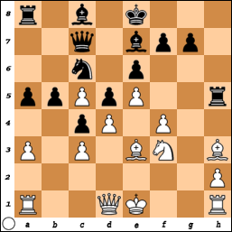
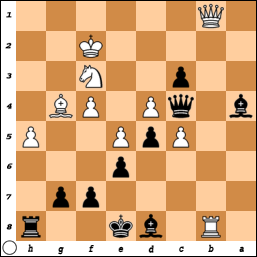

# A few notable games

## Notable in regard to the rules of the game

### Regarding castling

In a 1994 blitz game, Kasparov might have beaten Aleksey Dreev if Kasparov had 
called Dreev out for castling illegally. Kasparov played White, Dreev Black.

The game started out plainly enough: 1. e4 e6 2. d4 d5 3. Nc3 Nf6 4. e5 Nfd7 5. 
f4 c5 6. Nf3 Qb6 7. Be3 Nc6 8. Na4 Qa5+ 9. c3 c4 10. b4 Qc7 11. g4 b5 12. Nc5 
a5. Then: 13.a3 Nxc5 14. bxc5 Be7 15. Bh3 h5 16. gxh5.

Dreev decides to stop that White pawn's incursion with his rook, then moves the 
rook back to its starting position on his next turn.

16. ... Rxh5 

FEN: r1b1k3/2q1bpp1/2n1p3/ppPpP2r/2pP1P2/P1P1BN1B/7P/R2QK2R w KQq - 0 17

17. Bg4 Rh8 

The game continues, Dreev moves his other rook, etc. 18. h4 Rb8 19. Bd2 b4 20. 
axb4 axb4 21. cxb4 Nxb4 22. Bxb4 Rxb4 23. Rb1 Qb7 24. Rxb4 Qxb4+ 25. Kf2 Bd7 26. 
h5 Ba4 27. Qa1 c3 28. Rb1 Qc4 29. Rb8+ Bd8 30. Qb1.

FEN: 1R1bk2r/5pp1/4p3/2PpP2P/b1qP1PB1/2p2N2/5K2/1Q6 b - - 5 30

This is a crucial juncture. Kasparov might have been hoping to play 31. Rxd8+, 
in which case Dreev would not have been able to castle. But Dreev had apparently 
forgotten he had already lost the right to castle kingside when he played 16. 
... Rxh5. 

Since Kasparov failed to notice that 30. ... O-O was an illegal move, the game 
went on and Dreev won. On review, the move 30. ... O-O was stricken from the 
transcript, as well as every move after that, but Dreev's win was allowed to 
stand.

## Notable for showcasing future talent

In 2008, Garry Kasparov played several talented young players in Harlem 
simultaneously. The grandmaster won all the games, but Rochelle Ballantyne 
really made him work for the win.

Kasparov played White, Ballantyne played Black.

1. d4 d5 
2. Nf3 Nf6 
3. c4 c6 
4. Qc2 Bg4 
5. Ne5 Bh5 
6. cxd5 Qxd5 
7. e3 Nbd7 
8. Nc3 Qa5 
9. Nc4 Qc7 
10. e4 e5 

At this point, the game has coincidentally unfolded the same as a game between 
two grandmasters from a couple of decades prior. Kasparov diverges from the 
earlier game in the next move.

11. Be3 exd4 
12. Bxd4 Bc5 
13. Bxc5 Nxc5 
14. f3 O-O 

Kasparov hasn't castled yet, even though he could castle queenside. Not sure 
whether to ascribe that to overconfidence on Kasparov's part or the strategic 
calculation that kingside castling is best in all but a few unconventional 
openings.

Indeed Kasparov puts off kingside castling almost to the last minute, as 
Ballantyne makes preparations to beat Kasparov on his king's home row.

15. Qf2 Qe7 
16. Be2 b5 
17.Na5 Rac8 
18. a3 Rfd8 
19. O-O Ne6 
20. Rfd1 Qc7 
21. Nb3 Nf4 
22. Bf1 a5 
23. Nc5 Ng6 
24. Rac1 Ne5 
25. Be2 Qe7 
26. h3 h6 
27. a4 b4 
28. Nb1 Rxd1+ 
29. Rxd1 Rd8 
30. Nd2 Nfd7 
31. Nb7 Ra8 
32. Nb3 Qe6 
33. Qe3 f5 
34. N3c5 Nxc5 
35. Nxc5 Qa2 
36. Qd4 Re8 
37. exf5 Bf7 
38. f4 Nc4 
39. Ne6 Bxe6 
40. fxe6 Nxb2 
41. Rd2 Qb1+ 
42. Kh2 Nxa4 
43. Bh5 g6 
44. Qf6 1-0

Ballantyne resigns, but it's an impressive finish because she actually has 
slightly more material than Kasparov, just not positioned as strategically.

## Notable for appearing in a TV show not specifically about chess

### Star Trek

*Star Trek*, retroactively referred to as "the original series" (TOS) introduced 
3D chess. However, sequel series sometimes showed games of traditional chess. In 
at least two cases, these games were historical games available to the show's 
writers.

#### Donald Byrne vs. Bobby Fischer

This game was played in New York on October 17, 1956 in competition for the 
Rosenwald Trophy. The game started thus: 1. Nf3 Nf6 2. c4 g6 3. Nc3 Bg7 4. d4 
O-O 5. Bf4 d5 6. Qb3 dxc4 7. Qxc4 c6 8. e4 Nbd7 9. Rd1 Nb6 10. Qc5 Bg4 11. Bg5 
Na4 12. Qa3 Nxc3 13. bxc3 Nxe4.

In the *Star Trek: Deep Space Nine* episode "Playing God," Commander Benjamin 
Sisko (Avery Brooks) and Lt. Jadzia Dax (Terry Farrell) play a game of chess 
that looks to be precisely this Byrne-Fischer game. Sisko is repeating Byrne's 
moves and Dax is repeating Fischer's moves. Their conversation is only 
intermittently about the game.

14. Bxe7 

&mdash; Sisko: Your move. Your seaweed's been safely transported to the science 
lab.

&mdash; Dax: Did you take a look at it? 

14. ... Qb6 

They continue discussing the "seaweed" and Arjun, a young man hoping to be 
selected to be a "joined Trill."

15. Bc4 Nxc3 
16. Bc5 

&mdash; Dax: I'm not sure what he brings as a host, how he'll advance the 
symbiont to the next level. Frankly, he's more than a little arrogant, Benjamin.

&mdash; Sisko: Is he?

&mdash; Dax: Okay, for a Trill, that's to be expected. Check. But he's riding 
his father's ambitions and he doesn't have any idea what he'd do with a symbiont 
if he got one. 

16. ... Rfe8+ 

In real life, it must've been extremely obvious to Byrnes why Fischer moved his 
rook from the file 'f' to file 'e', and so there was no need for Fischer to 
announce the check.

17. Kf1 Be6 
18. Bxb6 Bxc4+

We don't see whether they keep playing the game, much less whether or not they 
deviate from the Byrnes-Fischer game. If they don't,
