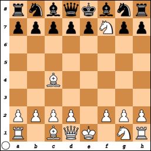
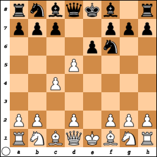
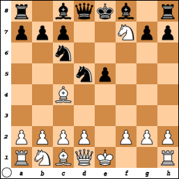
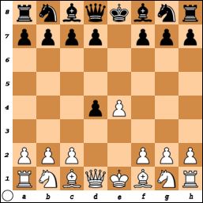
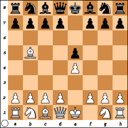
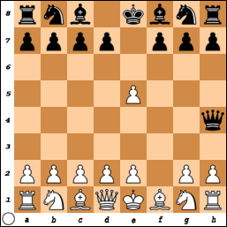
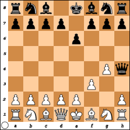
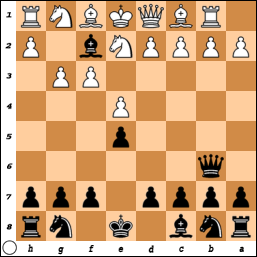

# Openings and Defenses

At the beginning of the game, White has only twenty possible moves: move one of 
the two knights to the left or to the right, or move one of the eight pawns one 
space forward or two. Of those twenty possible first moves, players tend to use 
only four or five.

Likewise, Black has twenty possible responses to White's first move, but some 
responses make more sense than others. Black will usually try to counteract 
White's presumptive strategy.

Some openings are more advantageous than others, but remember: good players can 
often figure out how to overcome disadvantages, and bad players can often 
squander advantages.

Also, for what it's worth, I can beat easy programs with any of these openings. 
But with the more common openings, a program on easy will make me work harder 
for the win. It's as if they have been programmed with more strategies for the 
common openings.

It shouldn't be any problem to pre-program two or three good defenses for each 
opening, and then have the computer choose one at random. A human player might 
make a systematic study of each opening, but they will probably prioritize 
studying defenses to the more common openings.

According to Schiller (2005), the main goals of the opening are to control the 
center, castle and "connect" the rooks (meaning that the two rooks defend each 
other on the home row.

Of course Schiller also notes that your opponent will try to thwart your 
accomplishment of these goals. An early check is unlikely to lead to checkmate 
too soon, but it could obliterate your ability to castle, for example.

Maybe I overlooked it, but in his book Schiller does not mention the "rule" of 
not moving a piece more than twice in the opening. Observing that stricture 
tends to be a natural consequence of castling and connecting the rooks.

But if you miscalculate and need to "undo" an imprudent move in the opening, or 
if you see an opportunity for an early checkmate against your opponent by moving 
a piece twice, then by all means, move that piece a second time in the opening.

In this document, I intend to cover all twenty possible openings, but for each 
opening only the most likely defenses for Black to respond with.

This document is written from the perspective of White, meaning that you're 
playing White and your opponent is playing Black.

Note also that some openings depend on the second move for their 
characterization, e.g., in some cases when your first move is to move a pawn 
other than the king's pawn but your second move is to move your king's pawn to 
e4, the opening might still be considered a king's pawn opening.

The so-called "algebraic notation" is used in this document. See 
[game notation](GameNotation.md#Algebraic-notation) for more details. 

This document also contains a few mentions of how these standard openings lead 
to different strategies in some chess variants.

## Knight openings

Either knight for a first move perhaps signals an intention to castle on that 
knight's side, at least in regular chess. Knight openings have their pros and 
cons for the Fog of War chess variant. On the one hand, you don't get to see 
anything of your opponent's forces, but on the other hand you know them to be at 
initial state at this point.

### Queenside knight to rook's file: Durkin opening, or "sodium attack"

1. Na3

Most openings are named after people. This one's named after Robert T. Durkin. 
The nickname "Sodium Attack" comes from the notation "Na" (the chemical symbol 
for sodium); moving the same knight to the other side would be notated Nc3.

I believe all grandmasters have thought about this opening, and may have even 
played it in a friendly game. But I also believe that they have all concluded 
that the element of surprise is not a good enough reason to choose it over the 
other knight openings.

However, I must acknowledge that Durkin himself won a few games with this 
opening. He liked this opening so much he even wrote a pamphlet about it.

In antichess (also known as "losing chess"), Black is likely to respond to this 
opening with 1. ... b5. Since capture is mandatory in antichess, White must then 
play 2. Nxb5.

#### Sicilian defense, Kronberger variation

1. Na3 c5
2. e4 Nc6

### Queenside knight to bishop's file: Van Geet opening

1. Nc3

This is a much more conventional opening. It helps clear the way for queenside 
castling, and it better positions your knight to rampage through your opponent's 
ranks.

For example, I like to deprive the opponent of their queen and a rook as early 
as I can, using a knight backed up by a bishop. It goes something like this:

1. Nc3 f5 
2. e4 fxe4 
3. Nxe4 Nf6 
4. Ng5 Rg8 
5. Bc4 Rh8 
6. Nf7 Ng8 
7. Nxd8

In this case, my opponent, a program on a very popular chess website, wised up 
to my strategy and thwarted my planned rook capture. Still, I was able adjust my 
tactics and win.

Even though my second move was e4, this is still considered the Van Geet 
opening. However, because of that second move, some of the same defenses used 
against the king's pawn opening might be suitable for the Van Geet opening if 
the player opens this way.

If my second move had been Nf3, some analysts might consider this a R&eacute;ti 
opening.

##### Four knights game, Scotch variation

1. Nc3 Nc6 
2. Nf3 Nf6 
3. e4 e5 
4. d4 

#### Indian game

1. Nc3 Nf6
2. d4

##### Queen's pawn opening, Chigorin variation

1. Nc3 Nf6
2. d4 d5

##### Indian game, Maddigan gambit

1. Nc3 Nf6
2. d4 e5

##### Alekhine's defense, Scandinavian variation

1. Nc3 Nf6
2. e4 d5
3. exd5

##### Vienna game, Falkbeer variation

1. Nc3 Nf6
2. e4 e5

##### Four knights game, Scotch variation

1. Nc3 Nf6
2. e4 e5
3. Nf3 Nc6
4. d4 d6

#### Laroche gambit

1. Nc3 b5

#### Potentially Sicilian defense

1. Nc3 c5

##### Sicilian two knights variation

1. Nc3 c5
2. Nf3 Nc6
3. d4 cxd4
4. Nxd4

##### Sicilian defense, closed, traditional line

1. Nc3 c5
2. Nf3 Nc6
3. e4

##### Van Geet opening

1. Nc3 c5
2. d4 cxd4
3. Qxd4 Nc6

##### Sicilian defense, closed

1. Nc3 c5
2. e4

###### Sicilian defense, closed, traditional line

1. Nc3 c5
2. e4 Nc6

###### Sicilian defense, pin variation

1. Nc3 c5
2. e4 e6
3. Nf3

##### Van Geet opening reclassified as Mieses opening

1. Nc3 c5
2. d3

#### Dunst opening

1. Nc3 d5

Of course Black doesn't expect White to respond with 2. Nxd5, because then Black 
can capture that knight without risk.

##### Reversed Mexican defense

1. Nc3 d5
2. Nf3

##### Van Geet opening reclassified as queen's pawn opening, Chigorin variation

1. Nc3 d5
2. d4 

##### Siberian attack

1. Nc3 d5
2. d4 Nf6
3. Qd3

##### Scandinavian defense, closed

1. Nc3 d5
2. e4 

##### Alekhine's defense, Scandinavian variation

1. Nc3 d5
2. e4 Nf6

#### Reversed Nimzowitsch variation

1. Nc3 e5

##### Napoleon attack

1. Nc3 e5
2. Nf3 Nc6
3. d4

##### Billockus-Johansen gambit

1. Nc3 e5
2. Nf3 Bc5

##### Napoleon attack

1. Nc3 e5
2. d4 Nc6
3. Nf3

##### Maddigan gambit

1. Nc3 e5
2. d4 Nf6

##### Chigorin, Shaviliuk gambit

1. Nc3 e5
2. d4 d5

##### Center game accepted, Paulsen-Berger variation

1. Nc3 e5
2. d4 exd4
3. Qxd4 Nf6
4. e4 Nc6
5. Qe3

#### Pirc defense

1. Nc3 d6
2. e4

#### French defense, two knights variation

1. Nc3 e6
2. Nf3 d5
3. e4 Nf6
4. Bb5+ c6

#### Modern defense, standard line

1. Nc3 g6 
2. d4 Bg7 
3. e4 d6

#### Modern defense

1. Nc3 g6
2. e4

### Kingside knight to bishop's file: Zukertort opening or R&eacute;ti opening

There is some disagreement as to what constitutes a R&eacute;ti opening. The 
move

1. Nf3

is thought by some to be enough only to define the Zukertort opening. It's a 
R&eacute;ti opening depending on how Black responds and how it goes from there.

This might also be considered a R&eacute;ti opening, even though it looks like a 
Van Geet opening at first:

1. Nc3 Nc6
2. Nf3 Nf6

Though that might not be considered a four knights game.

Opponent might respond to the R&eacute;ti opening with the reversed Mexican 
defense.

#### Black mustang defense

1. Nf3 Nc6

##### R&eacute;ti opening reclassified as queen's pawn opening, Mik&edot;nas defense

1. Nf3 Nc6
2. d4

###### Queen's pawn opening, Zukertort-Chigorin variation

1. Nf3 Nc6
2. d4 d5
3. Nc3 Bf5
4. e4 dxe4

##### Nimzowitsch defense declined

1. Nf3 Nc6
2. e4

###### French defense, normal variation

1. Nf3 Nc6
2. e4 Nf6
3. Nc3 e6
4. d4 d5

#### Potentially Indian game

1. Nf3 Nf6

##### Queen's pawn opening, Chigorin variation

1. Nf3 Nf6
2. Nc3 d5
3. d4

##### Indian game, knights variation, East Indian defense

1. Nf3 Nf6
2. Nc3 g6

##### Indian game, knights variation

1. Nf3 Nf6
2. d4

###### Indian game, knights variation

1. Nf3 Nf6
2. d4 e6

###### Indian game, knights variation, East Indian defense

1. Nf3 Nf6
2. d4 g6

##### Nimzowitsch defense declined

1. Nf3 Nf6
2. e4 Nc6
3. d3 e5?

###### King's pawn, Tayler opening

1. Nf3 Nf6
2. e4 Nc6
3. d3 e5
4. Be2

##### R&eacute;ti opening, quiet system

1. Nf3 Nf6 
2. e3

#### Ware defense

1. Nf3 a5

#### Sicilian invitation

1. Nf3 c5

##### Indian game, Spielmann-Indian variation

1. Nf3 c5
2. d4 Nf6

##### Sicilian defense, old Sicilian variation

1. Nf3 c5
2. e4 Nc6

###### Sicilian defense, Alapin variation

1. Nf3 c5
2. e4 Nc6
3. c3

###### Sicilian defense

1. Nf3 c5
2. e4 d6

###### Sicilian defense, canal attack

1. Nf3 c5
2. e4 d6
3. Bb5+ Nc6

#### R&eacute;ti opening, Sicilian invitation

1. Nf3 c5 
2. c3 Nf6

##### Reversed Mexican defense

1. Nf3 d5
2. Nc3 

##### Santasiere's folly

1. Nf3 d5 
2. b4

When Anthony Edward Santasiere played White, he preferred to begin with 1. Nf3. 
In such a game that his opponent responded with 1. ... d5, Santasiere intended 
to play 2. c4, but accidentally touched his queenside knight's pawn instead. 
Encouraged by the results of that game, he started playing the opening 
deliberately.

##### R&eacute;ti gambit

In some references, this is called *the* R&eacute;ti opening.

1. Nf3 d5
2. c4 

###### Caro-Kann defensive system

1. Nf3 d5 
2. c4 c6 
3. cxd5 cxd5

###### R&eacute;ti gambit accepted

1. Nf3 d5
2. c4 dxc4

May continue

3. Qa4+

This is a very smart move for White in three-check chess.

###### R&eacute;ti gambit declined, advance variation

1. Nf3 d5 
2. c4 d4

This has the effect of inhibiting White's queenside knight, as it would be a 
pointless sacrifice for White to play 3. Nc3, because Black would almost 
certainly respond with 3. ... dxc3.

##### Zukertort variation

1. Nf3 d5
2. d4

###### Queen's pawn opening, Zukertort-Chigorin variation

1. Nf3 d5
2. d4 Nc6

This can continue as the French defense, normal variation:

3. Nc3 e6
4. e4

##### Queen's pawn opening, symmetrical variation

1. Nf3 d5
2. d4 Nf6

###### Zukertort opening reclassified as queen's pawn opening, Chigorin variation

1. Nf3 d5
2. d4 Nf6
3. Nc3 g6

##### Zukertort opening reclassified as queen's pawn opening, Krause variation

1. Nf3 d5
2. d4 c5
3. dxc5 b6

##### Dutch variation

This opening can be considered a king's pawn opening if your second move is e4, 
e.g.,

1. Nf3 d5
2. e4 e5
3. Bb5+ Qd7
4. Bxd7+ Bxd7
5. exd5 ...

This also illustrates the elephant gambit, in which Black makes an ill-advised 
attempt to control the middle of the board.

##### Tennison gambit

1. Nf3 d5
2. e4

###### Elephant gambit

1. Nf3 d5
2. e4 e5

This can continue as the Ruy L&oacute;pez opening, Spanish countergambit:

3. Bb5+ Nc6

##### Old Indian attack

1. Nf3 d5
2. d3

##### King's Indian attack

1. Nf3 d5
2. g3 

Can continue

2. ... e6

or

2. ... Nc6
3. Bg2 e5
4. d3 Nf6
5. O-O

###### King's Indian attack, double fianchetto variation

1. Nf3 d5 
2. g3 g6 
3. d4

#### Ross gambit

1. Nf3 e5

##### Ross gambit accepted

1. Nf3 e5
2. Nxe5

##### Englund gambit declined, reversed Alekhine variation

1. Nf3 e5
2. d4

###### Dutch defense, Omega-Isis gambit

1. Nf3 e5
2. d4 f5

###### Englund gambit declined, reversed Alekhine, reversed Krebs variation

1. Nf3 e5
2. d4 e4
3. Bg5 Be7
4. Ne5 d6
5. Nxf7 Kxf7
6. e3 d5
7. Qh5+ g6
8. Qg4 Bxg4

#### Dutch variation

1. Nf3 f5

##### Dutch defense

1. Nf3 f5
2. d4

###### Dutch defense, Lisitsyn, Rydel-Bloodgood gambit

1. Nf3 f5
2. e4 fxe4

May continue

3. Ne5

#### Herrstrom gambit

1. Nf3 g5

#### Queen's gambit invitation

1. Nf3 e6

May continue 

2. g3

#### Arctic defense

1. Nf3 f6 

There are a few different ways it could go very wrong for Black.

1. Nf3 f6 
2. e4 e6 
3. Nd4 c6 
4. Qh5+ Ke7 
5. Nf5+ exf5 
6. exf5 Kd6 
7. Qg4 a5 
8. Qf4+ Ke7 
9. Qe4+ Kd6 
10. d4 a4 
11. Bf4# 1-0

##### R&eacute;ti reclassified as king's pawn, king's knight, Damiano variation

1. Nf3 f6 
2. e4 e5

#### Polish defense

The Polish defense works a lot better for Black:

1. Nf3 b5

#### Alekhine's Defense: John Tracy Gambit

1. Nf3 Nf6
2. e4

Quite surprisingly to me, the Van Geet opening can be considered a R&eacute;ti 
if your second move is Nf3, e.g.,

1. Nc3 Nf6
2. Nf3

##### Nimzowitsch defense declined, Colorado countergambit accepted

1. Nf3 f5 
2. e4 Nc6 

R&eacute;ti Opening: Dutch, Lisitsyn, Rydel-Bloodgood Gambit, 3.Ne5

#### Queenside fianchetto variation

1. Nf3 b6
2. Nc3 

#### Queenside fianchetto variation

1. Nf3 b6
2. e4 Bb7

#### Pirc invitation

1. Nf3 d6

##### Pirc defense, modern defense, Geller system

1. Nf3 d6
2. e4

#### Philidor defense

1. Nf3 d6
2. e4 e5

###### Wade defense

1. Nf3 d6
2. e4 Bg4

#### Queen's gambit invitation

1. Nf3 e6

#### Kingside fianchetto variation

1. Nf3 g6

May continue

2. e4

##### Modern defense

1. Nf3 g6
2. d4

##### Pirc defense, classical variation

1. Nf3 g6
2. e4 Bg7
3. d4 d6
4. Nc3 Nf6

#### Queen's pawn opening, Zukertort variation

1. Nf3 d5
2. d4 c6

#### Basman defense

1. Nf3 h6

### Kingside knight to rook's file: Amar opening

1. Nh3

Black will probably respond by moving their queen's pawn one or two spaces 
forward, in either case threatening your knight with their queenside bishop 
right off the bat.

In antichess (also known as "losing chess"), Black is likely to respond to this 
opening with 1. ... g5. Since capture is mandatory in antichess, White must then 
play 2. Nxg5.

#### Sicilian defense, brick variation

1. Nh3 c5
2. e4 

#### French defense, Morphy gambit

1. Nh3 d5
2. d4 e6
3. e4

#### Amar-Barnes, Krazy Kat variation

1. Nh3 e5
2. f3 d5

#### Easy victory with the Amar opening

I suppose it's not just with the Amar opening that you can set up a queen and 
bishop 6-move checkmate, you can accomplish such a checkmate with any opening 
that does not put pawns or knights on d3 or f3, provided that Black responds 
with f6 and then fails to recognize the queen and bishop threat.

1. Nh3 f6
2. e4 b6
3. Qh5+ g6
4. Qd5 Bg7
5. Bc4 a5
6. Qf7# 1-0

#### Barnes opening reclassified as Amar opening

1. f3 e5 
2. Nh3 

## Pawn two spaces forward

Since pawns can initially move forward two spaces, it makes sense to take 
advantage of this from the beginning of the game. Your opponent might respond by 
moving their corresponding pawn forward two spaces, effectively stymieing both 
pawns until such time as either one of them can capture or is captured.

Another option is that your opponent might offer a pawn sacrifice. Then it'll be 
up to you to decide to take them up on it or pass it up.

Or, perhaps better, they might move a pawn that neither stymies your pawn nor 
threatens to capture, as they're more interested in mobilizing their own pieces.

### Queenside rook's pawn: Ware opening

1. a4

This is a good way to get the queenside rook going, if you're not interested in 
queenside castling.

In the atomic chess variant, captures cause explosions that can kill off a king 
if he's too close. Here, "too close" means any space the king could move to. But 
if the capture occurs more than one space away from the king, the king is safe 
for the time being, unless the removal of the exploded pieces exposes the king 
to check or checkmate.

So, with the Ware opening, if Black responds with anything other than d5 or d6, 
you can play Ra3. If Black then still doesn't play d5 or d6, you can follow with 
Rd3. And maybe after that Rxd7 for the kill.

This can also work with the king's pawn, with the target winning move being 
Rxe7. Of course in regular chess, such a strategy would just be the pointless 
sacrifice of a rook. It might be worthwhile in the three-check variant, however.

In antichess, Black is likely to respond with b5, which then means you must 
respond with axb5. Then Black won't offer anything else for capture, because 
then you must play Rxa7. But at least Black is then forced to play Rxa7 as well.

#### Ware opening reclassified as R&eacute;ti opening

1. a4 Nf6
2. Nf3

#### Sicilian defense, Myers attack

1. a4 c5
2. e4 d6

#### R&eacute;ti opening, potato variation

1. a4 d5
2. Nf3

#### Meadow hay trap

1. a4 e5
2. Ra3 

As soon as I saw that Black king's pawn forward, I thought I had an opportunity 
for an early check with my rook. But foreseeing that, my opponent prepares a 
pawn to capture my rook, so I had to make other plans. I still won the game.

### Queenside knight's pawn: Polish opening

1. b4

If you want to follow up this opening with d4 in the three check variant, be 
sure to play c3 first. That way, your opponent can't then play Bxb4+, putting 
him or her one check closer to winning.

In the atomic chess variant, captures cause explosions that can kill off a king 
if he's too close. Here, "too close" means any space the king could move to. 
Here's one strategy you can try playing the Polish opening in atomic chess:

1. b4 ...
2. Ba3 ...
3. b5 ...

Then, depending on what Black's moves have been, you might or might not be able 
to play Bxe7 for the kill. The easiest way for Black to counter this would be to 
play 2. ... e5, which should then immediately deter you from playing 3. b5.

I don't recommend this strategy for regular chess or even the three-check 
variant. Unlike the similar strategy with the rook in the Ware opening, this 
Polish bishop strategy doesn't even give an early check to your opponent's king.

#### Bucker defense

1. b4 Na6

#### Grigorian variation

1. b4 Nc6

#### Zukertort system

1. b4 Nf6
2. Nf3

#### Karniewski variation

1. b4 Nh6

#### Symmetrical variation

1. b4 b5

#### Birmingham gambit

1. b4 c5

Should White capture the pawn that Black is offering up?

##### Sicilian defense, wing gambit

1. b4 c5
2. e4 cxb4

#### Scandinavian defense

1. b4 d5

##### Santasiere's folly

1. b4 d5 
2. Nf3

This transposition is an opening that comes from a mistake by a player who did 
not play the Polish opening all that often.

##### Scandinavian defense, Zilbermints gambit

1. b4 d5
2. e4 

Will Black capture White's king's pawn?

#### Bugayev attack

1. b4 e5
2. a3 

###### King's knight opening, Pachman wing gambit

1. b4 e5
2. e4 Nc6
3. Nf3

#### Kucharkowski-Meybohm gambit

1. b4 e5 
2. Bb2 Bxb4

#### Dutch defense

1. b4 f5

#### Outflank variation

1. b4 c6

#### French Defense: Banzai-Leong Gambit

1. b4 e6 
2. e4 d5 
3. exd5 Qxd5 
4. Bd3 Qxg2

Nimzowitsch Defense: Wheeler Gambit, 

1. b4 Nc6
2. e4 Nxb4

#### Caro-Kann Defense: Labahn attack

1. b4 d6
2. e4 d5

OR

1. b4 e5
2. e4 c6

### Queenside bishop's pawn: English opening

1. c4

This is an opening Bobby Fischer played in a championship

#### Anglo-Lithuanian defense

1. c4 Nc6

#### Anglo-Indian defense

1. c4 Nf6

##### Anglo-Indian defense, queen's knight variation

1. c4 Nf6
2. Nc3 g6

##### Anglo-Indian defense

1. c4 Nf6
2. Nf3

###### Anglo-Indian defense, queen's knight variation

1. c4 Nf6
2. Nf3 g6
3. Nc3

###### King's Indian defense, normal variation

1. c4 Nf6
2. Nf3 g6
3. Nc3 Bg7
4. d4 O-O
5. e4 d6

##### Indian game

1. c4 Nf6
2. d4

##### Old Indian defense

1. c4 Nf6
2. d4 d6

##### King's Indian defense, normal variation

1. c4 Nf6
2. d4 d6
3. Nc3 Bg7

##### King's Indian defense, advance anti-Gr&uuml;nfeld variation

1. c4 Nf6
2. d4 g6
3. d5

##### Anglo-Indian defense, Achilles-Omega gambit

1. c4 Nf6
2. e4

#### Jaenisch gambit

1. c4 b5

#### Symmetrical variation

1. c4 c5

##### Symmetrical, four knights variation

1. c4 c5 
2. Nc3 Nc6 
3. Nf3 Nf6

##### Symmetrical, three knights system

1. c4 c5 
2. Nc3 Nf6 
3. Nf3 d5

OR 

1. c4 c5 
2. Nf3 Nf6 
3. Nc3 d5

##### Symmetrical anti-Benoni variation

1. c4 c5 
2. Nf3 Nf6 
3. d4

##### Old Benoni defense

1. c4 c5
2. d4

Likely followed up with

2. ... cxd4

###### Queen's gambit declined, Austrian variation

1. c4 c5
2. d4 d5

##### Sicilian defense, Staunton-Cochrane variation

1. c4 c5
2. e4

#### Anglo-Scandinavian defense

1. c4 d5

##### R&eacute;ti gambit

1. c4 d5
2. Nf3

##### R&eacute;ti gambit declined, advance variation

1. c4 d5
2. Nf3

##### Anglo-Scandinavian defense, Schulz gambit

1. c4 d5
2. cxd5 Nf6

##### Loehn gambit

1. c4 d5
2. cxd5 e6

##### Anglo-Scandinavian, Malvinas variation

1. c4 d5
2. cxd5 Qxd5
3. Nc3 Qa5

#### King's English variation

1. c4 e5

##### Reversed Sicilian variation

1. c4 e5
2. Nc3

##### King's English, two knights variation

1. c4 e5
2. Nc3 Nf6

##### King's English, Nimzowitsch variation

1. c4 e5
2. Nf3

##### Queen's pawn opening, Mik&edot;nas defense

1. c4 e5
2. d4 Nc6

###### Queen's gambit declined, Albin countergambit

1. c4 e5
2. d4 d5

###### English rat defense

1. c4 e5
2. d4 d6

##### The Whale variation

1. c4 e5
2. e4

###### Dresden opening

1. c4 e5
2. e4 Nc6
3. Nf3

##### Great Snake, Adorj&aacute;n defense

1. c4 e5
2. e4 g6

##### King's English variation

1. c4 e5 
2. g3 d6

#### Anglo-Dutch defense

1. c4 f5

##### Hickman gambit

1. c4 f5
2. e4

##### Hickman gambit accepted

1. c4 f5
2. e4 fxe4

#### English defense

1. c4 b6
2. d4

#### Caro-Kann defensive system

1. c4 c6 
2. Nf3 d5 
3. cxd5 cxd5

##### Slav defense

1. c4 c6
2. d4 d5
3. Bd2 dxc4
4. Qc2 b5
5. d5 cxd5

##### Accelerated Panov attack

1. c4 c6
2. e4 d5
3. cxd5

#### Agincourt defense

1. c4 e6

##### Agincourt defense

1. c4 e6
2. Nf3 Nf6

###### Queen's Indian defense

1. c4 e6
2. Nf3 Nf6
3. d4 b6

##### Queen's gambit accepted, Rosenthal variation

1. c4 e6
2. Nf3 d5
3. d4 dxc4

##### Queen's pawn opening, Horowitz defense

1. c4 e6
2. d4

##### Queen's pawn opening, Zilbermint's gambit

1. c4 e6
2. d4 e5

##### Dutch defense, classical variation

1. c4 e6
2. d4 f5

##### Queen's pawn opening, English defense

1. c4 e6
2. d4 b6

##### Queen's pawn opening, Keres transpositional variation

1. c4 e6
2. d4 Bb4+
3. Nc3

#### Great snake variation

1. c4 g6

##### Great Snake, Adorj&aacute;n defense

1. c4 g6
2. e4 e5

##### King's Indian defense

1. c4 g6
2. Nf3 Bg7
3. d4 Nf6

1. c4 g6 2. Nf3 Bg7 3. d4 Nf6 4. e4 a6 5. e5 Ne4 6. Qe2 O-O 7. Qxe4 h6 8. e6 Re8
9. exf7+ Kxf7 10. Qf4+ Ke6 11. d5# 1-0

### Queen's pawn opening

1. d4

Apparently this one doesn't have a special name. Your opponent might put you in 
check early on, but such pre-middlegame attempts are easily repelled.

Statistics suggest you have a 40% chance of winning with this opening, and a 36% 
chance of drawing. That means only a 24% chance of losing. But of course this 
ignores other factors, such as how your opponent's skills compare to yours.

#### Australian defense

1. d4 Na6

#### Mik&edot;nas defense

1. d4 Nc6

##### Mik&edot;nas defense

1. d4 Nc6
2. Nf3

##### Mik&edot;nas defense

1. d4 Nc6
2. Nf3 d5

##### Englund gambit

1. d4 Nc6
2. Nf3 e5
3. dxe5

#### Indian game

1. d4 Nf6

##### Reversed Chigorin variation

1. d4 Nf6
2. Nc3 c5
3. dxc5 

##### Chigorin variation

1. d4 Nf6
2. Nc3 d5

###### Chigorin variation, Blackmar-Diemer gambit

1. d4 Nf6
2. Nc3 d5
3. e4 dxe4

###### Indian game, Maddigan gambit

1. d4 Nf6
2. Nc3 e5

###### Indian game, knights variation

1. d4 Nf6
2. Nf3

###### Indian game, Polish variation

1. d4 Nf6
2. Nf3 b5

##### Indian game, Spielmann-Indian variation

1. d4 Nf6
2. Nf3 c5

##### Indian game, Tartakower defense

1. d4 Nf6 
2. Nf3 d6

##### Pirc defense, Roscher gambit

1. d4 Nf6 
2. Nf3 d6
3. e4

##### Indian game, knights variation

1. d4 Nf6
2. Nf3 e6

##### Indian game, Yusupov-Rubinstein system

1. d4 Nf6
2. Nf3 e6
3. e3

###### Indian game, knights variation, East Indian defense

1. d4 Nf6
2. Nf3 g6

###### Indian game, knights variation, East Indian defense

1. d4 Nf6
2. Nf3 g6
3. Nc3 d5

##### Indian game, accelerated variation

1. d4 Nf6 
2. c4 b6

##### Old Indian defense

1. d4 Nf6 
2. c4 d6 
3. Nf3

##### Indian game, East Indian defense

1. d4 Nf6 
2. c4 e6 

###### East Indian, anti-Nimzo-Indian variation

1. d4 Nf6 
2. c4 e6 
3. Nf3 c5

May continue with

4. d5

###### Blumenfeld gambit

1. d4 Nf6 
2. c4 e6 
3. Nf3 c5
4. d5 b5

Gambit accepted, main line:

5. dxe6 fxe6
6. cxb5 d5

This might continue with 7. Nc3 or 7. e3 or 7. g3 or 7. Bf4 or 7. Bg5.

Gambit accepted, other line:

6. ... Bb7

Gambit declined, main line:

5. Bg5

Black might respond 5. ... bxc4 or 5. ... exd5 or 5. ... d6 or 5. ... h6 or 5. 
... Bb7 or 5. ... Qa5+ or 5. ... Qb6.

Other lines for declining the gambit: 5. Nc3, 5. a4, 5. e4, 5. Bf4, 5. Qc2.

The book by Przewo&zacute;nik (see the [bibliography](Bibliography.md) goes in 
depth on this gambit.

##### Bogo-Indian defense, Wade-Smyslov variation

1. d4 Nf6 
2. c4 e6 
3. Nf3 Bb4+ 
4. Bd2 a5

##### Bogo-Indian defense, V&imacr;toli&ncedil;&scaron; variation

1. d4 Nf6 
2. c4 e6 
3. Nf3 Bb4+ 
4. Bd2 c5

###### King's Indian defense, normal variation

1. d4 Nf6
2. c4 g6
3. Nc3 Bg7
4. Nf3 O-O

###### King's Indian defense, normal variation

1. d4 Nf6
2. c4 g6
3. Nc3 Bg7
4. e4 d6
5. Nf3 O-O

##### King's Indian defense, advance anti-Gr&uuml;nfeld variation

1. d4 Nf6
2. c4 g6
3. d5

###### Indian game, omega gambit

1. d4 Nf6
2. e4

##### Indian game, canard variation

1. d4 Nf6
2. f4

##### Gibbins-Weidenhagen gambit accepted

1. d4 Nf6
2. g4 Nxg4

###### Indian game, Basque opening

1. d4 Nf6
2. b3

###### Indian game, Tartakower attack

1. d4 Nf6
2. g3

###### Indian game, Tartakower attack, Ueberlinger gambit

1. d4 Nf6
2. g3 e5

###### Indian game, pawn push variation

1. d4 Nf6 
2. d5

#### Knight to king's rook's file

1. d4 Nh6

An unlikely defense, has probably never occurred in tournament play.

#### King's pawn opening, Ware defense

1. d4 a5
2. e4 

#### Polish defense

1. d4 b5

##### Queen's pawn opening, Polish, Spassky gambit accepted

1. d4 b5 
2. e4 Bb7 
3. Bxb5 Bxe4

#### Old Benoni defense

1. d4 c5

##### R&eacute;ti opening, Sicilian invitation

1. d4 c5
2. Nf3

Likely followed by 

2. ... Qa5+ 

##### Old Benoni defense, Schlenker defense

1. d4 c5 
2. dxc5 Na6

##### Old Benoni defense, Cormorant gambit

1. d4 c5
2. dxc5 b6

#### Chigorin variation

1. d4 d5
2. Nc3

#### Queen's pawn opening reclassified as Van Geet opening

1. d4 d5
2. Nc3 Nc6

##### Chigorin variation

1. d4 d5
2. Nc3 Nf6

###### Blackmar-Diemer, H&uuml;bsch gambit

1. d4 d5
2. Nc3 Nf6
3. e4 Nxe4

##### Chigorin, Irish gambit

1. d4 d5
2. Nc3 c5

##### Chigorin, Shaviliuk gambit

1. d4 d5
2. Nc3 e5

##### Chigorin, Alburt defense

1. d4 d5
2. Nc3 Bf5

##### Blackmar-Diemer, Zeller defense

1. d4 d5
2. Nc3 Bf5
3. e4 dxe4
4. Bb5+

##### Zukertort variation

1. d4 d5
2. Nf3

Can continue

2. ... e6

and then

3. g3

or 

3. Bg5

White hopes Black will either play 3. ... Qxg5, which then leads to 4. Nxg5, or 
some other move which then allows White to play 4. Bxd8. Most of the time, 
however, the Black queen eludes capture as Black either moves the queen to 
safety or blocks the planned capture in some way, likely with 3. ... f6, or, far 
less likely, 3. ... Be7.

##### Zukertort-Chigorin variation

1. d4 d5
2. Nf3 Nc6

##### French defense, normal variation

1. d4 d5
2. Nf3 Nc6
3. Nc3 e6
4. e4 Nf6

##### Symmetrical variation

1. d4 d5
2. Nf3 Nf6

##### Chigorin variation

1. d4 d5
2. Nf3 Nf6
3. Nc3

###### Pseudo-Catalan variation

1. d4 d5
2. Nf3 Nf6
3. g3

###### London system

1. d4 d5 
2. Nf3 Nf6 
3. Bf4

Even if Black does not play d5 or Nf6, it is still possible for White to set up 
a neat trap in a which an early check leads to queen capture by causing the 
[FINISH WRITING]

###### Torre attack

1. d4 d5
2. Nf3 Nf6
3. Bg5 e6

##### Krause variation

1. d4 d5
2. Nf3 c5

##### Anti-Torre attack

1. d4 d5
2. Nf3 Bg4

##### Queen's gambit

The most famous move sequence for the queen's pawn opening.

1. d4 d5
2. c4

Will Black capture that defenseless pawn?

##### Queen's gambit declined, Chigorin exchange variation

1. d4 d5 
2. c4 Nc6
3. cxd5 Qxd5

Thus Black denies White the opportunity to play the early check Qa4+.

##### Queen's gambit declined, Austrian variation

1. d4 d5 
2. c4 c5

Rather than take White's pawn, Black decides to offer up a pawn.

##### Queen's gambit accepted

1. d4 d5
2. c4 dxc4

##### Queen's gambit accepted, Gunsberg defense

1. d4 d5
2. c4 dxc4
3. Nf3 c5

##### Queen's gambit accepted, central variation, Rubinstein defense

1. d4 d5
2. c4 dxc4
3. Nf3 c5
4. e4

##### Queen's gambit accepted, Rosenthal variation

1. d4 d5
2. c4 dxc4
3. Nf3 e6

##### Queen's gambit accepted, central variation

1. d4 d5
2. c4 dxc4
3. e4

###### Queen's gambit accepted, accelerated Mannheim variation

1. d4 d5
2. c4 dxc4
3. Qa4+

###### Queen's gambit declined, Albin countergambit

1. d4 d5
2. c4 e5

###### Slav defense

1. d4 d5
2. c4 c6

###### Slav defense, exchange variation

1. d4 d5
2. c4 c6
3. cxd5 cxd5

Neither side has an advantage, both sides are exposed.

###### Slav defense, Diemer gambit

1. d4 d5
2. c4 c6
3. e4

##### Queen's gambit declined

1. d4 d5
2. c4 e6

##### Blackmar-Diemer gambit

1. d4 d5
2. e4

Will Black capture the White pawn on e4? White might be more interested in an 
early check.

1. d4 d5
2. e4 dxe4
3. Bb5+

The best answer for Black is c6, forcing the White bishop to retreat or be 
captured. But sometimes an easy bot playing Black will respond with Qd7. Then 
the sacrifice of a bishop for a queen is quite worthwhile for White.

##### Nimzowitsch defense, Scandinavian, exchange, Marshall gambit

1. d4 d5
2. e4 Nc6
3. exd5 Qxd5
4. Nc3

###### Blackmar gambit

1. d4 d5 
2. e4 dxe4

Depending on what your opponent does next, you might be able to pull off a quick 
victory.

3. Bb5+ Bd7 
4. Bc4 a5 
5. Qh5 Nc6 
6. Qxf7# 1-0

This would also work:

6. Bxf7# 1-0

###### Center game, Beyer gambit (Blackmar-Diemer gambit declined)

1. d4 d5
2. e4 e5

##### Caro-Kann defense, exchange variation

1. d4 d5
2. e4 c6
3. exd5 cxd5

Both sides end up one pawn poorer, but White might be feeling pressure to either 
put Black in check (e.g., Bb5+) or prepare to castle.

###### French defense, normal variation

1. d4 d5
2. e4 e6

##### Queen's pawn opening

1. d4 d5
2. e3 Nf6

##### Amazon attack

1. d4 d5
2. Qd3 

#### Amazon defense

1. d4 d5
2. Qd3 Nf6

##### Siberian attack

1. d4 d5
2. Qd3 Nf6
3. Nc3

#### Englund gambit

1. d4 e5

Will you follow with 2. dxe5? That would be Englund gambit accepted.

##### Englund gambit declined, reversed Alekhine variation

1. d4 e5
2. Nf3

###### Vos gambit

1. d4 e5
2. Nf3

###### Englund gambit accepted

1. d4 e5 
2. dxe5

###### Englund gambit accepted, mosquito gambit

1. d4 e5 
2. dxe5 Qh4

###### Englund gambit accepted, Hartlaub-Charlick gambit

1. d4 e5 
2. dxe5 d6

If you go down this path, you might have to trade queens way too early in the 
game.

###### Englund gambit declined, reversed French variation

1. d4 e5
2. e3

#### Dutch defense

1. d4 f5

##### Dutch defense, Staunton gambit accepted

1. d4 f5
2. e4 fxe4

##### French defense, Franco-Hiva gambit

1. d4 f5 
2. e4 e6 

#### Borg defense

1. d4 g5

#### Goldsmith, picklepuss defense

1. d4 h5 
2. e4 Nf6

#### St. George defense

1. d4 a6

But if White's next move is e4, then this is a king's pawn opening.

#### Tartakower variation

1. d4 d6
2. Nf3

##### Tartakower variation

1. d4 d6
2. Nf3 e5

#### English rat defense

1. d4 d6
2. c4 e5

#### Pirc defense

1. d4 d6
2. e4

##### Pirc defense

1. d4 d6
2. e4 Nf6

##### Pirc defense, small center defense

1. d4 d6
2. e4 e6

#### Horwitz defense

1. d4 e6

This defense has the potential to put your king in check on barely the second 
move.

1. d4 e6
2. Qd3 Bb4+

##### French defense, normal variation

1. d4 e6
2. Nc3 d5
3. e4 f5

###### Indian game, knights variation

1. d4 e6
2. Nf3 Nf6

###### Torre attack

1. d4 e6
2. Nf3 d5
3. Bg5 Nf6

##### Keres transpositional variation

1. d4 e6
2. c4

Another defense with the potential for an early check.

1. d4 e6
2. c4 Bb4+

#### Pterodactyl defense

1. d4 g6
2. Nf3 Bg7
3. g3 c5

### King's pawn opening

1. e4

The king's pawn opening is the most popular opening, and probably the most 
closely studied. No branches of the chess game tree have been analyzed as 
closely as the ones stemming from this opening.

Some analysts might still consider other first moves as a king's pawn opening if 
your second move is the king's pawn forward two spaces.

1. b3 e5
2. e4

On the one hand, this sort of opening might feel like you're leaving your king 
unprotected too early in the game. But remember: your opponent hasn't begun 
mobilizing yet. Follow this opening by mobilizing your queen and kingside 
bishop.

#### Lemming's defense

1. e4 Na6

However, if you follow this up with Nf3, it might be considered a R&eacute;ti 
opening instead.

##### R&eacute;ti opening, drunken cavalry variation

1. e4 Na6
2. Nf3 Nh6

##### Nimzowitsch defense declined, Franco-Nimzowitsch variation

1. e4 Na6
2. Nf3 e6

#### Nimzowitsch defense

1. e4 Nc6

##### Nimzowitsch defense declined, Colorado countergambit accepted

1. e4 Nc6 
2. Nf3 f5 

##### Scandinavian, Bogoljubov-Vehre variation

1. e4 Nc6
2. d4 Nf6
3. Nc3 d5

OR 

1. e4 Nc6
2. d4 d5
3. Nc3 Nf6

##### Nimzowitsch defense, Kennedy variation

1. e4 Nc6
2. d4 e5

##### Vienna game, Max Lange, Fyfe gambit

1. e4 Nc6
2. d4 e5
3. Nc3

##### Scotch game

1. e4 Nc6
2. d4 e5
3. Nf3 exd4

##### Nimzowitsch defense, Kennedy, Linksspringer variation

1. e4 Nc6 
2. d4 e5 
3. d5

##### Nimzowitsch defense, Scandinavian, exchange, Marshall gambit

1. e4 Nc6
2. d4 d5
3. exd5 Qxd5
4. Nc3

##### Nimzowitsch defense, declined

1. e4 Nc6
2. Nf3

##### Ponziani opening

1. e4 Nc6
2. Nf3 e5
3. c3

##### Ponziani opening, Jaenisch Neumann gambit

1. e4 Nc6
2. Nf3 e5
3. c3 Nf6
4. Bc4

##### Nimzowitsch defense, declined: Williams variation

1. e4 Nc6
2. Nf3 d6

##### Nimzowitsch defense, Kennedy variation

1. e4 Nc6
2. d4 e5
3. dxe5

#### Alekhine's defense

1. e4 Nf6

##### Alekhine's Defense: John Tracy gambit

1. e4 Nf6
2. Nf3 

##### Alekhine's defense, Scandinavian variation

1. e4 Nf6
2. d3 d5
3. Nc3 Bg4
4. Nf3

1. e4 Nf6 2. d3 d5 3. Nc3 Bg4 4. Nf3 dxe4 5. h3 exf3 6. Bd2 fxg2 7. f4 gxh1=Q 8.
b4 Bxh3 9. Bc1 Bxf1 10. Kd2 Qg2+ 11. Ke1 Qg3+ 12. Kxf1 Qd4 13. Be3 Qh3+ 14. Ke1
Qdxe3+ 15. Ne2 Qh4+ 16. Kf1 Qhf2# 0-1

##### Alekhine's defense, omega gambit

1. e4 Nf6
2. d4 

###### Caro-Kann defense, Masi variation

1. e4 Nf6
2. d4 c6

###### Pirc defense, Czech defense

1. e4 Nf6
2. d4 c6
3. Nc3 d6
4. d5

##### Alekhine's defense, normal variation

1. e4 Nf6
2. e5 Nd5
3. d4 e6

##### Alekhine's defense, Buntin gambit

1. e4 Nf6
2. e5 Nd5
3. e6

##### Alekhine's defense, Mokele Mbembe variation

1. e4 Nf6
2. e5 Ne4

##### Alekhine's defense, Mar&oacute;czy variation

1. e4 Nf6
2. d3 

##### Alekhine's defense, Krejcik variation

1. e4 Nf6
2. Bc4 d5
3. exd5

#### Hippopotamus defense

1. e4 Nh6

Your opponent might try to deprive you of your queen early on.

1. e4 Nh6
2. d3 d5
3. e5 Bg4

Perhaps the best way to block that is

4. Nf3

#### Ware defense

1. e4 a5

#### King's pawn opening reclassified as queen's pawn opening, Polish defense

1. e4 b5
2. d4

You might as well use your kingside bishop to capture that pawn on file 'b'.

#### Sicilian defense

1. e4 c5

##### Sicilian defense, Kronberger variation

1. e4 c5
2. Na3

###### Sicilian defense, Kronberger variation

1. e4 c5
2. Na3 Nc6

##### Sicilian defense, closed

1. e4 c5
2. Nc3

##### Sicilian defense, closed, traditional line

1. e4 c5
2. Nc3 Nc6

##### Sicilian defense, old Sicilian variation

1. e4 c5
2. Nf3 Nc6

May continue

3. d3

##### Sicilian defense, open

1. e4 c5
2. Nf3 Nc6
3. d4 cxd4

##### Sicilian defense, closed, traditional line

1. e4 c5
2. Nf3 Nc6
3. Nc3 e5

##### Sicilian defense, Nimzowitsch, closed

1. e4 c5
2. Nf3 Nf6
3. Nc3

##### Sicilian defense, Jalalabad variation 

1. e4 c5
2. Nf3 e5

##### Sicilian defense, delayed Alapin variation

1. e4 c5 
2. Nf3 d6 
3. c3

May continue thus:

3. ... Nf6

##### Sicilian defense, canal attack

1. e4 c5
2. Nf3 d6
3. Bb5+

##### Sicilian defense, canal, main line

1. e4 c5
2. Nf3 d6
3. Bb5+ Bd7
4. Bc4 Bg4
5. d4 d5
6. Bxd5

##### Sicilian defense, French variation

1. e4 c5 
2. Nf3 e6

May continue 

3. d4 cxd4

###### Sicilian defense, pin variation

1. e4 c5 
2. Nf3 e6 
3. Nc3

###### Sicilian defense, Marshall counterattack

1. e4 c5 
2. Nf3 e6 
3. d4 d5

##### Sicilian defense, hyper-accelerated dragon variation

1. e4 c5 
2. Nf3 g6

May continue 

3. c3

##### Sicilian defense, brick variation

1. e4 c5
2. Nh3

##### Sicilian defense, wing, Marshall variation

1. e4 c5
2. b4 cxb4
3. a3

##### Sicilian defense, Staunton-Cochrane variation

1. e4 c5
2. c4

##### Sicilian defense, Smith-Morra gambit

1. e4 c5
2. d4 cxd4

#### Sicilian defense, McDonnell attack

1. e4 c5 
2. f4 e6

#### Sicilian defense, Snyder variation

1. e4 c5 
2. b3

#### Sicilian defense, Alapin variation

1. e4 c5
2. c3

##### Sicilian defense, Alapin variation, barmen defense

1. e4 c5
2. c3 d5
3. exd5 Qxd5
4. Be2

##### Sicilian defense, Lasker-Dunne variation

1. e4 c5
2. g3 d5

##### Sicilian defense, Bowdler attack

1. e4 c5
2. Bc4

#### Scandinavian defense

1. e4 d5

##### Scandinavian defense, closed

1. e4 d5
2. Nc3

###### Scandinavian defense, closed, Dougherty gambit

1. e4 d5
2. Nc3 dxe4
3. f3

###### Scandinavian defense, closed, Dougherty, pseudo-Diemer gambit

1. e4 d5
2. Nc3 dxe4
3. f3 exf3

#### Scandinavian defense

1. e4 d5
2. exd5

#### Scandinavian defense, modern variation

1. e4 d5
2. exd5 Nf6

##### Scandinavian defense, Panov transfer

Also called Scandinavian gambit (see Harman and Taulbut, 1993, Chapter 6).

1. e4 d5
2. exd5 Nf6
3. c4 c6

###### Panov-Botvinnik attack

1. e4 d5
2. exd5 Nf6
3. c4 c6
4. d4

The recommended response for Black is 4. ... cxd5. This leads to a position that 
can also arise from the Caro-Kann defense or from the Tarrasch variation of the 
queen's gambit declined. The continuation 4. ... b5 "was popular in Yugoslavia 
for a time but cannot really be recommended for serious play."

See Harman and Taulbut, 1993, Chapter 7, for an in-depth discussion.

##### Icelandic gambit

Also called Palme gambit.

1. e4 d5
2. exd5 Nf6
3. c4 e6

See Harman and Taulbut, 1993, Chapter 8, for an in-depth discussion.

###### Icelandic gambit declined

1. e4 d5
2. exd5 Nf6
3. c4 e6
4. d4

###### Icelandic gambit accepted

1. e4 d5
2. exd5 Nf6
3. c4 e6
4. dxe6

##### Scandinavian defense, modern Portuguese variation

1. e4 d5
2. exd5 Nf6
3. d4 Bg4

##### Scandinavian defense, modern variation

1. e4 d5
2. exd5 Nf6
3. Bb5+

##### Scandinavian defense

1. e4 d5
2. exd5 e5

##### Scandinavian defense, Mieses-Kotr&ccaron; variation

1. e4 d5
2. exd5 Qxd5

###### Scandinavian defense, Mieses-Kotr&ccaron; variation

1. e4 d5
2. exd5 Qxd5
3. Nc3

Most likely the Black queen will evade the White knight's threat. Main line 
continues:

3. ... Qa5
4. d4 Nf6

#### Open game

1. e4 e5

Reuben Fine devotes an entire chapter of his book (1989) to openings beginning 
in this way. Chapter 2 (p. 6) begins thus:

> Both White's and Black's initial moves here are perfectly natural and normal: 
both assist development and affect vital central squares.

##### Vienna game

1. e4 e5
2. Nc3 

##### King's knight defense, knight variation

1. e4 e5
2. Nf3 

##### King's knight opening

1. e4 e5
2. Nf3 Nc6

###### King's knight opening, Pachman wing gambit

1. e4 e5
2. Nf3 Nc6
3. b4

###### Dresden opening

1. e4 e5
2. Nf3 Nc6
3. c4

##### Scotch game

1. e4 e5
2. Nf3 Nc6
3. d4

###### Scotch game, normal line

1. e4 e5
2. Nf3 Nc6
3. d4 exd4
4. Nxd4 Nf6
5. Nc3 Bb4
6. Nxc6 bxc6
7. Bd3 d5
8. exd5 cxd5
9. O-O O-O
10. Bg5 c6
11. Qf3 Be7
12. Rae1 Rb8
13. Nd1 Re8
14. h3 Be6

##### Four knights game

1. e4 e5 
2. Nf3 Nc6 
3. Nc3 Nf6

###### Four knights game, Scotch variation

1. e4 e5 
2. Nf3 Nc6 
3. Nc3 Nf6
4. d4

###### Four knights game, Italian variation

1. e4 e5 
2. Nf3 Nc6 
3. Nc3 Nf6 
4. Bc4 Nxe4

##### Scotch game, Lolli variation

1. e4 e5
2. Nf3 Nc6
3. d4 Nxd4

##### Scotch game

1. e4 e5
2. Nf3 Nc6
3. d4 exd4

##### Ponziani opening

1. e4 e5
2. Nf3 Nc6
3. c3

##### Ponziani opening, Jaennisch counterattack

1. e4 e5
2. Nf3 Nc6
3. c3 Nf6

May continue 

4. Bc4

###### Ponziani opening, Jaennisch, Breyer opening

1. e4 e5
2. Nf3 Nc6
3. c3 Nf6
4. d3

##### Berlin defense

1. e4 e5
2. Nf3 Nc6
3. Bb5 Nf6

##### Ruy L&oacute;pez opening

1. e4 e5
2. Nf3 Nc6
3. Bb5 

###### Ruy L&oacute;pez opening, Spanish countergambit

1. e4 e5
2. Nf3 Nc6
3. Bb5 d5

###### Ruy L&oacute;pez, Morphy defense

1. e4 e5
2. Nf3 Nc6
3. Bb5 a6
4. Ba4

####### Ruy L&oacute;pez, main line

1. e4 e5
2. Nf3 Nc6
3. Bb5 a6
4. Ba4 Nf6

####### Closed Ruy L&oacute;pez

1. e4 e5
2. Nf3 Nc6
3. Bb5 a6
4. Ba4 Nf6
5. O-O Be7

####### Closed Spanish, Karpov system

1. e4 e5
2. Nf3 Nc6
3. Bb5 a6
4. Ba4 Nf6
5. O-O Be7
6. Re1 b5
7. Bb3 d6
8. c3 O-O
9. h3 Nd7

The main line continues:

10. d4 Bf6
11. a4 Bb7

A significant portion of Karpov (1994) deals with the Karpov system, though of 
course Karpov doesn't call it that.

###### Closed Spanish, Chigorin system

1. e4 e5
2. Nf3 Nc6
3. Bb5 a6
4. Ba4 Nf6
5. O-O Be7
6. Re1 b5
7. Bb3 d6
8. c3 O-O
9. h3 Na3

This is "one of the most time-honoured variations in chess theory," however, it 
"is seen much more rarely now than it used to be &mdash; either because it is 
simply not in fashion or because clear-cut methods of obtaining the initiative 
have been discovered for White." (Karpov, 1994, p. 7)

###### Closed Spanish, Breyer system

1. e4 e5
2. Nf3 Nc6
3. Bb5 a6
4. Ba4 Nf6
5. O-O Be7
6. Re1 b5
7. Bb3 d6
8. c3 O-O
9. h3 Nb8

Like the Chigorin system, the Breyer system "with 9 ... &#x2658; is not in vogue 
nowadays either." (Karpov, 1994, p. 7)

###### Closed Spanish, Smyslov system

1. e4 e5
2. Nf3 Nc6
3. Bb5 a6
4. Ba4 Nf6
5. O-O Be7
6. Re1 b5
7. Bb3 d6
8. c3 O-O
9. h3 h6
10. d4 Re8
11. Nbd2 Bf8
12. Nf1

May continue

12. ... Bb7

or 

12. ... Bd7

This system "has been completely superseded by the immediate 9 ... &#x265D;b7 
[of the Zaitsev system] which aims to save a tempo, since in some cases Black 
can do without ... h7-h6." (Karpov, 1994, p.s 7 &mdash; 8).

###### Closed Spanish, Zaitsev system

Also called Ruy L&oacute;pez, Flohr system.

1. e4 e5
2. Nf3 Nc6
3. Bb5 a6
4. Ba4 Nf6
5. O-O Be7
6. Re1 b5
7. Bb3 d6
8. c3 O-O
9. h3 Bb7

The main line continues:

10. d4 Re8
11. Nbd2 Bf8
12. a4 h6
13. Bc2 exd4
14. cxd4 Nb4
15. Bb1 c5

####### Closed Ruy L&oacute;pez, Averbakh variation

1. e4 e5
2. Nf3 Nc6
3. Bb5 a6
4. Ba4 Nf6
5. O-O Be7
6. Re1 d6

#### Italian game

1. e4 e5
2. Nf3 Nc6
3. Bc4

##### Two knights' defense

1. e4 e5
2. Nf3 Nc6
3. Bc4 Nf6

###### Fegatello attack

Also known as the fried liver attack.

1. e4 e5 
2. Nf3 Nc6 
3. Bc4 Nf6 
4. Ng5 ...

It's considered bad form to move one piece more than once in the opening. But 
White might value winning more than playing elegantly.

White's goal here is to play Bxf7+, thus completely denying Black the ability to 
castle: even if 4. ... Kxf7 was a valid response at this point (it's not, on 
account of White's knight on g5), that would still mean the Black king has moved 
and is therefore unable to castle either queenside or kingside. Black has one 
very obvious way to thwart that plan.

4. ... d5 
5. exd5 Nxd5?! 

And then, even though the bishop can't support the knight's incursion...

6. Nxf7

FEN: r1bqkb1r/ppp2Npp/2n5/3np3/2B5/8/PPPP1PPP/RNBQK2R b KQkq - 0 6

The best move for Black out of several bad options here is 6. ... Kxf7. If Black 
is desperate to both not lose the queen and still castle, Black can move the 
queen, sacrificing the kingside rook and very definitively losing the ability to 
castle kingside.

###### Traxler counterattack

Also known as the Wilkes-Barre variation.

1. e4 e5 
2. Nf3 Nc6 
3. Bc4 Nf6 
4. Ng5 ...

Then Black chooses to ignore the threat to the kingside bishop's pawn and 
threaten White's own kingside bishop's pawn.

4. ... Bc5

The main line of this counterattack is

5. Nxf7 Bxf2+

White might not be able to take advantage of the fork after all. The obvious 
move

6. Kxf2 ...

is not such a good idea since Black is likely to follow with 

6. ... Nxe4+

possibly leading to 

7. Kg1 Qh4

and the specter of an embarrassingly early checkmate by Black with 8. ... Qf2#.

Let's now backtrack to 

4. ... Bc5

A better response for White is to follow through with the earlier plan to force 
the Black king to move from his original position, forfeiting Black's right to 
castle.

5. Bxf7+ ...

Then the best way for Black to dodge is

5. ... Ke7.

###### Ponziani opening, Jaenisch-Neumann gambit

1. e4 e5 
2. Nf3 Nc6 
3. Bc4 Nf6 
4. c3

##### Giuoco piano

1. e4 e5
2. Nf3 Nc6
3. Bc4 Bc5

##### Max Lange opening

1. e4 e5
2. Nf3 Nc6
3. Bc4 Bc5
4. O-O Nf6
5. d4 

##### Tayler opening

1. e4 e5 
2. Nf3 Nc6 
3. Be2

This is one of the quickest ways to get ready for castling. The bishop on e2 
absolutely discourages Black from trying to capture the e4 pawn.

###### Tayler opening

1. e4 e5
2. Nf3 Nc6
3. Be2 Nf6
4. d3

OR

1. e4 e5 
2. Nf3 Nc6 
3. d3 Nf6 
4. Be2

##### Petrov's defense

1. e4 e5
2. Nf3 Nf6

May continue 

3. d3 Nc6 
4. Be2

###### Petrov's defense, classical variation

Most of the time, White feels no urgency to capture Black's king's pawn.

1. e4 e5 
2. Nf3 Nf6 
3. Nxe5 

In the Damiano variation, Black might retaliate with 

3. ... Nxe4

Thus both sides have lost their king's pawns.

###### Petrov's defense, Steinitz attack

1. e4 e5
2. Nf3 Nf6
3. d4

Also called Russian game, modern attack.

###### Petrov's defense, Steinitz attack

1. e4 e5
2. Nf3 Nf6
3. d4 Nxe4

###### Petrov's defense, Steinitz attack, symmetrical center variation

1. e4 e5
2. Nf3 Nf6
3. d4 Nxe4
4. Bd3 d5
5. dxe5

OR

1. e4 e5
2. Nf3 Nf6
3. d4 d5
4. dxe5 Nxe4
5. Bd3

###### Philidor defense, Nimzowitsch variation

1. e4 e5
2. Nf3 Nf6
3. d4 d6
4. dxe5 

May continue with a recapture of the pawn.

4. ... dxe5

###### Petrov's defense, Urusov-Lichtenhein defense

1. e4 e5
2. Nf3 Nf6
3. Bc4 Nxe4

##### Sicilian defense, Jalalabad variation 

1. e4 e5
2. Nf3 c5

##### Elephant gambit

1. e4 e5
2. Nf3 d5

##### Knight variation, elephant gambit ???

1. e4 e5
2. Nf3 d5
3. exd5

##### King's knight variation, McConnell defense ????

1. e4 e5
2. Nf3 d5
3. exd5

##### Latvian gambit

1. e4 e5
2. Nf3 f5

Very long ago this was called the Greco countergambit. But in the early 20th 
Century, several Latvian chess players like K&amacr;rlis 
B&emacr;ti&ncedil;&scaron; used it to great effect in their games. So it was 
renamed "Latvian gambit" at the 1937 FIDE Congress.

See Kosten (2001) for a comprehensive study.

###### Latvian gambit, main line

1. e4 e5
2. Nf3 f5
3. Nxe5 Qf6

###### Mason countergambit to the Latvian gambit

1. e4 e5
2. Nf3 f5
3. d4

##### Gunderam gambit

1. e4 e5 
2. Nf3 c6

##### Philidor defense

1. e4 e5
2. Nf3 d6
3. d4 Nf6

##### Philidor defense, Nimzowitsch variation

1. e4 e5
2. Nf3 d6
3. d4 Nf6
4. dxe5 dxe5

##### Philidor defense, Hanham variation

1. e4 e5 
2. Nf3 d6 
3. d4 Nd7

##### Philidor defense, exchange variation

1. e4 e5
2. Nf3 d6
3. d4 exd4

##### Damiano defense

1. e4 e5
2. Nf3 f6

##### Busch-Gass gambit

1. e4 e5
2. Nf3 Bc5

##### Center game accepted, Kieseritzky variation

1. e4 e5
2. Nf3 Bc5
3. d4 exd4

##### Gunderam defense

1. e4 e5
2. Nf3 Qe7

###### King's knight variation, McConnell defense

1. e4 e5
2. Nf3 Qf6

###### King's knight variation, McConnell defense

1. e4 e5
2. Nf3 Qf6
3. Bc4

##### The Whale variation

1. e4 e5 
2. c4

##### Center game

1. e4 e5
2. d4

###### Nimzowitsch defense, Kennedy variation

1. e4 e5
2. d4 Nc6

###### Scotch game

1. e4 e5
2. d4 Nc6
3. Nf3

###### Scotch game

1. e4 e5
2. d4 Nc6
3. Nf3 exd4

##### Center game, Beyer gambit

1. e4 e5
2. d4 d5

###### Center game accepted

1. e4 e5
2. d4 exd4

###### Center game accepted, Kieseritzky variation

1. e4 e5
2. d4 exd4
3. Nf3

May continue

3. ... Bc5

###### Danish gambit

1. e4 e5 
2. d4 exd4 
3. c3

Instead of capturing Black's pawn, White offers Black another pawn.

Black can accept the gambit with 3. ... dxc3, and White might respond with 4. 
Nxc3 or 4. Bc4. With either of these, White opens up paths for both bishops, 
while Black's queenside bishop remains closed in by the queen, queenside knight 
and three pawns.

Or Black can respond with the S&ouml;rensen or Capablanca defense and offer 
White a pawn with 3. ... d5. This has the advantage of allowing Black's light 
squares bishop to leave the home row, and also gives Black's queen another way 
to mobilize.

###### Center game accepted, continuation

1. e4 e5
2. d4 exd4
3. Qxd4

###### Center game accepted, normal variation

1. e4 e5 
2. d4 exd4 
3. Qxd4 Nc6

###### Center game accepted, Hall variation

1. e4 e5 
2. d4 exd4 
3. Qxd4 Nc6 
4. Qc4

###### Center game accepted, Paulsen-Berger variation

1. e4 e5 
2. d4 exd4 
3. Qxd4 Nc6 
4. Qe3 Nf6 
5. Nc3

#### King's gambit

1. e4 e5
2. f4

Will Black capture that bishop's pawn offered for sacrifice?

##### King's gambit declined, mafia defense

1. e4 e5 
2. f4 c5

##### Kimg's gambit declined, Falkbeer accepted, Nimzowitsch-Marshall countergambit

1. e4 e5
2. f4 d5
3. exd5 c6

##### King's gambit accepted, Schurig gambit

1. e4 e5
2. f4 exf4
3. Bd3

##### King's gambit, Panteldakis countergambit

1. e4 e5
2. f4 f5

Two pairs of enemy pawns facing off just slightly off center.

##### King's gambit declined, Keene defense

1. e4 e5
2. f4 Qh4+

Sometimes offense is the best defense. Of course White will simply block that 
check with the knight's pawn.

##### Bishop's opening

1. e4 e5
2. Bc4

###### Scholar's mate

1. e4 e5
2. Bc4 Nc6
3. Qh5 Nf6
4. Qxf7#

Black's crucial mistake here was 3. ... Nf6. But if Black knows White is 
targeting Black's king's pawn, Black can stave off the fourth move embarrassment 
with a simple move like g6.

##### Leonardis variation

1. e4 e5
2. d3

##### "Sicilian Defense: Amazon Attack"  [FINISH WRITING]

1. e4 e5 
2. Qg4 Qf6 
3. Bc4 Bc5 
4. Ne2 Bb6 
5. d4 exd4 
6. Nxd4 Nh6 
7. O-O a6 
8. Bf4 Nxg4 
9. Be5 Qxe5 
10. Nc6 Qxh2# 0-1

##### Leonardis variation

1. d3 e5
2. e4

This one looks like the Mieses opening, but if that king's pawn goes forward on 
the second move, it doesn't really matter anymore that the queen's pawn moved 
first.

##### MacLeod attack

1. e4 e5 
2. c3

###### MacLeod attack, Lasa gambit

1. e4 e5 
2. c3 f5

#### Portuguese opening

1. e4 e5
2. Bb5

This opening is rare in regular chess, as Black likely responds

2. ... c6

#### Bishop's opening

1. e4 e5
2. Bc4

##### Bishop's opening, Berlin defense

1. e4 e5
2. Bc4 Nf6
3. d3

#### D&uring;ras Gambit

1. e4 f5
2. Qh5+

#### Borg defense

1. e4 g5

#### Borg defense, Borg gambit

1. e4 g5
2. d4 Bg7

#### Goldsmith defense

1. e4 h5

##### Goldsmith, picklepuss defense

1. e4 h5
2. d4 Nf6

#### St. George defense

1. e4 a6

I can still beat an easy bot with this defense. But it took me a lot of effort, 
and two promoted pawns.

It still counts as a king's pawn opening with St. George defense if it starts 
out as a queen's pawn opening.

1. d4 a6
2. e4

##### St. George defense, Zilbermints gambit

1. d4 a6
2. e4 e5

##### St. George defense

1. e4 a6
2. d4

#### Owen's defense

1. e4 b6

##### Owen's defense, Hekili-Loa gambit

1. e4 b6
2. d4 c5
3. dxc5 Nc6

##### Owen's defense

1. e4 b6
2. d4 Bb7

#### Caro-Kann defense

1. e4 c6

##### Caro-Kann defense, accelerated Panov attack

1. e4 c6
2. c4

##### Caro-Kann defense, exchange variation

1. e4 c6
2. d4 d5
3. exd5 cxd5

##### Caro-Kann defense, spike variation

1. e4 c6 
2. g4 d5

##### Caro-Kann defense, Euwe attack

1. e4 c6 
2. b3

##### Caro-Kann defense, Breyer variation

1. e4 c6 
2. d3 d5

#### Pirc defense

1. e4 d6

##### Pirc defense, modern defense, Geller system

1. e4 d6
2. Nf3

###### Wade defense

1. e4 d6
2. Nf3 Bg4

##### Pirc defense, Roscher gambit

1. e4 d6 
2. d4 Nf6 
3. Nf3

##### Pirc defense, Mar&oacute;czy defense

1. e4 d6 
2. d4 e5

###### Pirc defense, small center defense

1. e4 d6 
2. d4 e6

Generally, you want to control the center. That's considered a basic principle 
of sound chess playing. But here Black decides that's jut not as much of a 
priority in the opening.

##### Pirc defense, Harmonist variation

1. e4 d6 
2. f4

#### Pirc defense, spike attack

1. e4 d6
2. g4

##### Pirc defense, Petruccioli attack

1. e4 d6
2. h4

#### French defense

1. e4 e6

##### French defense, queen's knight variation

1. e4 e6
2. Nc3

##### French defense, knight variation ??? TODO: Doublecheck which variation this is

1. e4 e6
2. Nf3

###### French defense, normal variation ??? TODO: Doublecheck which variation this is

1. e4 e6
2. Nf3

###### Sicilian defense, French variation

1. e4 e6
2. Nf3 c5
3. d4 cxd4

###### French defense, normal variation ??? TODO: Doublecheck which variation this is

1. e4 e6
2. Nf3 d5

###### French defense, Perseus gambit

1. e4 e6
2. Nf3 d5
3. d4 

###### French defense, knight variation, Franco-Hiva gambit

1. e4 e6 
2. Nf3 f5

Should White play 3. exf5? And then would Black follow with 3. ... exf5, leaving 
both players exposed to an early check with 4. Qe2+ or, perhaps less likely, 4. 
... Qe7+?

##### French defense, normal variation

1. e4 e6
2. d4 d5

###### French defense, normal variation

1. e4 e6
2. d4 d5
3. Nc3 Nc6
4. Nf3

###### French defense, Morphy gambit

1. e4 e6
2. d4 d5
3. Nh3

###### French defense, exchange variation

1. e4 e6
2. d4 d5
3. exd5 exd5
4. Nf3

###### French defense, Franco-Hiva gambit

1. e4 e6 
2. d4 f5

###### St. George defense

1. e4 e6
2. d4 a6

###### Pirc defense, small center defense

1. e4 e6 
2. d4 d6

###### French defense, la Bourdonnais variation

1. e4 e6
2. f4 d5

May continue 

3. e5

which is a good choice for White in the king of hill variant of the game.

###### French defense, la Bourdonnais variation, Reuter gambit

1. e4 e6
2. f4 d5
3. Nf3 dxe4

###### French defense, Horwitz attack

1. e4 e6
2. b3 d5

##### French defense, king's Indian attack

1. e4 e6
2. d3

###### French defense, Perseus gambit

1. e4 e6
2. d4 d5
3. Nf3

###### French defense, Perseus gambit ?accepted?

1. e4 e6
2. d4 d5
3. Nf3 dxe4

##### Barnes defense

1. e4 f6

This defense gives Black the same vulnerability the Barnes opening gives White, 
the potential for a second move check.

In his book, international grandmaster Reuben Fine (1989, p. 1) singles this 
defense out as particularly bad.

> The reply is bad, so bad in fact that it will not be found in any collection 
of standard opening moves. What to do about it? The man who has memorized oodles 
and oodles of moves without understanding them is at a loss; he will not even be 
able to give a reason why the move is bad. But the man who knows that Black has 
neglected the centre, deprived his KN of its best square, and weakened his King 
position will find it a simple matter to refute his opponent's faulty play.

The game could continue:

2. Qh5+ g6

This easily leads to an embarrassing early checkmate against Black.

##### Modern defense

1. e4 g6

###### Modern defense, standard line

1. e4 g6 
2. d4 Bg7 
3. Nc3 d6

###### Modern defense, three pawns attack

1. e4 g6
2. d4 Bg7
3. f4 

###### Modern defense, three pawns attack

1. e4 g6
2. f4

##### Carr defense

1. e4 h6

##### Carr defense, Zilbermints gambit

1. e4 h6
2. d4 e5
3. Bd2 exd4
4. Na3

Napoleon attack

King's pawn opening, king's knight variation

1. Nf3 e5?
2. e4

### Kingside bishop's pawn: Bird's opening

1. f4

#### Myers defense

1. f4 b5

#### Bird's opening embarrassment

With Bird's opening, be absolutely certain to also open an avenue of escape for 
your king, or else risk an embarrassingly early checkmate. Like this:

1. f4 e5
2. fxe5 Qh4+

Actually, it's not checkmate, since you can respond like this:

3. g3

Or prepare a counter to such a checkmate attempt:

1. f4 e5
2. Nf3 Qh4+
3. Nxh4

This sequence

1. f4 ...
2. e3

gives your king an out if your opponent sends their queen to h4.

If you stick around longer with this opening, you might pull

King's Gambit Declined: Soller-Zilbermints Gambit

#### King's gambit declined, queen's knight defense

1. f4 Nc6
2. e4 e5

#### Dutch variation

1. f4 Nf6
2. Nf3 d5

#### Indian game, canard variation

1. f4 Nf6
2. d4

#### King's gambit declined, mafia defense

1. f4 c5
2. e4 e5

#### Sicilian defense, McDonnell attack

1. f4 c5
2. e4 e6

#### Dutch variation

1. f4 d5

##### Dutch variation

1. f4 d5
2. Nf3

May continue

2. ... c5

##### Dutch variation, Sturm gambit

1. f4 d5
2. c4

##### Bird's opening reclassified as queen's pawn opening, Mason attack

1. f4 d5
2. d4

##### Double duck formation

1. f4 d5
2. d4 f5

##### Dutch variation, Williams gambit

1. f4 d5
2. e4

##### Dutch variation, Williams gambit accepted

1. f4 d5
2. e4 dxe4

##### Williams gambit declined, Falkbeer countergambit

1. f4 d5
2. e4 e5

##### French defense, La Bourdonnais variation

1. f4 d5
2. e4 e6

##### French defense, La Bourdonnais variation, Reuter gambit

1. f4 d5
2. e4 e6
3. Nf3 dxe4

#### From's gambit

1. f4 e5

##### From's gambit

1. f4 e5
2. d4

##### From's gambit accepted

1. f4 e5
2. fxe5

##### From's gambit, Schlechter gambit

1. f4 e5
2. fxe5 Nc6

##### From's gambit, Platz gambit

1. f4 e5
2. fxe5 Ne7

##### From's gambit

1. f4 e5
2. fxe5 d6

##### Langheld gambit

1. f4 e5
2. fxe5 d6
3. exd6 Nf6

##### From's gambit, Lasker variation

1. f4 e5
2. fxe5 d6
3. exd6 Bxd6
4. Nf3 g5

##### From's gambit, Lasker variation

1. f4 e5
2. fxe5 d6
3. exd6 Bxd6
4. Nf3 g5
5. d4 g4

##### Lasker gambit

1. f4 e5
2. fxe5 f6

#### Double duck formation

???

#### Swiss gambit

1. f4 f5
2. e4

#### Swiss gambit accepted

1. f4 f5
2. e4 fxe4

#### Panteldakis countergambit

1. f4 f5
2. e4 e5

#### King's gambit, Panteldakis countergambit

1. f4 f5
2. e4 e5
3. exf5

#### Panteldakis countergambit, Greco variation

1. f4 f5
2. e4 e5
3. exf5 Qh4+
4. g3 Qxg3+

#### Hobbs gambit

1. f4 g5

Should White capture that hanging pawn or instead seek to develop other pieces?

#### Pirc defense, Harmonist variation

1. f4 d6 
2. e4

#### Modern defense, three pawns attack

1. f4 g6
2. d4 Bg7
3. e4 

### Kingside knight's pawn: Grob opening

1. g4

Generally this might not seem like a good opening for kingside castling. 
However, if your opponent's king ventures far out enough to file f, kingside 
castling might just be the way to a clever check.

If your second move is Nc3, this opening might be reclassified as a Van Geet 
opening, e.g., the Glascoe gambit.

1. g4 f5
2. Nc3

Sicilian defense: Grob variation

#### ???

1. g4 Nf6

##### Gibbins-Weidenhagen gambit

1. g4 Nf6
2. d4

###### Gibbins-Weidenhagen gambit accepted

1. g4 Nf6
2. d4 Nxg4

#### Bucker defense

1. g4 Nh6

#### ???

1. g4 d5

##### Grob opening reclassified as Queen's pawn opening, Z&uuml;rich gambit

1. g4 d5
2. d4

##### Caro-Kann defense, spike variation

1. g4 d5
2. e4 c6

##### Grob gambit

1. g4 d5
2. Bg2

Will your opponent capture the pawn on g4?

##### Grob gambit accepted

1. g4 d5
2. Bg2 Bxg4

##### Grob gambit declined

1. g4 d5
2. Bg2 c6

#### Grob gambit

1. g4 e5
2. Bg2

#### Alessi gambit

1. g4 f5

##### Alessi gambit (accepted? declined?)

1. g4 f5
2. gxf5

I see no disadvantage for White to immediately capture that pawn. But you might 
have other priorities at this point in the game.

If you're playing Black, take care to give your king an out. Otherwise, you 
might suffer an embarrassing defeat along these lines:

2. ... Nf6 
3. e4 g5 
4. e5 Nd5 
5. Qh5# 1-0

#### Grob opening reclassified as Van Geet opening

1. g4 f5
2. Nc3

##### Van Geet opening, Glascoe gambit

1. g4 f5
2. Nc3 fxg4

Since you decided not to capture the pawn your opponent offered, your opponent 
took your pawn.

#### Double Grob variation

1. g4 g5

##### Coca-Cola gambit

1. g4 g5
2. f4

##### Pirc defense, spike attack

1. g4 d6
2. e4

### Kingside rook's pawn: K&aacute;das opening

1. h4

Also called Desprez opening.

Your opponent will quite predictably try to make an early incursion into your 
side of the board with a bishop, e.g.,

1. h4 d5
2. g4 Bxg4

In the atomic chess variant, captures cause explosions that can kill off a king 
if he's too close. Here, "too close" means any space the king could move to. 
Here's one strategy you can try playing the K&aacute;das opening in atomic 
chess:

1. h4 ...
2. Rh3 ...
3. Re3 ...

Then, depending on what Black's moves have been, you might or might not be able 
to play Rxe7 for the kill. One way for Black to counter this is to move some of 
their central pawns forward. Or, more easily, put the knights in the way.

#### Schneider gambit

1. h4 g5

#### Koola-Koola variation

1. h4 a5

[TODO: FINISH WRITING]

#### Sicilian defense, Myers attack

1. h4 c5
2. e4 Nc6

##### Sicilian defense, Myers beat-down

This short game demonstrates the importance of giving your king a way out of 
early checks, or else it might be an early checkmate...

1. h4 c5
2. e4 Nc6
3. Bc4 h6
4. Qh5 Nb8
5. Bxf7# 1-0

#### Sicilian defense, Myers attack

1. h4 c5
2. e4 d6
3. Bb5+

#### Beginner's trap

1. h4 d5
2. Rh3

#### Pirc defense, Petruccioli attack

1. h4 d6
2. e4

#### Modern defense

1. h4 g6
2. d4 Nf6

##### Pirc defense, main line, bayonet attack

1. h4 g6
2. d4 Nf6
3. Nc3 d6
4. e4

## Pawn one space forward

These openings strike me as particularly cautious. Some of them are just as good 
as their corresponding two-spaces-forward openings for mobilizing the queen and 
the bishops, while perhaps offering some more protection for the king.

### Queenside rook's pawn: Anderssen opening

1. a3

Not as good as the Ware opening, in my opinion, because it doesn't help your 
rook get out, and it restricts the queenside knight to move to c3 (since d2 is 
for the time being also occupied by a pawn).

Some players might care more about the statistics: this is the second worst 
opening because you only have a 3-in-10 chance of winning. But of course that's 
ignoring how good your opponent is.

A really good player will overcome the disadvantages of this opening, while a 
really bad opponent will squander the initial advantage, such as perhaps by 
choosing a bad defense to counter.

Note that if your second move is your king's pawn forward two spaces, e.g.,

1. a3 e5 
2. e4 

then this is considered a king's pawn opening, and it's called the Mengarini 
opening.

Your opponent might seek to capture your e4 pawn with moves along these lines:

2. ... Qh4
3. Nf3 Qxe4+

#### Sicilian defense, Mengarini variation

1. a3 c5
2. e4 Nc6

### Queenside knight's pawn: Nimzowitsch-Larsen attack 

1. b3

I think this is a bad choice to prepare for queenside castling. This opening 
might still be considered a king's pawn opening if your second move is e4.

Watch out for an embarrassing early checkmate with the modern variation of the 
Nimzowitsch-Larsen:

1. b3 e5 
2. Bb2 Qf6 
3. e4 Bc5 
4. Bd3 Qxf2#

#### Indian variation

1. b3 Nf6

##### R&eacute;ti opening

1. b3 Nf6
2. Nf3

###### R&eacute;ti opening

1. b3 Nf6
2. Nf3 Nf6

##### Indian game, Basque opening

1. b3 Nf6
2. d4

##### Indian variation

1. b3 Nf6
2. Bb2 g6

#### Defense with queenside rook's pawn

1. b3 a5

I think Black can win a game starting this way. But, as with any reply to an 
opening, it's important to follow it up with ways to defend the king against 
early checks.

2. e4 h5 
3. d4 Na6 
4. Bf4 Rh7 
5. Bd3 f6 
6. e5 f5 
7. Bxf5 b6 
8. Bg6# 1-0

#### Polish variation

1. b3 b5

#### English variation

1. b3 c5

#### Sicilian defense, Snyder variation

1. b3 c5
2. e4

### Classical variation

1. b3 d5

##### R&eacute;ti opening, Nimzowitsch-Larsen attack

1. b3 d5
2. Nf3 ...

Black will probably respond 2. ... Nf6.

##### Scandinavian defense

1. b3 d5
2. e4

Black will probably capture your pawn.

##### Classical atomic variation

1. b3 d5
2. Ba3

This move doesn't make much sense in regular chess. But in atomic chess, as long 
as Black does not play 2. ... c5 or 2. ... d6, White can play 

3. Bxe7#

for the kill. In regular chess, 3. Bxe7 would be a pointless sacrifice.

###### French defense, Horwitz attack

1. b3 d5
2. e4 e6

#### Modern variation

1. b3 e5

Note that if your second move is e4, this opening might be considered a king's 
pawn opening by some analysts, e.g.,

1. b3 e5
2. e4

#### Dutch variation

1. b3 f5

#### Symmetrical variation

1. b3 b6

##### Caro-Kann defense, Euwe attack

1. b3 c6 
2. e4

#### French defense, Horwitz attack

1. b3 e6
2. e4 Nf6

#### ???

1. b3 g6

##### Indian variation

1. b3 g6
2. Bb2 Nf6

### Queenside bishop's pawn: Saragossa opening

1. c3

This one's good for getting your queen out early on. But if you also want to get 
one of your bishops going early, choose another opening, like maybe king's pawn.

1. c3 b5 2. h4 f5 3. e4 h6 4. Qh5+ g6 5. Qxg6# 1-0

###### Ponziani opening, Jaennisch, Breyer opening

1. c3 Nc6
2. e4 Nf6
3. d3 e5
4. Nf3

#### Ponziani opening

1. c3 Nc6
2. e4 e5
3. Nf3

##### Ponziani opening, Jaenisch Neumann gambit

1. c3 Nc6
2. e4 e5
3. Nf3 Nf6
4. Bc4

#### R&eacute;ti opening, Sicilian invitation

1. c3 c5 
2. Nf3 Nf6

#### Sicilian defense, delayed Alapin variation

1. c3 c5
2. Nf3 d6
3. e4

May continue thus:

3. ... Nf6

#### Sicilian defense, Alapin variation

1. c3 c5
2. e4

##### Bad response to the Saragossa opening

1. c3 d5

This is especially bad in the three check variant, since it gives White an 
opportunity for an early check with 2. Qa4+.

#### Saragossa opening reclassified as king's pawn opening, MacLeod attack

1. c3 e5
2. e4 

#### Sicilian defense, Alapin variation

1. c3 d6
2. e4

##### Worst response to the Saragossa opening

1. c3 d6

This is especially bad in the three check variant, since it gives White an 
opportunity for an early check with 2. Qa4+.

### Queen's pawn: Mieses opening

1. d3

#### Alekhine defense, Mar&oacute;czy variation

1. d3 Nf6
2. e4

#### Leonardis variation

1. d3 Nf6
2. e4

##### Sicilian defense, old Sicilian variation

1. d3 c5 
2. Nf3 Nc6 
3. e4

#### Mieses opening reclassified as Van Geet opening

1. d3 d5
2. Nc3

#### Mieses opening reclassified as R&eacute;ti opening

1. d3 d5
2. Nf3

#### Mieses opening reclassified as R&eacute;ti opening, old Indian attack

1. d3 d5
2. Nf3 c5

#### Caro-Kann defense, Breyer variation

1. d3 d5
2. e4 c6

#### Reversed rat variation

1. d3 e5

The easy bots tend to respond to the Mieses opening with the reversed rat 
variation, and then I like to threaten the queen with my bishop backed up by my 
own queen.

2. Be3 d6
3. Qd2

They never take the bait, but I'm usually able to get their queen some other 
way.

But if the second move is the king's pawn forward two spaces,

1. d3 e5
2. e4

then it's a king's pawn opening, Leonardis variation. Also the case for 

1. d3 d5
2. e4

[FINISH WRITING]

Also, if your second move is your kingside knight, it might be considered a 
R&eacute;ti opening, old Indian attack.

1. d3 Nf6
2. Nf3 d5

#### Van Geet opening reclassified as Mieses opening

1. Nc3 c5
2. d3

#### Caro-Kann defense, Breyer variation

1. d3 c6 
2. e4 d5

### King's pawn: Van't Kruijs opening

1. e3

Statistically, this is the worst opening. According to the statistics, you only 
a 28% chance of winning with this opening, and only a 25% chance of stalemate. 
Which means almost a 1-in-2 chance you will lose. But of course those are odds 
without knowing anything about your opponent.

For what it's worth, I can beat all the easy computer programs, like Stockfish 
level 1, with this opening. For the hard programs, like Stockfish level 8, I'm 
gonna lose no matter what opening I use.

#### Van't Kruijs reclassified as R&eacute;ti opening, quiet system

1. e3 Nf6
2. Nf3

##### Queen's pawn opening

1. e3 Nf6
2. d4 d5

##### Colle system

1. e3 Nf6
2. d4 e6
3. Nf3 d5

#### Van't Kruijs reclassified as queen's pawn opening

1. e3 d5
2. d4

#### Van't Kruijs reclassified as Bird's opening, Dutch variation

1. e3 d5
2. f4

#### Englund gambit declined, reversed French variation

1. e3 e5
2. d4

#### Englund gambit declined, French variation

1. e3 e5
2. d4 Nc6

#### Englund gambit declined, reversed French variation

1. e3 e5
2. d4 d6

##### French defense, exchange variation

1. e3 e5
2. d4 exd4
3. exd4 d5
4. Nf3

#### ???

1. e3 e6

##### Indian game, Yusupov-Rubinstein system

1. e3 e6
2. Nf3 Nf6
3. d4

##### Colle system

1. e3 e6
2. d4 d5
3. Nf3 Nf6

### Kingside bishop's pawn: Barnes opening

1. f3

This is a particularly bad opening, in my opinion. It exposes your king to check 
from your opponent's queen or kingside bishop very early on, and it makes 
mobilizing your own queen and bishops rather awkward.

If you use this opening, be absolutely certain to also open an avenue of escape 
for your king, or else risk an embarrassingly early checkmate. Like this:

1. f3 e6
2. g4 Qh4#

Even if you successfully fend off that second move check, you still need to open 
an avenue of escape for your king, since your opponent might find a different 
way to exploit the situation.

1. f3 e5
2. Nc3 Qh4+
3. g3 Qf6
4. e4 Bc5
5. Nce2 Qb6
6. Rb1 Bf2# 0-1

As with quite a few other openings, this one can be reclassified depending on 
your second move.

#### Indian game, pale face attack

1. f3 Nf6
2. d4 

OR 

1. f3 d5
2. d4 Nf6

#### Barnes opening reclassified as king's head opening

1. f3 Nf6
2. e4

#### Queen's pawn opening, Chigorin-Richter variation

1. f3 d5
2. d4 Nf6
3. Nc3 e6
4. e4 Nc6

#### Indian game, deferred Blackmar-Diemer gambit

1. f3 d5
2. d4 Nf6
3. e4 dxe4

#### Barnes opening reclassified as Amar opening

1. f3 e5 
2. Nh3 

If your opponent wants to try an early checkmate, your having a knight on h3 
might deter them. You might even be able to beat them in less than twenty moves. 
For example:

1. f3 e5 
2. Nh3 Nc6 
3. d4 Bd6 
4. Bg5 Nf6 
5. dxe5 Nxe5 
6. Nc3 Be7 
7. Ne4 h5 
8. Nxf6+ Bxf6 
9. Bxf6 gxf6 
10. Nf4 b6 
11. Nd5 Ba6 
12. Qd4 f5 
13. Qxe5+ Kf8 
14. Qxh8# 1-0

##### Amar opening, Krazy Kat variation

1. f3 e5 
2. Nh3 d5

#### King's pawn opening, king's head opening

1. f3 e5
2. e4

#### Fool's mate

1. f3 e5
2. g4 Qh4#

Though 1. f3 is not the best opening, it can still be a competitive game for 
White if White doesn't commit the blunder of 2. g4. Because then it doesn't 
actually matter if Black played 1. ... e5 or 1. ... e6, as either move allows 
Black to play 2. ... Qh4#.

The general lesson here, I think, is to go for early checks, even if you're not 
playing three check chess.

### Kingside knight's pawn: Hungarian opening

1. g3

Also called "king's fianchetto opening."

#### Indian defense

1. g3 Nf6

##### Indian game, Tartakower attack

1. g3 Nf6
2. d4

#### Sicilian invitation

1. g3 c5

#### Sicilian defense: Lasker-Dunne attack

1. g3 c5
2. e4

#### King's Indian attack

1. g3 d5
2. Nf3

##### King's Indian attack, Keres variation

1. g3 d5
2. Nf3 Bg4
3. Bg2

##### King's Indian attack

1. g3 d5
2. Nf3 Nc6

##### Queen's pawn opening, pseudo-Catalan variation

1. g3 d5
2. d4 Nf6
3. Nf3

#### Reversed Alekhine variation

1. g3 e5
2. Nf3

##### King's Indian, omega delta gambit

1. g3 e5
2. Nf3 d5

#### King's Indian attack

1. g3 e5
2. Bg2 Nf6
3. Nf3 Nc6
4. O-O d5
5. d3

Note the early castling: you can't castle any faster than that (though there are 
other ways to castle as fast as that).

#### Hungarian opening reclassified as Amar opening

1. g3 e5
2. Nh3 d5

###### Indian game, Tartakower attack, Ueberlinger gambit

1. g3 e5
2. d4 Nf6

A transposition of a queen's pawn opening.

#### Dutch defense

1. g3 f5

##### Dutch defense

1. g3 f5
2. e4

##### Dutch, Pachman gambit

1. g3 f5
2. e4 fxe4
3. Qh5+ g6

#### Myers defense

1. g3 g5

#### Lasker Simul special variation

1. g3 h5 
2. Nf3

Very rare, occurs in much less than 1% of games. Black favored to win.

#### King's English variation

1. g3 d6 
2. c4 e5 

#### R&eacute;ti opening, queen's gambit invitation

1. g3 e6 
2. Nf3

##### Zukertort variation

1. g3 e6 
2. Nf3 d5

Can continue 

3. d4

The bad thing about this one is that Black is likely to play 3. ... Bb4+, making 
this opening inadvisable for three-check chess.

#### Symmetrical variation

1. g3 g6

##### Modern defense

1. g3 g6
2. Nf3 Bg7
3. d4

OR

1. g3 g6
2. d4 Bg7
3. Nf3

###### Pterodactyl defense

1. g3 g6
2. Nf3 Bg7
3. d4 c5

### Kingside rook's pawn: Clemenz opening

1. h3

A rather awkward opening that wastes initial momentum, in my opinion. The only 
thing I can say to justify this opening is that it prepares a Luft for your 
to-be castled king long before there's a need for it. But you also forfeit the 
ability to castle on your fourth move.

But of course a grandmaster can win with this opening, and a beginner can lose 
with 1. e4.

And besides, Black playing precisely will not want to sacrifice the dark squares 
bishop, in order to attack the White king on the Luft square.
