# Puzzles

A puzzle is a chess position from a game in progress, in which the reader is 
asked to figure out the best next few moves for one side. Almost all puzzles are 
designated as "White to play" or "Black to play."

In many cases, a little context is provided by showing one move prior to the 
puzzle situation. Sometimes this might indicate that a special move, like 
castling, is off the table, or that a special move, like en passant, is an 
option. Just as easily the prior move could be chosen to distract you from the 
solution.

Puzzles help beginners learn the tactics of the game. I think they can also be 
useful for testing how good a chess program is at strategy more than one move 
ahead.

I've included several diagrams in this document, but also lots of notation. 
Sometimes I'll write "*x* + 1" to mean the first move after the position shown 
in the diagram, "*x* + 2" for the second, etc.

A lot of people, perhaps almost all people, expect each chess puzzle to have a 
single unique correct solution. The incorrect solutions should be obviously bad, 
because they lead to defeat, draw or very long and hard-fought victories that 
depend on the opponent blundering more than you.

However, humans and programs alike encounter lots of situations with multiple 
correct solutions, and commentators disagree on what the best solution is.

Because the goal here is training rather than elegance, I have included some 
puzzles with more than one correct solution. I will try to indicate when that 
is the case for all endgame puzzles. But not for middlegame or opening puzzles.

## Endgame puzzles

In my opinion, endgame puzzles are the easiest. Sure we can put in some stymied 
pawns to hide the solution, but the goal is almost always quite plain: put the 
opponent king in check, if not checkmate.

Many puzzles show the pitfalls of castling. The shield of pawns can become a 
vulnerability if your opponent can figure out a way to corner your king. The 
idea in such puzzles is that you have to force the opponent king to the corner, 
so that when you move a queen or a rook to that back row, the opponent king has 
nowhere to go.

Though you might have to make one, two or even three sacrifices to accomplish 
the checkmate. Black to play:

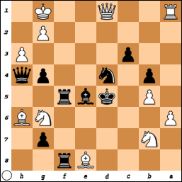

FEN: 4Br2/1N4p1/P5NB/1P1kbr2/1p1n2pq/2p4P/6P1/R2Q2K1 b - - 0 1

You're going to lose your queen. The question is when and how. Do you lose your 
queen to the knight on g6 on your way to a loss? Or do you lose her a couple of 
moves later on your way to a win?

There is only one good move for you here. Any other move you make will lose you 
the game. You have to put your opponent in check right now, because if you 
don't, your opponent will put you in check and soon checkmate.

*x* + 1. ... Qf2+

*x* + 2. Kh1

Of course that's the only possible move for your opponent. And then you bite the 
bullet and sacrifice your queen and one of your rooks.

*x* + 2. ... Qf1+

*x* + 3. Qxf1 Rxf1+

*x* + 4. Rxf1 Rxf1# 0-1

### Sometimes you have to sacrifice your queen

Because the queen is such a powerful piece, most players don't like to sacrifice 
their queen. One sure sign of poor sportsmanship in chess is when your opponent 
taunts you after capturing your queen, saying things like "You won't be needing 
that."

But if it wins you the game, it's certainly worthwhile to sacrifice your queen. 
For example:

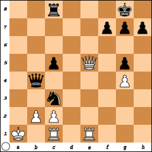

If you're playing White, you need to move your queen to the last rank, even 
though your opponent will certainly capture your queen with their rook. And 
if you're playing Black, you hope your opponent doesn't do that.

You have to be willing to sacrifice your queen, but you also have to choose the 
right time for that. Hence this puzzle, White to play:

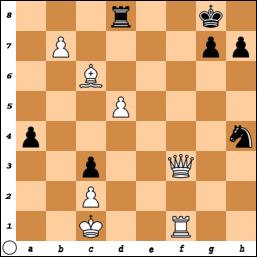

You can win this one without sacrificing your queen, and even getting a second 
queen, but it'll probably take you seven moves, maybe more.

Let's say for your next move, you decide to promote that pawn to a queen, even 
though you have no way to protect the new queen before you can get her to a good 
position. Maybe your opponent won't capture your new queen, but...

*x* + 1. b8=Q h6

As soon as the opponent king goes to the seventh rank, you know it's going to 
take more effort than you would've liked.

*x* + 2. Qxd8+ Kh7

*x* + 3. Qxh4 a3

*x* + 4. e5 Kg8

*x* + 5. Qd5+ Kh7

*x* + 6. Qde4+ g6

*x* + 7. Rf7+ Kg8

*x* + 8. Qxg6+ Kh8

*x* + 9. Qhxh6# 1-0

Moving your original queen to the back rank would be the wrong lesson to learn 
here. You can still win, but it'll probably take twenty-odd moves.

*x* + 1. Qf8+ Rxf8

*x* + 2. Rxf8+ Kxf8

You get the idea.

But the correct answer to this puzzle is first to move your queen to f7, where 
she can threaten the opponent king without immediate risk of capture.

*x* + 1. Qf7+ Kh8

With the king forced into the corner, you can sacrifice your queen and then move 
in your rook for the checkmate.

*x* + 2. Qf8+ Rxf8

*x* + 3. Rxf8# 1-0

### Put your queen close if you can back her up

Black to play: checkmate is just one move away. Remember: the opponent king can 
capture one of your pieces, unless he'd get captured that way. Hint: move your 
queen to b7. 

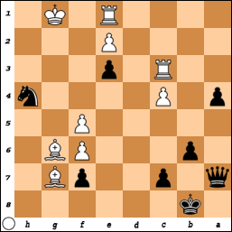

Your opponent might figure out what you're trying to do, and they have a 
definite numerical advantage of "officer" pieces, but they're all currently 
blocked.

This next puzzle has a little more context before the moment of putting your 
queen close to your opponent's king. This is not a proper puzzle in that it has 
two solutions, but the two solutions are the same idea of putting your queen 
very close to your opponent's king because she's supported by another piece, a 
bishop this time.

Black has just played Kg7 to dodge a check from one of White's knights. Not the 
best move Black could have made, but that's not the point of this puzzle. White 
to play:

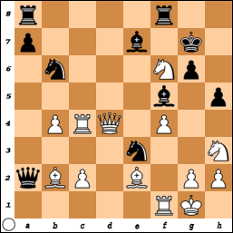

FEN: r4r2/p3b1k1/1n3Np1/5b1p/1PRQ1P2/4n2N/qBP1B1PP/5RK1 w - - 1 29

This is one of those where the first move in the puzzle is quite obvious: Nxf6+, 
move a knight so your queen can threaten your opponent's king. It doesn't matter 
that both of your knights can be captured, because Black's priority is getting 
out of check. The best move for Black would be Kf7, but Black blunders yet again 
with Kg8, Kh7 or Kh6. There's one move that works for all three of those, and an 
extra option if Black plays Kg8.

Here's a somewhat easier puzzle to illustrate that concept. Black to play:

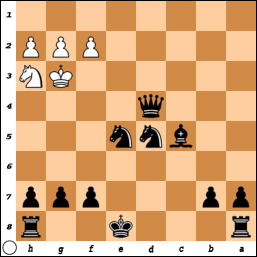

Another Black to play puzzle to illustrate this concept: your opponent has just 
moved their knight to h3, thwarting your plan to capture the rook on g1 and put 
your opponent in check.

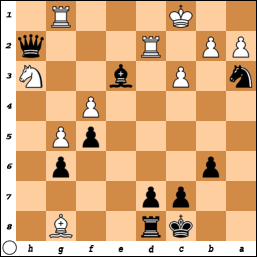

My first instinct in this situation is to instead use my bishop to capture the 
rook on d2. Even against a very strong player, I can win in 25 moves. But there 
is a much better move here. Can you figure it out?

### Watch out for the opponent's remaining material...

I was playing one of the easy bots on a popular chess website. I was playing 
White, the bot was playing Black. I had captured all of the bot's rooks, knights 
and bishops, but not the queen, though I sure had tried.

I sacrificed both bishops trying to capture the opponent queen, in gambits that 
just didn't pay off. As for my knights, I think I just blundered them away.

Now I had an advantage of 11 "points," and the opportunity for a queen and rook 
checkmate. But that was by no means guaranteed, because if blundered my queen or 
rook in the path of the opponent queen, the bot could seize an advantage.

White to play. Black has just played 40. ... Kg8, the only valid move in 
response to the latest check. 

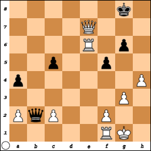

FEN: 6k1/4Q3/4R1p1/2p2p2/p6P/6P1/PqP2P2/5RK1 w - - 2 41

There are at least two correct solutions to this puzzle. Checkmate can be 
achieved in three moves but not any fewer than that. One solution continues 
thus:

 41. Rxg6+ Kh8

If you then move your queen to file g, you might as well resign, because your 
opponent will almost certainly seize on the opportunity created by your blunder.

 42. Qg7+ Qxg7

Ouch. You should've played

 42. Qd8+

or

 42. Qe8+

or 

 42. Qf8+

instead. None of those is checkmate because the opponent king can escape to h7. 
But then you should be able to checkmate on the very next move, ending the game 
transcript at line 43 (if your solution has a win at line 44, rewind to 42 and 
look for the better move).

Rewinding to 40, we see that

 41. Qe8+

is also a solution that can lead to a win at line 43. The opponent king still 
has to escape to h7, and the opponent pawn on g6 still gets captured.

In terms of points, the solutions are the same: you end up with an advantage of 
12 points and the game transcript ends at line 43. But maybe if we did a 
centipawn analysis we might find that one solution ends up with slightly more 
than 1200 centipawns and the other with slightly fewer than 1200.

But maybe this second solution can be considered better, without doing the 
centipawn analysis, because there's less risk of blundering your queen away.

### ... but remember that the points don't matter in a stalemate

Black has just obtained a new queen knowing full well that she can be captured 
two different ways. White to play:

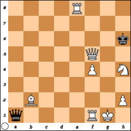

FEN: 4R3/8/7k/5Q2/5P1N/8/1B5P/q4RK1 w - - 0 57

But replacing a lost queen wasn't the point of Black's desperate promotion. The 
point was to distract White. By capturing Black's new queen, White has a 
material advantage of 27 points.

But White has also made the colossal blunder of leaving Black's king safe in his 
square with nowhere to go. Which is to say this is a stalemate. White has 
squandered away a victory with an advantage of 18 points for a stalemate with an 
essentially worthless advantage of 27 points.

What should White have played here instead? There are at least two very good 
options for immediate checkmate, and decent options for checkmate in two or 
three moves. You can figure out one of the two very good options by remembering 
the lesson of putting your queen close when you can.

### Take advantage of pinned pawns

White to play. Black has just played Nd3, to avoid capture by your pawn on a3.

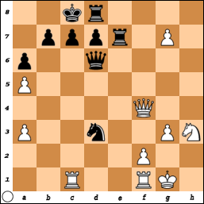

FEN: 2kr4/1pppr1P1/p2q4/P7/5Q2/P2n2PN/5P2/2R2RK1 w - - 0 1

You've been wanting to break through Black's pawn shield. And that queen is a 
big obstacle. You could use your queen to capture the opponent queen. But why 
hasn't your opponent captured your queen? Because she would be captured by your 
pawn on g3. A similar consideration has stopped you from capturing the opponent 
queen before.

But there's a big difference between your situation and your opponent's 
situation: you're free to move the pawn in front of your king to a different 
file. And you have a rook pointed at the pawn in front of the opponent king. You 
can capture the opponent queen with your queen without fear of loss because the 
black pawn on c7 is stuck there as long as the opponent king is on c8.

So the best move here is to capture the opponent queen. Checkmate is not 
guaranteed from this point, but any other move is likelier to end in your 
defeat.

Moral of the story: Remember that a pinned pawn is unable to capture.

### Don't forget about your bishop

Black to play. White just moved a knight closer to the Black king in a risky 
attempt to move that king to a file on which the White rook can attack. But the 
obvious move for Black here is to use a rook to deliver a check. Then White's 
only option is to block with their rook.

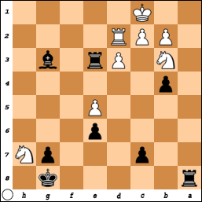

*x* + 1. Nh7 Re1+

*x* + 2. Rd1 ...

Here's where the puzzle gets interesting. Under the pressure of a timer, I would 
probably capture that rook, putting the opponent king in check immediately. But 
against a skilled opponent, or a program on a medium or hard setting, it would 
put me on a path to concede the game.

Getting distracted by the enemy knight close to your king would also be a 
mistake. The best move here is to bring your bishop into the action:

*x* + 2. Rd1 Bf4+

Then capturing your rook is not an option, and it doesn't matter if the opponent 
king responds to the check by retreating,

*x* + 3. Kb1 Rxd1+

*x* + 4. Nc1 Rxc1# 0-1

or by blocking with their closer knight,

*x* + 3. Nd2 Ra1# 0-1

the result is the same, the opponent king is trapped.

White to play. This is from a game I played against a bot. I started with the 
K&aacute;das opening. I got to this point where checkmate was within my reach, 
but my pieces were positioned just too awkwardly.

32. Qc8+ Kb6 
33. Qxa6+ Kc7
34. Ra7+ Kd6 
35. Bf4+ e5 
36. Bh6 b3 
37. cxb3 Kc5 
38. bxa4 e4

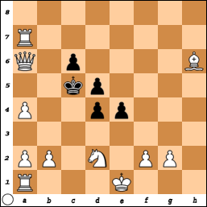

I had the option of a queenside castling, but that doesn't get my queenside rook 
where I want it, on file c, to threaten the opponent king. Why not just move 
that rook to c1? Then I got sidetracked by I don't remember what, and since I 
wasn't playing against a human being, I could leave them hanging for a long 
time.

When I got back to the game, I couldn't quite recall my thinking before the 
distraction. That was for the better, I had been overthinking the position. 
Almost unthinkingly, I made a move and it was checkmate. Can you figure it out, 
or will you also fall into the trap of thinking too hard about how to get your 
queen or a rook to confront the opponent king?

Another White to play puzzle. I wanted to move my rook to my opponent's home 
row, but my opponent had a pesky bishop defended by a pawn. I don't like to lose 
pieces to pawns. I failed to notice a better way, see if you can spot it:

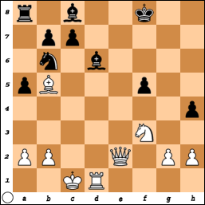

It wouldn't have been checkmate, but it would've put me closer than what I 
actually did, which was to bring the knight closer.

### Promote pawns

Some puzzles are about knowing when to race a pawn to promotion, with the 
opponent king not far behind.

In such a puzzle, usually any promotion completes the puzzle, because then 
checkmate is only a few moves away. The opponent might as well concede.

And there are also puzzles in which you can promote your pawn immediately, but 
you have to take care of something else before you can promote your pawn ''and'' 
actually get to use your new queen.

White to play. Move your pawn on d7 to d8 right away and you fail the puzzle, 
because the Black rook will take your new queen.

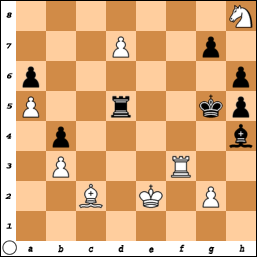

Instead, you need to distract that rook so that you can promote your pawn and 
not have it captured immediately. The best way to do that is to put the opponent 
king in check. You'll probably lose your rook, but that's worth it for checkmate 
in five moves.

*x* + 1. Rf5+ Rxf5 

*x* + 2. d8=Q+ Rf6 

*x* + 3. Qd5+ Rf5 

*x* + 4. Nf7+ Kf4 

*x* + 5. g3+ Bxg3 

*x* + 6. Qd4# 1-0

Your opponent might instead decide to move their king out of check, in which 
case you can capture their rook.

*x* + 1. Rf5+ Kg4 

*x* + 2. Rxd5 g6 

But watch out, you can't promote your pawn yet because your opponent's bishop 
now has a clear path to capture it. Checkmate's still within reach, but with 
more moves to go, your opponent might try to cause a stalemate or get you to 
repeat moves to draw by repetition.

*x* + 3. Nxg6 Kg3 

*x* + 4. Nxh4 Kg4 

*x* + 5. d8=Q Kf4 

*x* + 6. Ng6+ Kg4 

*x* + 7. Qd7+ Kg3 

*x* + 8. Qd6+ Kg4 

*x* + 9. Qe6+ Kg3 

*x* + 10. Qe5+ Kg4 

*x* + 11. Qf4# 1-0

A very good player might decide to concede rather than try for a draw. A program
on a hard setting will make you work the checkmate, and you'll have to take care 
to avoid a stalemate.

*x* + 1. Rf5+ Kg4 

*x* + 2. Rxd5 Kg3 

*x* + 3. Ng6 Bd8 

*x* + 4. Ne5 Kxg2 

*x* + 5. Nd3 h4 

*x* + 6. Nxb4 h3 

*x* + 7. Nxa6 Kh2 

*x* + 8. Nb8 Kg3 

*x* + 9. a6 h2 

*x* + 10. Rd1 Be7 

*x* + 11. a7 g5 

*x* + 12. a8=Q g4 

*x* + 13. Qa3 Bxa3 

*x* + 14. d8=Q Kh3 

*x* + 15. Bf5 Bd6 

*x* + 16. Bxg4+ Kxg4 

*x* + 17. Qxd6 Kf5 

*x* + 18. Qd5+ Kf6 

*x* + 19. Nd7+ Kg7 

*x* + 20. Qe5+ Kh7 

*x* + 21. Nf6+ Kg6 

*x* + 22. Ng4 h5 

*x* + 23. Nxh2 h4 

*x* + 24. Rd6+ Kf7 

*x* + 25. Qe6+ Kf8 

*x* + 26. Rd8+ Kg7 

*x* + 27. Rd7+ Kh8 

*x* + 28. Qe8# 1-0

#### Prevent opponent's pawn promotion

White to play. You have a pawn close to promotion. But your opponent has a pawn even closer to promotion. As you well know, you can't move two of your own pieces at a time (except in the case of castling, which doesn't apply here).

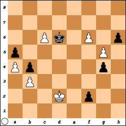

FINISH WRITING

### All capture targets are potentially high value

White to play. You have one knight that you have managed to put in a position to 
capture your opponent's queen. That's what you've been trying to do. You put one 
of your rooks on c5. For some strange reason, your opponent moved their queen to 
b4 when they should've used their dark squares bishop to capture that rook. Now 
you have a choice of which of four pieces to capture.

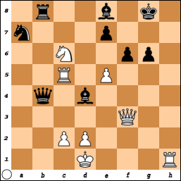

FEN: 1r2b1k1/n3p3/2N2pp1/2R1P3/1q1b4/5Q2/2PP4/3K3R w - - 0 1

So, should you capture the queen, the rook, the knight or the pawn? Actually, 
capturing the queen might be the worst move you can make here, especially if 
you're playing against a stronger opponent. The best move is to capture the 
humble, lowly pawn. Then you'll be at most ten moves away from checkmate.

Here's one way that could play out:

*x* + 1. Nxe7+ Kf8
*x* + 2. Qxf6+ Kf7
*x* + 3. Nxg6+ Ke8
*x* + 4. Rh8+ Bg8
*x* + 5. Qe6+ Kd8
*x* + 6. Qd5+ Ke8
*x* + 7. Qe6+ Kd8
*x* + 8. Qd5+ Ke8

Uh oh, you better close the deal somehow or your opponent will get draw by 
threefold repetition.

*x* + 9. Rxg8# 1-0

Even so, capturing the pawn at the beginning of this puzzle is still the best 
option. But you might be able to win even more quickly, depending on how your 
opponent tries to postpone the inevitable.

*x* + 1. Nxe7+ Kf7
*x* + 2. Rh7+ Kf8
*x* + 3. Rh8+ Kf7
*x* + 4. Qd5+ Kg7
*x* + 5. Qg8# 1-0

If you capture the pawn on f6, you can win even more quickly if your opponent 
responds by having the bishop intercede.

*x* + 1. Nxe7+ Kf8
*x* + 2. Qxf6+ Bf7
*x* + 3. Rh8# 1-0

Your quickest path to victory is if your opponent plays Kg7.

*x* + 1. Nxe7+ Kg7
*x* + 2. Qxf6# 1-0

### Sometimes an ordinary pawn can do the trick

Sometimes you have lots of options to deliver a check, and they're all bad. 
White to play:

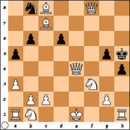

Obviously your dark squares bishop is not very useful here, and capturing the 
Black pawn on d6 might give the opponent king an opportunity to wiggle out of 
the tough spot he's in.

Move your original queen (the one on e4, I'm very sure that's the one from the 
beginning of the game) to h4 and she's protected by your knight on f3, but she's 
only protected from capture by the opponent king, but not from capture by the 
opponent pawn on g5.

Instead move your original queen to g4, where she's protected by your light 
squares bishop, but the opponent king can just elude the check by moving to g6. 
However, you can then obtain checkmate with your light squares bishop. Checkmate 
int two moves is very good, but we can actually do better here.

Sacrifing your rook for a pawn might look like the least appealing option here, 
but then your light squares bishop can swoop in for the win. Actually, if you 
move your light squares bishop to g4 as your first move on this puzzle, it 
should be counted as a correct solution, because that's checkmate.

Okay, so this is not such a good example of having no good options for check 
with the "officer" pieces.

In this particular puzzle, however, the most elegant solution is to move your 
pawn on g2 to g4.

Here's another White to play puzzle in which there are multiple options for 
checkmate, but in this one only one is the best option.

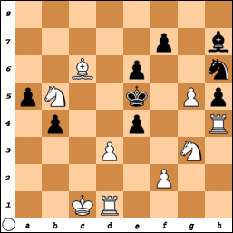

The pawn on g5 needs too much work to get promoted. You could move your kingside 
bishop's pawn to f4, but then your opponent can capture it en passant. That's 
just the beginning of your troubles.

*x* + 1. f4+ exf3 

*x* + 2. Re1+ Be4 

*x* + 3. Nxe4 Ng4 

*x* + 4. Ng3+ Kf4 

*x* + 5. Re4+ Kxg3 

*x* + 6. Rhxg4+ hxg4 

*x* + 7. Nd4 f2 

*x* + 8. Bb5 f1=Q+ 

*x* + 9. Kd2 Kh4 

*x* + 10. Ne2 b3 

*x* + 11. d4 b2 

*x* + 12. Nc3 Qc1+ 

*x* + 13. Kd3 b1=B+ 

*x* + 14. Nxb1 Qxb1+

Your opponent promoted a pawn to a bishop? Your opponent is taunting you now. 
You should've resigned on the previous promotion, if not earlier.

What about your rook? 

*x* + 1. Rxe4+ ...

But your opponent has that light squares bishop...

*x* + 1. ... Bxe4

The whole thing just goes downhill from there. The best you can hope for is a 
draw, after an internecine battle that leaves your opponent with just their king 
and a knight, and you with only your knight.

The correct solution to this puzzle is to move your queen's pawn to d4. 
Checkmate. Your opponent has a knight, a bishop and almost all their pawns, but 
none of those pieces do the opponent king any good.

By the way, this game probably started with a king's pawn opening, and both 
sides got their queens going early and lost their queens early. Bonus puzzle: 
figure out the likeliest sequence of moves to get to the position shown above.

### Avoiding stalemates

I don't like to lose, but it happens, when my opponent is simply more skilled at 
the game than I am. But I really don't like stalemates, especially if I could 
have won if only I hadn't made the boneheaded move that stalled the game.

I haven't seen any puzzles about stalemates, and usually when I get a stalemate 
I'm too annoyed to record the position. So I contrived a potential stalemate 
situation. In this situation, White has a pawn on rank 7 that can be promoted to 
a queen.

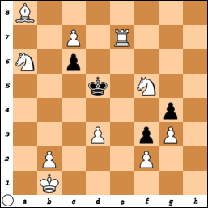

But that would be the worst possible move for White to make, since it would mean 
stalemate. Black has pawns, but one of them is pinned by White's bishop, and the 
other two are hopelessly stymied by White pawns. The Black king is oddly safe 
only in the square he currently occupies, any move whatsoever means capture. 
Hence stalemate.

The best option for White is to move either knight to put the opponent king in 
check. Here *x* stands for however many moves had been made that led up to 
this position.

*x* + 1. Ne3+ Kd4
*x* + 2. Kc2 ...

It's not stalemate, because the pawn that protected the Black king from the 
White bishop is no longer pinned.

*x* + 2. ... c5
*x* + 3. Nf5# 1-0

Or what if instead the king escapes towards the edge of the board?

*x* + 1. Ne3+ Kd6
*x* + 2. c8=N# 1-0

Promoting to a knight delivers checkmate. Who would've thunk it?

Moving the other knight (presumably an original knight rather than a promotion) 
is good, too, but checkmate takes just a little more work.

*x* + 1. Nb4+ Kc5

*x* + 2. c8=Q Kb5

*x* + 3. Qxc6+ Kxb4

*x* + 4. Re4+ Ka5

*x* + 5. Ra4# 1-0

There are also situations in which you have to underpromote to a rook or a 
bishop to avoid stalemate. This next puzzle is White to play.

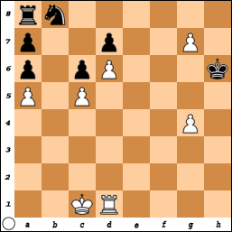

You should promote the pawn on g7, before your opponent can capture it, because 
most of your other pawns are currently stymied, and the one that can still move 
is too far away.

But if you promote it to a queen, that's a stalemate: the opponent king is safe 
where he is, but he can't move, and the rest of your opponent pieces are stymied 
either by each other or by your pawns.

Underpromoting to a knight gives an immediate check, but you'll really have to 
work for a checkmate. With a new rook, checkmate will still be tricky, but more 
manageable.

There's also a puzzle here for Black. Capturing a single White pawn is enough 
for Black to start unblocking the stymied pieces, but only the Black king can do 
that, and he must also fend off checks.

Here's another White to play puzzle in which promoting to a queen would also 
cause a stalemate. You don't *have* to capture the opponent queen, and you also 
have the option of capturing her with your knight.

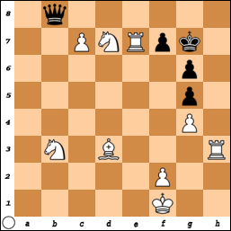

Still, most players wouldn't pass up the opportunity to deprive their opponent 
of their queen, especially if said opponent took your queen earlier on. But in 
this case you can't get another queen to replace the one you lost earlier, nor 
can you get a third rook, without stalling the game.

The most straightforward option to checkmate here is with a bishop. Black's 
options are very limited, and you can get checkmate in, at most, four moves. 
Upon obtaining your new bishop, your opponent's only move is to move their king 
back to the home row, because the pawn on f7 is pinned by your rook on e7.

*x* + 1. cxb8=B Kg8

*x* + 2. Be5 f6

*x* + 3. Bc4# 1-0

Trying to capture your pawn on g4 is just as hopeless.

*x* + 1. cxb8=B Kg8

*x* + 2. Be5 f5

*x* + 3. Bc4# 1-0

In this scenario, you can also achieve checkmate with a third knight, but it's 
going to take more than four moves. More moves means more opportunities for your 
opponent to try to get a stalemate.

*x* + 1. cxb8=N Kg8

*x* + 2. Nf6+ Kf8

*x* + 3. Nc6 Kg7

*x* + 4. Rh7+ Kxf6

*x* + 5. Rexf7+ Ke6

*x* + 6. Ncd4+ Ke5

*x* + 7. Re7+ Kd5

*x* + 8. Be4+ Kc4

*x* + 9. Rc7+ Kb4

*x* + 10. Rb7+ Kc3

*x* + 11. Rhc7+ Kb2

*x* + 12. Nd2+ Ka3

*x* + 13. Nb1+ Ka4

*x* + 14. Ra7+ Kb4

*x* + 15. Nc2+ Kb5

*x* + 16. Bd3+ Kb6

*x* + 17. Rab7+ Ka5

*x* + 18. Rc8 Ka4

*x* + 19. Ra8# 1-0

More recently I did take down the game transcript of a stalemated game and 
restarted from just prior to my crucial mistake, though of course I had made 
plenty of mistakes prior to that point, as even the excerpt below will show.

 45. Qf4?! b2
 46. Qe3 c1=Q
 47. Qxc1 bxc1=Q
 48. Kxh3 Qe3+
 49. Kh2 Qf4+
 50. Kg1 ...
 
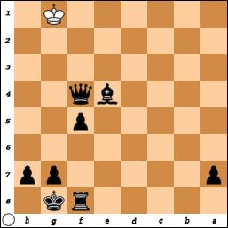 
 
 50. ... Rf6 1/2-1/2

Oh, damn it. If only I had done anything other than move that rook. So I deleted 
that disastrous move from the transcript

 50. Kg1 ...

and restarted from there. That's the puzzle, Black to play. The correct answer 
is any move that doesn't cause a stalemate.

 50. Kg1 Bd3

I back my bishop off so that my opponent has at least one move to make.

 51. Kh1 Qf1+
 52. Kh2 Qf2+
 53. Kh3 Bf1# 0-1

Stockfish comes up with an even better solution:

 50. Kg1 Qg3+
 51. Kf1 Bd3# 0-1

A lone opponent king is the likeliest scenario for a potential stalemate, and 
it's also the most disappointing way to not win, in my opinion.

Here's another recent game stalled game of mine. With this one I had also made 
my share of mistakes and blunders prior to crucial mistake. So did my opponent.

 36. Qd4?! Kdg8?!
 37. Qxd7 f6
 38. Bd4 Kh7
 39. Bxb6 f5
 40. a4 h5
 41. a5 h4
 42. Nxh4 f4
 43. Bd4 Kh6 
 44. Qxg7+ Kh5

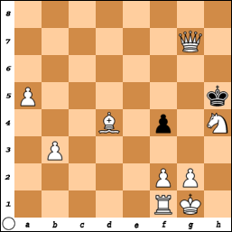 

 45. Nf3?? 1/2-1/2

Ouch.

Rewind to 44. Qxg7+ Kh5. White play. Correct move is anything but Nf3.

Notice how the knight on h4 can protect the queen if she moves to g6. I thought 
about making that move, but stupidly I played Nf3. If instead I had moved the 
queen, I probably would've won.

 45. Qg6+ Kxh4
 46. Bf6# 1-0

Stockfish as White does the same.

### Pinned pieces can still help against the opponent

Sometimes a pinned piece can prevent you from making what would in any case be a 
bad move. For example, in this White to play puzzle, you might immediately 
assume it's one of those puzzles where you sacrifice a rook to one of your 
opponent's rooks in order to corner the opponent king.

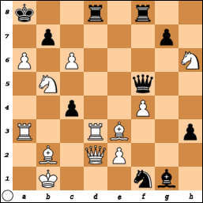

FEN: k2r1r2/1p4p1/P1P4N/1N3q2/2p2P2/R2RB2p/1B1QP3/1K3nb1 w - - 0 1

But in this puzzle you actually can't play Rxd8+, because that rook is 
protecting your king from your opponent's queen. The correct move involves your 
other rook, but without moving it just yet.

To throw you off from the correct answer, we might say that the move immediately 
prior to the board shown above was one of Black's pawns inching a bit closer to 
promotion.

### Best defense against a queen capture might be a double check

Given how powerful the queen is, you don't want to lose her if the sacrifice is 
not absolutely necessary. White to play.

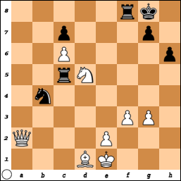

FEN: 5rk1/2p3p1/2P4p/2rN4/1n6/5PP1/Q3P3/3BK3 w - - 0 1

You might be tempted to play Nxb4+, which seems like a good move at the moment, 
but if your opponent is a much better player than you are, the best outcome for 
you might be a twenty-odd move stalemate. There's a better move with which you 
can win in less than twenty moves even against a stronger opponent.

### Resign gracefully, but not prematurely

It's good sportsmanship to resign a chess game when it's clear that you can't 
win. However, even in the face of your opponent's obvious numerical advantage, 
even if you've lost your queen, it's not always clear that you can't possibly 
win. In fact, you might be able to eke out a surprising win if you have some 
pieces in the right places.

In this next one, White has just played Rb8+, putting Black in check. Black to 
play.

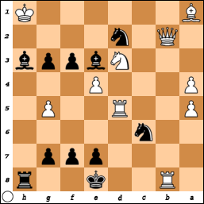

FEN: 1R2k2r/4ppp1/2n5/P2R2P1/P3P3/3Nbppb/1Q1n4/B6K b - - 0 1

If you're playing Black, you might be thinking about resigning. If you play 
Nxb8, you're just delaying the inevitable, right? Eventually that queen and rook 
are going to trap you on your home row, is what it looks like.

If you do play Nxb8, you still have a subtle advantage that you can use for 
checkmate in forty or so. But actually, there's a much, much quicker checkmate 
here.

## Opening puzzles

If I've ever seen an opening puzzle, I don't remember.

[FINISH WRITING]

## Middlegame puzzles

In my opinion, the most satisfying win happens in the thick of the middlegame. 
If you beat your opponent soon after the opening, it just means they made some 
serious blunders early on. And if you beat them in an endgame in which they ran 
you all over the board when they should've conceded earlier, that takes the edge 
off your win.

But to identify an opportunity for checkmate with so many of their pieces and 
your own pieces in the way, and to see it through, that might mean you're a very 
good player.

For example, in this game, the middlegame was already underway.

1. c3 b6 
2. d4 Bb7 
3. Bf4 Bc6?! 
4. Qd3 Nf6 
5. e4?? Bxe4 
6. Qe3 h6?! 
7. Bd3?? Bd5?? 
8. Nh3?? Bxg2 
9. Rg1 h5?? 
10. Ng5?? Nd5?? 
11. Qe5?! f6

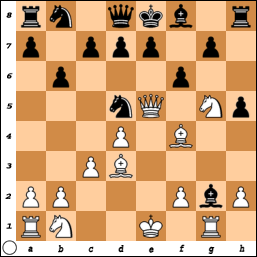

White to play. Your queen is in danger of capture. But if you move your queen, 
that's a fail on this puzzle. I played Qf5 and the game dragged on for sixty-odd 
more moves. I still won, but I could've won a lot sooner if I had tried to give 
a check at this point, rather than blunder on to a perilous endgame.

However, even with my move of Qf5, I still had another opportunity to win, 
because my opponent failed to eliminate a vulnerability.

12. Qf5 Nxf4?

You want to protect your queen, but you also have to be willing to risk her at 
the right time.

13. Qg6+ Nxg6
14. Bxg6# 1-0

Be open to such possibilities. Most middlegame puzzles, however, are about 
gaining advantages that will pay off in the endgame.

For example, if you can deprive your opponent of their queen early on, and keep 
your own queen, you're in better shape for the endgame.

White to play. You've been trying to get your kingside knight to f7, to be able 
to capture either your opponent's unmoved queen or unmoved kingside rook.

It's a technique that's worked for you in the past. There's always the risk that 
your opponent will use their king to capture your knight, but then they forfeit 
the right to castle. However, against this particular opponent that would be a 
mistake.

To get your knight to f7, that piece needs to go to g5 first. But on this 
particular board, the opponent queen can capture your knight first. But... 
you've got your dark squares bishop ready to capture that queen. But... is your 
opponent going to take the bait? More likely they'll move a pawn to give the 
queen more freedom of movement.

The correct solution here is to immediately your opponent's queen with your dark 
squares bishop.

I understand that you don't want to lose your queen, but remember: getting the 
king out of check takes precedence over saving the queen. It's okay to expose 
your queen to capture if you put the opponent king in a bind such that capturing 
your queen is not a viable option.

This Black to play puzzle illustrates that:

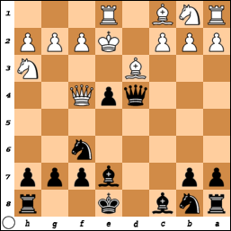

The correct solution here is for you to use your pawn to capture the White 
bishop, putting the White king in check. Your queen is exposed to capture, but 
your opponent can't act on that before getting their king out of danger.

If your queen is under threat of capture, threatening the opponent king is 
sometimes the best way to protect your queen. From the previous scenario, 
suppose you chose not to execute the solution of the previous puzzle, and 
instead tried to capture the opponent queen. But then your opponent brought in 
the other bishop to threaten your queen. Black to play:

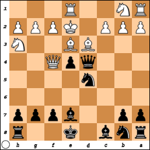

You should go ahead with your planned queen capture, because that has the added 
bonus of putting the opponent king in check.

### Breaking through a pawn shield

You can have a definitive material advantage over your opponent, but if the 
opponent king is shielded well enough, the path to checkmate might be very 
unclear. Let's say you just put your opponent in check with a pawn and they 
evaded that simply by moving the king.

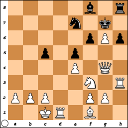

FEN: 5b1r/4n1k1/5pPp/2p1p3/4P1Q1/5N1R/PPP2PP1/2KR1B2 w - - 0 1

Okay, now what? White to play. You could play Bc4, but what does that get you? [FINISH WRITING]

26. Qe6

The hope here is that your opponent will maybe try to get the pawn on c5 closer to promotion so that then you can play Qf7+ and hopefully checkmate onr or two moves later. But the smart move would be 

26. ... Nxg6

thus thwarting your planned checkmate. Still, you can get to checkmate from here in twenty moves or less by gradually knocking out your opponent's remaining pieces.

### Checkmate in so many moves

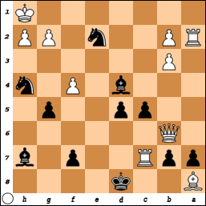

Black to play. First thing you want to do is deprive White of their queen.

*x* + 1. ... axb6

*x* + 2. f5 Bxf5

*x* + 3. Rxf7 Be4

*x* + 4. Rf8+ Ke7

*x* + 5. Rf3 Nxf3

*x* + 6. Ra7 Ne1

*x* + 7. Rxb7+ Kf6

*x* + 8. Rxb6+ Kf5

*x* + 9. Bxd5 Bxd5

*x* + 10. Rf6+ Kxf6

*x* + 11. h3 Bxg2+

*x* + 12. Kh2 Be5#

[FINISH WRITING]

### Ignore a promoted queen

White to play. Black has just gotten a new queen by playing c1 = Q.

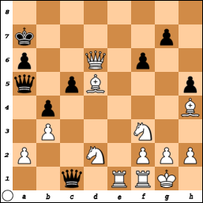

FEN: 8/k5p1/p2Q1p2/q1pB3p/1p5B/1P3N2/P2N1PPP/2q1RRK1 w - - 0 31

Normally, if your opponent promotes a pawn and you have the means to capture the 
promoted piece, you probably should. But not always. Sometimes it might be best 
to ignore that promoted piece. Like in this scenario.

 31. Re7+ Qc7
 32. Qxc7#

You can probably still win if you do capture that new queen, but most likely it 
will take longer.

 31. Rxc1 Qd8
 32. Qxd8 a5
 33. Qc7+ Ka6
 34. Bb7+ Ka7
 35. Bc6+ Ka6
 36. Qb7#

## Unlikely scenarios

[FINISH WRITING]

### Castling leads to checkmate

[FINISH WRITING]

### En passant leads to checkmate

White moves their pawn on e2 two spaces forward to e4. Black to play. Either 
invoke the en passant rule and get an immediate checkmate, or play anything else 
and give your opponent an opportunity to put you on the run.

[FINISH WRITING]

As I remember that the king's pawn opening is the most popular chess opening, I 
realize that makes this scenario even more unlikely. Also, White moving their 
pawn only one space forward would've led to the same outcome.

[FINISH WRITING]
