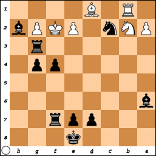

# Puzzles

A puzzle is a chess position from a game in progress, in which the reader is 
asked to figure out the best next few moves for one side. Almost all puzzles are 
designated as "White to play" or "Black to play."

In many cases, a little context is provided by showing one move prior to the 
puzzle situation. Sometimes this might indicate that a special move, like 
castling, is off the table, or that a special move, like en passant, is an 
option. Just as easily the prior move could be chosen to distract you from the 
solution.

Puzzles help beginners learn the tactics of the game. I think they can also be 
useful for testing how good a chess program is at strategy more than one move 
ahead.

## Endgame puzzles

In my opinion, endgame puzzles are the easiest. Sure we can put in some stymied 
pawns to hide the solution, but the goal is almost always quite plain: put the 
opponent king in check, if not checkmate.

One classic endgame puzzle teaches that sometimes you have to sacrifice your 
queen to get the checkmate. For example:

If you're playing White, you need to move your queen to the last rank, even 
though your opponent will certainly capture your queen with their rook. And 
if you're playing Black, you hope your opponent doesn't do that.

### Put your queen close if you can back her up

Black to play: checkmate is just one move away. Remember: the opponent king can 
capture one of your pieces, unless he'd get captured that way. Hint: move your 
queen to b7. 

Your opponent might figure out what you're trying to do, and they have a 
definite numerical advantage of "officer" pieces, but they're all currently 
blocked.

Here's a somewhat easier puzzle to illustrate that concept. Black to play:

### Don't forget about your bishop

Black to play. White just moved a knight closer to the Black king in a risky 
attempt to move that king to a file on which the White rook can attack. But the 
obvious move for Black here is to use a rook to deliver a check. Then White's 
only option is to block with their rook.

*x* + 1. Nh7 Re1+

*x* + 2. Rd1 ...

Here's where the puzzle gets interesting. Under the pressure of a timer, I would 
probably capture that rook, putting the opponent king in check immediately. But 
against a skilled opponent, or a program on a medium or hard setting, it would 
put me on a path to concede the game.

Getting distracted by the enemy knight close to your king would also be a 
mistake. The best move here is to bring your bishop into the action:

*x* + 2. Rd1 Bf4+

Then capturing your rook is not an option, and it doesn't matter if the opponent 
king responds to the check by retreating,

*x* + 3. Kb1 Rxd1+

*x* + 4. Nc1 Rxc1# 0-1

or by blocking with their closer knight,

*x* + 3. Nd2 Ra1# 0-1

the result is the same, the opponent king is trapped.

White to play. This is from a game I played against a bot. I started with the 
K&aacute;das opening. I got to this point where checkmate was within my reach, 
but my pieces were positioned just too awkwardly.

32. Qc8+ Kb6 
33. Qxa6+ Kc7
34. Ra7+ Kd6 
35. Bf4+ e5 
36. Bh6 b3 
37. cxb3 Kc5 
38. bxa4 e4

I had the option of a queenside castling, but that doesn't get my queenside rook 
where I want it, on file c, to threaten the opponent king. Why not just move 
that rook to c1? Then I got sidetracked by I don't remember what, and since I 
wasn't playing against a human being, I could leave them hanging for a long 
time.

When I got back to the game, I couldn't quite recall my thinking before the 
distraction. That was for the better, I had been overthinking the position. 
Almost unthinkingly, I made a move and it was checkmate. Can you figure it out, 
or will you also fall into the trap of thinking too hard about how to get your 
queen or a rook to confront the opponent king?

Another White to play puzzle. I wanted to move my rook to my opponent's home 
row, but my opponent had a pesky bishop defended by a pawn. I don't like to lose 
pieces to pawns. I failed to notice a better way, see if you can spot it:

It wouldn't have been checkmate, but it would've put me closer than what I 
actually did, which was to bring the knight closer.

### Promote pawns

Some puzzles are about knowing when to race a pawn to promotion, with the 
opponent king not far behind.

In such a puzzle, usually any promotion completes the puzzle, because then 
checkmate is only a few moves away. The opponent might as well concede.

And there are also puzzles in which you can promote your pawn immediately, but 
you have to take care of something else before you can promote your pawn ''and'' 
actually get to use your new queen.

White to play. Move your pawn on d7 to d8 right away and you fail the puzzle, 
because the Black rook will take your new queen.

Instead, you need to distract that rook so that you can promote your pawn and 
not have it captured immediately. The best way to do that is to put the opponent 
king in check. You'll probably lose your rook, but that's worth it for checkmate 
in five moves.

*x* + 1. Rf5+ Rxf5 

*x* + 2. d8=Q+ Rf6 

*x* + 3. Qd5+ Rf5 

*x* + 4. Nf7+ Kf4 

*x* + 5. g3+ Bxg3 

*x* + 6. Qd4# 1-0

Your opponent might instead decide to move their king out of check, in which 
case you can capture their rook.

*x* + 1. Rf5+ Kg4 

*x* + 2. Rxd5 g6 

But watch out, you can't promote your pawn yet because your opponent's bishop 
now has a clear path to capture it. Checkmate's still within reach, but with 
more moves to go, your opponent might try to cause a stalemate or get you to 
repeat moves to draw by repetition.

*x* + 3. Nxg6 Kg3 

*x* + 4. Nxh4 Kg4 

*x* + 5. d8=Q Kf4 

*x* + 6. Ng6+ Kg4 

*x* + 7. Qd7+ Kg3 

*x* + 8. Qd6+ Kg4 

*x* + 9. Qe6+ Kg3 

*x* + 10. Qe5+ Kg4 

*x* + 11. Qf4# 1-0

A really good player might decide to concede rather than try for a draw. A 
program on a hard setting will make you work the checkmate, and you'll have to 
take care to avoid a stalemate.

*x* + 1. Rf5+ Kg4 

*x* + 2. Rxd5 Kg3 

*x* + 3. Ng6 Bd8 

*x* + 4. Ne5 Kxg2 

*x* + 5. Nd3 h4 

*x* + 6. Nxb4 h3 

*x* + 7. Nxa6 Kh2 

*x* + 8. Nb8 Kg3 

*x* + 9. a6 h2 

*x* + 10. Rd1 Be7 

*x* + 11. a7 g5 

*x* + 12. a8=Q g4 

*x* + 13. Qa3 Bxa3 

*x* + 14. d8=Q Kh3 

*x* + 15. Bf5 Bd6 

*x* + 16. Bxg4+ Kxg4 

*x* + 17. Qxd6 Kf5 

*x* + 18. Qd5+ Kf6 

*x* + 19. Nd7+ Kg7 

*x* + 20. Qe5+ Kh7 

*x* + 21. Nf6+ Kg6 

*x* + 22. Ng4 h5 

*x* + 23. Nxh2 h4 

*x* + 24. Rd6+ Kf7 

*x* + 25. Qe6+ Kf8 

*x* + 26. Rd8+ Kg7 

*x* + 27. Rd7+ Kh8 

*x* + 28. Qe8# 1-0

### Sometimes an ordinary pawn can do the trick

Sometimes you have lots of options to deliver a check, and they're all bad. 
White to play:

Obviously your dark squares bishop is not very useful here, and capturing the 
Black pawn on d6 might give the opponent king an opportunity to wiggle out of 
the tough spot he's in.

Move your original queen (the one on e4, I'm very sure that's the one from the 
beginning of the game) to h4 and she's protected by your knight on f3, but she's 
only protected from capture by the opponent king, but not from capture by the 
opponent pawn on g5.

Instead move your original queen to g4, where she's protected by your light 
squares bishop, but the opponent king can just elude the check by moving to g6. 
However, you can then obtain checkmate with your light squares bishop. Checkmate 
int two moves is very good, but we can actually do better here.

Sacrifing your rook for a pawn might look like the least appealing option here, 
but then your light squares bishop can swoop in for the win. Actually, if you 
move your light squares bishop to g4 as your first move on this puzzle, it 
should be counted as a correct solution, because that's checkmate.

Okay, so this is not such a good example of having no good options for check 
with the "officer" pieces.

In this particular puzzle, however, the most elegant solution is to move your 
pawn on g2 to g4.

Here's another White to play puzzle in which there are multiple options for 
checkmate, but in this one only one is the best option.

The pawn on g5 needs too much work to get promoted. You could move your kingside 
bishop's pawn to f4, but then your opponent can capture it en passant. That's 
just the beginning of your troubles.

*x* + 1. f4+ exf3 

*x* + 2. Re1+ Be4 

*x* + 3. Nxe4 Ng4 

*x* + 4. Ng3+ Kf4 

*x* + 5. Re4+ Kxg3 

*x* + 6. Rhxg4+ hxg4 

*x* + 7. Nd4 f2 

*x* + 8. Bb5 f1=Q+ 

*x* + 9. Kd2 Kh4 

*x* + 10. Ne2 b3 

*x* + 11. d4 b2 

*x* + 12. Nc3 Qc1+ 

*x* + 13. Kd3 b1=B+ 

*x* + 14. Nxb1 Qxb1+

Your opponent promoted a pawn to a bishop? Your opponent is taunting you now. 
You should've resigned on the previous promotion, if not earlier.

What about your rook? 

*x* + 1. Rxe4+ ...

But your opponent has that light squares bishop...

*x* + 1. ... Bxe4

The whole thing just goes downhill from there. The best you can hope for is a 
draw, afer an internecine battle that leaves your opponent with just their king 
and a knight, and you with only your knight.

The correct solution to this puzzle is to move your queen's pawn to d4. 
Checkmate. Your opponent has a knight, a bishop and almost all their pawns, but 
none of those pieces do the opponent king any good.

By the way, this game probably started with a king's pawn opening, and both 
sides got their queens going early and lost their queens early. Bonus puzzle: 
figure out the likeliest sequence of moves to get to the position shown above.

### Avoiding stalemates

I don't like to lose, but it happens, when my opponent is simply more skilled at 
the game than I am. But I really don't like stalemates, especially if I could 
have won if only I hadn't made the boneheaded move that stalled the game.

I haven't seen any puzzles about stalemates, and usually when I get a stalemate 
I'm too annoyed to record the position. So I contrived a potential stalemate 
situation. In this situation, White has a pawn on rank 7 that can be promoted to 
a queen.

But that would be the worst possible move for White to make, since it would mean 
stalemate. Black has pawns, but one of them is pinned by White's bishop, and the 
other two are hopelessly stymied by White pawns. The Black king is oddly safe 
only in the square he currently occupies, any move whatsoever means capture. 
Hence stalemate.

The best option for White is to move either knight to put the opponent king in 
check. Here *x* stands for however many moves had been made that led up to 
this position.

*x* + 1. Ne3+ Kd4
*x* + 2. Kc2 ...

It's not stalemate, because the pawn that protected the Black king from the 
White bishop is no longer pinned.

*x* + 2. ... c5
*x* + 3. Nf5# 1-0

Or what if instead the king escapes towards the edge of the board?

*x* + 1. Ne3+ Kd6
*x* + 2. c8=N# 1-0

Promoting to a knight delivers checkmate. Who would've thunk it?

Moving the other knight (presumably an original knight rather than a promotion) 
is good, too, but checkmate takes just a little more work.

*x* + 1. Nb4+ Kc5

*x* + 2. c8=Q Kb5

*x* + 3. Qxc6+ Kxb4

*x* + 4. Re4+ Ka5

*x* + 5. Ra4# 1-0

There are also situations in which you have to underpromote to a rook or a 
bishop to avoid stalemate. This next puzzle is White to play.

You should promote the pawn on g7, before your opponent can capture it, because 
most of your other pawns are currently stymied, and the one that can still move 
is too far away.

But if you promote it to a queen, that's a stalemate: the opponent king is safe 
where he is, but he can't move, and the rest of your opponent pieces are stymied 
either by each other or by your pawns.

Underpromoting to a knight gives an immediate check, but you'll really have to 
work for a checkmate. With a new rook, checkmate will still be tricky, but more 
manageable.

There's also a puzzle here for Black. Capturing a single White pawn is enough 
for Black to start unblocking the stymied pieces, but only the Black king can do 
that, and he must also fend off checks.

Here's another White to play puzzle in which promoting to a queen would also 
cause a stalemate. You don't *have* to capture the opponent queen, and you also 
have the option of capturing her with your knight.

Still, most players wouldn't pass up the opportunity to deprive their opponent 
of their queen, especially if said opponent took your queen earlier on. But in 
this case you can't get another queen to replace the one you lost earlier, nor 
can you get a third rook, without stalling the game.

The most straightforward option to checkmate here is with a bishop. Black's 
options are very limited, and you can get checkmate in, at most, four moves. 
Upon obtaining your new bishop, your opponent's only move is to move their king 
back to the home row, because the pawn on f7 is pinned by your rook on e7.

*x* + 1. cxb8=B Kg8

*x* + 2. Be5 f6

*x* + 3. Bc4# 1-0

Trying to capture your pawn on g4 is just as hopeless.

*x* + 1. cxb8=B Kg8

*x* + 2. Be5 f5

*x* + 3. Bc4# 1-0

In this scenario, you can also achieve checkmate with a third knight, but it's 
going to take more than four moves. More moves means more opportunities for your 
opponent to try to get a stalemate.

*x* + 1. cxb8=N Kg8

*x* + 2. Nf6+ Kf8

*x* + 3. Nc6 Kg7

*x* + 4. Rh7+ Kxf6

*x* + 5. Rexf7+ Ke6

*x* + 6. Ncd4+ Ke5

*x* + 7. Re7+ Kd5

*x* + 8. Be4+ Kc4

*x* + 9. Rc7+ Kb4

*x* + 10. Rb7+ Kc3

*x* + 11. Rhc7+ Kb2

*x* + 12. Nd2+ Ka3

*x* + 13. Nb1+ Ka4

*x* + 14. Ra7+ Kb4

*x* + 15. Nc2+ Kb5

*x* + 16. Bd3+ Kb6

*x* + 17. Rab7+ Ka5

*x* + 18. Rc8 Ka4

*x* + 19. Ra8# 1-0

More recently I did take down the game transcript of a stalemated game and 
restarted from just prior to my crucial mistake, though of course I had made 
plenty of mistakes prior to that point, as even the excerpt below will show.

 45. Qf4?! b2
 46. Qe3 c1=Q
 47. Qxc1 bxc1=Q
 48. Kxh3 Qe3+
 49. Kh2 Qf4+
 50. Kg1 ...
 
 
 
 50. ... Rf6 1/2-1/2

Oh, damn it. If only I had done anything other than move that rook. So I deleted 
that disastrous move from the transcript

 50. Kg1 ...

and restarted from there. That's the puzzle, Black to play. The correct answer 
is any move that doesn't cause a stalemate.

 50. Kg1 Bd3

I back my bishop off so that my opponent has at least one move to make.

 51. Kh1 Qf1+
 52. Kh2 Qf2+
 53. Kh3 Bf1# 0-1

Stockfish comes up with an even better solution:

 50. Kg1 Qg3+
 51. Kf1 Bd3# 0-1

A lone opponent king is the likeliest scenario for a potential stalemate, and 
it's also the most disappointing way to not win, in my opinion.

## Opening puzzles

If I've ever seen an opening puzzle, I don't remember.

[FINISH WRITING]

## Middlegame puzzles

In my opinion, the most satisfying win happens in the thick of the middlegame. 
If you beat your opponent soon after the opening, it just means they made some 
serious blunders early on. And if you beat them in an endgame in which they ran 
you all over the board when they should've conceded earlier, that takes the edge 
off your win.

But to identify an opportunity for checkmate with so many of their pieces and 
your own pieces in the way, and to see it through, that might mean you're a very 
good player.

Be open to such possibilities. Most middlegame puzzles, however, are about 
gaining advantages that will pay off in the endgame.

For example, if you can deprive your opponent of their queen early on, and keep 
your own queen, you're in better shape for the endgame.

White to play. You've been trying to get your kingside knight to f7, to be able to capture either your opponent's unmoved queen or unmoved kingside rook.

It's a technique that's worked for you in the past. There's always the risk that your opponent will use their king to capture your knight, but then they forfeit the right to castle. However, against this particular opponent that would be a mistake.

To get your knight to f7, that piece needs to go to g5 first. But on this particular board, the opponent queen can capture your knight first. But... you've got your dark squares bishop ready to capture that queen. But... is your opponent going to take the bait? More likely they'll move a pawn to give the queen more freedom of movement.

The correct solution here is to immediately your opponent's queen with your dark squares bishop.

I understand that you don't want to lose your queen, but remember: getting the 
king out of check takes precedence over saving the queen. It's okay to expose 
your queen to capture if you put the opponent king in a bind such that capturing 
your queen is not a viable option.

This Black to play puzzle illustrates that:

The correct solution here is for you to use your pawn to capture the White 
bishop, putting the White king in check. Your queen is exposed to capture, but 
your opponent can't act on that before getting their king out of danger.

If your queen is under threat of capture, threatening the opponent king is 
sometimes the best way to protect your queen. From the previous scenario, 
suppose you chose not to execute the solution of the previous puzzle, and 
instead tried to capture the opponent queen. But then your opponent brought in 
the other bishop to threaten your queen. Black to play:

You should go ahead with your planned queen capture, because that has the added 
bonus of putting the opponent king in check.

### Checkmate in so many moves

Black to play. First thing you want to do is deprive White of their queen.

*x* + 1. ... axb6

*x* + 2. f5 Bxf5

*x* + 3. Rxf7 Be4

*x* + 4. Rf8+ Ke7

*x* + 5. Rf3 Nxf3

*x* + 6. Ra7 Ne1

*x* + 7. Rxb7+ Kf6

*x* + 8. Rxb6+ Kf5

*x* + 9. Bxd5 Bxd5

*x* + 10. Rf6+ Kxf6

*x* + 11. h3 Bxg2+

*x* + 12. Kh2 Be5#

[FINISH WRITING]

## Unlikely scenarios

[FINISH WRITING]

### Castling leads to checkmate

[FINISH WRITING]

### En passant leads to checkmate

White moves their pawn on e2 two spaces forward to e4. Black to play. Either 
invoke the en passant rule and get an immediate checkmate, or play anything else 
and give your opponent an opportunity to put you on the run.

[FINISH WRITING]

As I remember that the king's pawn opening is the most popular chess opening, I 
realize that makes this scenario even more unlikely. Also, White moving their 
pawn only one space forward would've led to the same outcome.

[FINISH WRITING]
