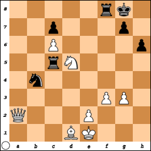
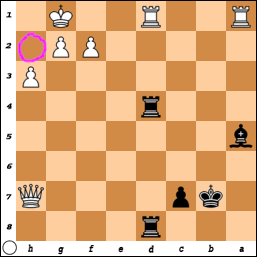

# Terminology

Like law, mathematics, and just about anything else, chess has its own 
terminology, some of it more obvious than others.

This is not intended to be comprehensive. I only intend to include the most 
commonly used terms, and those which might cause me confusion because they're 
common words used to mean somewhat different things in chess.

I also don't intend this document to conform to any official reference.

Board spaces will occasionally be referred to by the nomenclature from the 
so-called "algebraic notation," in which the White king starts out on e1 and the 
Black king starts out on e8.

## A

* **Absolute pin** &mdash; A pin in which a piece protects the king. The pinned 
piece can't be moved until either the king moves or the threatening piece moves 
or is captured. An absolute pin can't be ignored, since the rules of the game 
forbid moves that expose a player's own king to the opponent's attack.
* **Accuracy** &mdash; How well someone plays. The fewer blunders, the higher 
the accuracy. Winning is good, winning with high accuracy is better. Of course 
it's possible to play with greater accuracy than your opponent and still lose 
(for example, if you play very well but then make a major blunder and your 
opponent seizes the opportunity, but doesn't choose the shortest way to a 
checkmate). On some chess websites, accuracy is measured by how much one plays 
as the website's best program would play.
* **Algebraic notation** &mdash; A notation for chess games in which the ranks 
and files of the board are numbered from White's perspective, and the starting 
position of a piece is generally omitted. It is the most common notation in use 
today. The term "algebraic" is somewhat of a misnomer.
* **Amar opening** &mdash; The opening in which White begins by playing the 
kingside knight to the kingside edge of the board. See 
[Openings](OpeningsAndDefenses.md#Kingside-knight-to-rook's-file:-Amar-opening) 
for more details.
* **Anderssen opening** &mdash; The opening in which White begins by playing the 
queenside rook's pawn forward one space. See 
[Openings](OpeningsAndDefenses.md#Queenside-rook's-pawn:-Anderssen-opening) for 
more details.
* **Antichess** &mdash; A chess variant in which one wins by playing in a way 
that one would lose in regular chess. Captures are compulsory for both sides. 
Also called losing chess.
* **Archbishop** &mdash; A nonstandard chess piece combining the capabilities of 
the bishop and the knight.
* **Atomic chess** &mdash; The most hilarious chess variant, in which captures 
cause explosions that destroy the capturing piece, the captured piece and any 
non-pawn pieces in immediately neighboring squares.

## B

* **B** &mdash; Notation for bishop.
* **Barnes opening** &mdash; The opening in which White begins by playing the 
kingside bishop's pawn forward one space. Very similar to Bird's opening. See 
Openings for more details.
* **Bird's opening** &mdash; The opening in which White begins by playing the 
kingside bishop's pawn forward two spaces. Very similar to the Barnes opening. 
See Openings for more details.
* **Bishop** &mdash; Pieces which flank the king and queen at the beginning of 
the game, each player gets two of them. They move diagonally, provided no pieces 
of their own side are in the way. In a game with only valid moves, bishops end 
up on squares of the same color that they started, e.g., White's queenside 
bishop starts on a dark-colored square and is either captured from a 
dark-colored square or survives to the end of the game having only been on 
dark-colored squares.
* **Black** &mdash; The player who always goes second, or the group of pieces 
that player controls. Depending on the chess set, the pieces may actually be a 
dark brown color, or some other dark color.
* **Blitz chess** &mdash; A timed game with each player getting three to five 
minutes. Compare ''rapid chess''.
* **Blunder** &mdash; A very bad mistake that could cost the player the game.
* **Breath** &mdash; Synonym for Luft.

## C

* **Candidate master** &mdash; An official title awarded by FIDE to some good 
players who might eventualy meet the requirements for international master or 
grandmaster. 
* **Capture** &mdash; The act of taking an opponent's piece and moving it off 
the board. Only knights can jump over intervening pieces of either side to 
capture. Only pawns capture in a different way from their non-capture moves, and 
only in the case of en passant does a capturing piece end up on a space other 
than where the captured piece was.
* **Castling** &mdash; A special move in which the king and a rook come together 
for the king's protection. See [the game rules](GameRules.md#Castling) for 
details. Castling is not allowed in some variants, like antichess.
* **Center** &mdash; The four squares on the board that each has a corner that 
is the geometrical center of the board.
* **Center game** &mdash; Openings in which both White and Black make plays for 
the center of the board with pawns. See [Openings](OpeningsAndDefenses.md) for 
more details.
* **Centipawn** &mdash; A measure of a position's value in terms of pawns. Some 
chess engines use centipawns to compare moves. A captured pawn means a loss of 
100 centipawns for the player who lost that pawn. Other than a pawn being worth 
100 centipawns at the beginning of the game, there's no agreement on how the 
pieces should be valued, and programmers are free to come up with their own 
valuations. The valuation closest to achieving consensus values a queen at 900 
centipawns, a bishop or a knight at 300 centipawns and a rook at 500 centipawns. 
Bobby Fischer once gave a valuation that is exactly like that except for valuing 
a bishop at 325 centipawns instead of 300. One situation in which a centipawn 
valuation would be useful is when the opponent's knight threatens to capture 
either the computer's queen or the computer's rook, and it's possible for the 
computer to move either of those out of the way and allow the other to be 
captured. Because the queen is almost always valued at more centipawns than the 
rook, the computer decides to move its queen out of the opposing knight's reach.
* **Chancellor** &mdash; A nonstandard chess piece combining the capabilities of 
a rook and a knight.
* **Check** &mdash; A threat of capture to a player's king. The checked player 
must get their king out of danger, even if it means allowing some other piece to 
be captured. There are no checks in antichess, the game can continue even if 
both players have lost their kings. Checks are notated with the plus sign.
* **Checkmate** &mdash; A threat of capture to a player's king with no means of 
escape. Depending on context, checkmates may be considered checks. Checkmates 
are notated with two plus signs (++) or the pound sign (#).
* **Class A** &mdash; A USCF tournament player rated at 1800 or higher but less 
than 2000 in the Elo rating system.
* **Class B** &mdash; A USCF tournament player rated at 1600 or higher but less 
than 1800 in the Elo rating system.
* **Class C** &mdash; A USCF tournament player rated at 1400 or higher but less 
than 1600 in the Elo rating system.
* **Class D** &mdash; A USCF tournament player rated at 1200 or higher but less 
than 1400 in the Elo rating system.
* **Class E** &mdash; A USCF tournament player rated lower than 1200 in the Elo 
rating system.
* **Clemenz opening** &mdash; The opening in which White begins by playing the 
kingside rook's pawn forward one space. See [Openings](OpeningsAndDefenses.md) 
for more details.
* **Closed** &mdash; Said of an opening or early game board state in which pawn 
congestion limits the mobility of the queen, bishops or rooks, requiring the 
player to rely more on the knights to attack.
* **CM** &mdash; Abbreviation for candidate master.
* **Compulsory capture** &mdash; The requirement that whenever a side that can 
capture without putting their own king in immediate danger must capture. This 
requirement is not present in regular chess but it is present in some variants. 
Also, some chess programs might be programmed with compulsory capture, 
especially for an easy level (the human opponent then is not bound by this 
requirement). When bound by compulsory capture and two or more capture 
opportunities present themselves, the player is generally free to choose any of 
the opportunities, while a program might be programmed to choose the piece of 
highest centipawn value (e.g., capture a queen rather than a bishop).
* **Connecting the rooks** &mdash; The act of a player placing said player's 
rooks so they defend each other on the home row, usually by developing the 
queen, both bishops and both knights, and then castling.
* **Countergambit** &mdash; When a player declines a gambit by instead offering 
one of their own pawns for sacrifice.
* **Crazyhouse** &mdash; A chess variant in which captures grant the capturing 
side the ability to place a piece of the same kind on an empty square as a move 
later on. For example, if White captures a Black knight, White can later place a 
White knight on an empty square later.

## D

* **Danish gambit** &mdash; A variation on the center game in which White offers 
Black two pawns early on. See [Openings](OpeningsAndDefenses.md) for more 
details.
* **Dark chess** &mdash; Synonym for fog of war.
* **Descriptive notation** &mdash; An older notation in which each player's 
moves are reckoned from the player's perspective.
* **Discovered check** &mdash; A check that arises when a piece (which may be a 
pawn) moves in such a way that another piece suddenly has a clear line of attack 
to the opponent's king.
* **Double attack** &mdash; Another term for fork.
* **Double check** &mdash; A special kind of discovered check in which a king is 
threatened simultaneously by two of the opponent's pieces, one of them usually 
but not always being a knight. Even if the checked side has pieces that can 
capture both of the attacking pieces, neither can be captured at the moment, 
because, in chess, a player can only capture one of the opponent's pieces in a 
single turn. Therefore, the only option in a double check is for the threatened 
king to move out of the way of the threats. Sometimes notated with two plus 
signs.
* **Draw** &mdash; When the game ends with neither player a winner. Generally 
notated "1/2 - 1/2". Stalemate is perhaps the most common kind of draw. It is 
also possible for both players to agree that neither of them can win, as a sort 
of simultaneous resignation.
* **Draw by repetition** &mdash; When the same position occurs thrice in a game, 
the game ends in a draw. Most likely to occur on consecutive turns, but it can 
also occur on non-consecutive turns, especially in the endgame.
* **Dunst opening** &mdash; When Black responds to the Van Geet opening by 
moving the queen's pawn forward two spaces. See 
[Openings](OpeningsAndDefenses.md) for more details.
* **Durkin opening** &mdash; The opening in which White begins by playing the 
queenside knight to the queenside edge of the board. Robert T. Durkin championed 
this opening. See Openings for more details.

The following diagram illustrates both discovered check and double check. White 
to play.

FEN: 5rk1/2p3p1/2P4p/2rN4/1n6/5PP1/Q3P3/3BK3 w - - 0 1

If White plays Ne7+, that puts Black in check not just because the knight 
threatens the square the king is on, but also because now the queen has a direct 
line of attack to the opponent's king. Black has a knight that can capture 
White's queen, but that doesn't neutralize the threat from White's knight. 
Therefore, the Black king must move to file h.

## E

* **Elo rating** &mdash; A player's chess rating according to a system devised 
by Arpad Elo.
* **Endgame** &mdash; The last few moves of a game in which most or all pieces 
have moved from their initial positions. Among players of roughly equal ability, 
both players have had pieces captured but usually both players still have pawns 
left.
* **Engine** &mdash; A computer program for assessing chess positions. It is 
cheating to use an engine to pretend to be a better player online than one is 
unassisted. 
* **English notation** &mdash; Synonym for ''descriptive notation''.
* **English opening** &mdash; The opening in which White begins by playing the 
queenside bishop's pawn forward two spaces. See Openings for more details.
* **En passant** &mdash; A special move in which a pawn captures an opponent 
pawn. See [the game rules](GameRules.md#En passant) for details.
* **En prise** &mdash; Said of a piece exposed to capture in certain situations. 
There is much disagreement as to what exactly constitutes en prise. Some authors 
expect the piece in question to be undefended, others expect the piece to have 
been placed in a vulnerable position unintentionally, or to be defended but only 
slightly less than what would constitute a pointless sacrifice, etc.
* **Even trade** &mdash; When a player uses a piece to capture an opponent's 
piece of the same worth, and that piece is immediately captured by the opponent. 
For example, a player uses a rook to capture an opponent's rook, and the 
capturing rook is then itself captured on the opponent's turn.
* **Expert** &mdash; A USCF tournament player rated at 2000 or higher but less 
than 2200 in the Elo rating system.

## F

* **F&eacute;d&eacute;ration Internationale des &Eacute;checs** &mdash; The 
International Chess Federation, which sets many standards for chess accepted 
worldwide. Known by the acronym FIDE even where French isn't widely spoken.
* **Fianchetto** &mdash; A sequence of developing moves that gives a bishop 
access to a long diagonal of the board. For example, open by moving one of your 
knight's pawns forward one space, then on your next turn move the bishop next to 
the knight to the space the pawn has just vacated. Then that bishop might get an 
opportunity to capture the opponent's rook on the other side of the board.
* **FIDE** &mdash; Acronym of the International Chess Federation 
(F&eacute;d&eacute;ration Internationale des &Eacute;checs).
* **File** &mdash; A column on a chessboard, generally notated with the 
lowercase letters 'a' to 'h'. At the beginning of the game, the rooks are on 
files 'a' and 'h', knights on files 'b' and 'g', bishops on files 'c' and 'f', 
queens on file 'd', and kings on file 'e'.
* **Flight square** &mdash; Synonym for Luft.
* **Fog of War** &mdash; A chess variant almost always played on computers, in 
which each player can only see their own pieces and the spaces where their 
pieces may move to. This is, in my opinion, the most interesting variant of all. 
It is somewhat like Kriegspiel, which was invented long before anyone thought 
about using computers for chess in any capacity. Aside from the limited 
visibility, the only deviation from the traditional rules is that it is a 
one-check game. Thus castling tends to be more effective in Fog of War than in 
traditional chess.
* **Fork** &mdash; When a piece of one side simultaneously threatens two of the 
opponent's pieces. The threatened pieces are then said to be forked. When one of 
the forked pieces is the opponent's king in check, this usually means the 
opponent must move the king to safety and allow the forking piece to capture the 
other forked piece.
* **Four knights game** &mdash; An opening involving both of White's knights and 
both of Black's knights.
 

FEN: r1bk2n1/1pp2N1n/p5pr/1Bb2P1p/3pP3/3P4/PPPQ2PP/R3K2R b KQ - 2 14

Example of a fork. The Black king must move off d8, so then White can capture 
the rook on h6. Black might follow with Nxh6, but that would be a mistake, since 
then it's easier for White to make more dangerous incursions into Black's 
territory, such as with Qxh6.

## G

* **Gambit** &mdash; An opening in which a player risks a sacrifice. It is a 
gamble whether the opponent will take the bait or not.
* **GM** &mdash; Abbreviation for grandmaster.
* **Grandmaster** &mdash; An official title awarded by FIDE to the very best 
chess players. The title is irrevocable except due to cheating. 
* **Grob opening** &mdash; The opening in which White begins by playing the 
kingside knight's pawn forward two spaces. See Openings for more details.

## H

* **Hanging piece** &mdash; A piece that can be captured by sacrificing a piece 
of lesser value, or which can be captured with no sacrifice at all (Martin, p. 
26). For example, given a Black rook that can be captured by a White knight 
which in turn is captured by a Black pawn, the Black rook is said to be a 
hanging piece. In this example, White captures the Black rook, valued at roughly 
5 points, by sacrificing a piece valued at roughly 3 points. Or if the rook in 
the scenario was not protected by a pawn, it would be said to be hanging even if 
captured by another rook or by a queen, since the capturing side does not make a 
sacrifice to achieve the capture.
* **Horde** &mdash; A chess variant in which White has only a bunch of pawns 
over most of the board. Horde is played on a standard board, but the radically 
different complement of pieces requires radically different rules and strategy. 
It is probably the creepiest chess variant.
* **Hungarian opening** &mdash; The opening in which White begins by playing the 
kingside knight's pawn forward one space. See Openings for more details.

## I

* **IM** &mdash; Abbreviation for international master.
* **Inaccuracy** &mdash; A move that is just not all that good when a better 
move was possible. Some commentators use this term to mean bad moves that aren't 
bad enough to be considered mistakes or blunders.
* **In-between move** &mdash; Synonym for Zwischenzug.
* **Intermediate move** &mdash; Synonym for Zwischenzug.
* **Intermezzo** &mdash; Synonym for Zwischenzug.
* **International Chess Day** &mdash; The day July 20, recognized by the United 
Nations with a 2019 resolution. FIDE was founded in Paris on July 20, 1924.
* **International master** &mdash; An official title awarded by FIDE to very 
good players who don't meet the requirements for grandmaster.

## J

* **"J'adoube"** &mdash; French for "I adjust," said by a player about to adjust 
a piece, temporarily suspending the touch-move rule.

## K

* **K** &mdash; Notation for king.
* **K&aacute;das opening** &mdash; The opening in which White begins by playing 
the kingside bishop's pawn forward two spaces. See Openings for more details.
* **King** &mdash; A player's most important chess piece, must be defended at 
all costs. The piece typically has a crown with a cross.  The White king starts 
out on e1, the Black king starts out on e8.
* **King of the Hill** &mdash; A chess variant in which the first side to get 
their king to one of the center squares wins. Castling is allowed in this 
variant, in which case the strategy is to win with a conventional checkmate, 
taking care to keep the opponent king as far away from the center as possible.
* **Kingside** &mdash; The half of the board with the kings at the beginning of 
the game, consisting of the files e, f, g and h. As an adjective, it refers to 
the pieces initially on that side of the board, or to an event on that side of 
the board.
* **Kingside castling** &mdash; Castling with the kingside rook.
* **King's pawn opening** &mdash; The opening in which White begins by playing 
the king's pawn forward two spaces. Easily the most popular opening, and the 
most studied. See Openings for more details.
* **Knight** &mdash; A piece shaped like a horse, the only one capable of 
jumping over other pieces. Each player gets two of them. At the beginning of the 
game, each knight is placed between a rook and a bishop.
* **Kriegspiel** &mdash; A variant of chess for two players and a referee using 
three boards. The referee's board starts out with all the White and Black 
pieces, the players' boards start out with only their own side's pieces. As the 
game progresses, the referee allows the players to learn of opponent pieces they 
may capture. It is quite a cumbersome precursor to Fog of War.

## L

* **Losing chess** &mdash; Synonym for antichess.
* **Luft** &mdash; German for air, used in chess to mean a square that a castled 
king, otherwise trapped on his home row, can escape to, avoiding or at least 
postponing checkmate. Such a square is provided by having a pawn, generally the 
kingside's rook pawn, move from the pawn's starting row. Generally not 
capitalized in English.

The following diagram illustrates Luft for the White king. Black to play.

FEN: 3r4/1kp4Q/8/b7/3r4/7P/5PP1/R2R2K1 b - - 0 1

Black will most likely play Rxd1+. Then White responds Rxd1, and Black responds 
with Rxd1+. This would be checkmate, except White played h3 long before, leaving 
h2 available for the White king to escape to.

## M

* **Major piece** &mdash; A queen or a rook. Two major pieces are better able to 
force checkmate against the opponent king than two minor pieces.
* **Master** &mdash; A USCF tournament player rated at 2200 or higher but less 
than 2400 in the Elo rating system.
* **Mate** &mdash; Synonym for checkmate. Theoretically it could also be used as 
a synonym for stalemate, but I have never seen it used that way.
* **Material** &mdash; Synonym for a player's pieces. When a player deliberately 
allows one of their pieces to be captured, that might be referred to as 
"sacrificing material." This term is also used when assessing a player's ability 
to achieve checkmate. A player with a queen and a rook definitely has "enough 
material" for a checkmate; a player with only a knight besides the king 
definitely does not. Of course an advantage of material does not guarantee 
checkmate.
* **Middlegame** &mdash; A stage of the game beginning after the opening but 
ending before the endgame. In my opinion, among players of equal ability, the 
middlegame begins when both players have mobilized every piece they want to 
mobilize (and castled if they so desired and were able to), and ends when 
stalemate becomes a possibility. 
* **Mieses opening** &mdash; The opening in which White begins by playing the 
queen's pawn forward one space. See Openings for more details.
* **Minor piece** &mdash; A bishop or a knight. Two minor pieces are not as able 
to force checkmate against the opponent as two major pieces.
* **Missed win** &mdash; When a player fails to notice an opportunity for 
checkmate.
* **Mistake** &mdash; A technically valid move that puts the player at a 
tactical disadvantage. It's the result of either carelessness or misjudging the 
position. Getting the king out of a check is never a mistake, even if it forces 
the player to abandon a piece they would rather not. Some commentators use this 
term to mean only bad moves that waste a tactical advantage but don't risk 
losing the game.

## N

* **N** &mdash; Notation for knight (K is for king).
* **Nimzowitsch-Larsen attack** &mdash; The opening in which White begins by 
playing the queenside knight's pawn forward one space. See Openings for more 
details.

## O

* **Officer piece** &mdash; A non-pawn piece. This term is not at all standard, 
often just the term "piece" is used to mean an officer piece and exclude pawns. 
Officer pieces at the beginning of the game are valued at more than 100 
centipawns each.
* **One-check** &mdash; A chess variant in which a single check wins the game. 
Or, as an adjective, to refer to a chess variant in which a single check wins 
the game and there are other differences between regular chess and the variant 
(e.g., Fog of War is a one-check variant with one other difference from regular 
chess).
* **O-O** &mdash; Notation for kingside castling. Rendered as "0-0" in some 
books.
* **O-O-O** &mdash; Notation for queenside castling. Rendered as "0-0-0" in some 
books.
* **Open** &mdash; Said of an opening or early game board state in which it is 
fairly easy for the queen, bishops and rooks to move about the board on account 
of low pawn congestion.
* **Opening** &mdash; A player's first few moves. To my knowledge I've never 
seen this term in regard to chess used to mean a vulnerability in the opponent's 
defense. Most openings are given special names, which are not quite exactly 
standard. I will try to list the most common name for each opening.
* **Original** &mdash; A piece a player had at the beginning of the game, as 
opposed to a piece obtained through pawn promotion. This term is not standard, 
and some players might regard it as unnecessary. But I believe many who write 
chess programs wind up needing to make this distinction. 

## P

* **Passed pawn** &mdash; A pawn that can't be stopped from promotion by any 
opposing pawns. If such a pawn can be captured by a higher-ranking piece, that 
pawn is still considered a passed pawn.
* **Patzer** &mdash; A chess player who does not progress beyond the beginner 
level after playing many games.
* **Pawn** &mdash; The lowest ranking pieces, each player gets eight of them. 
Pawns are notated by their position, without the letter P.
* **Piece** &mdash; A token that is moved on a chess board. Sometimes this term 
is used to mean only pieces that are kings, queens, bishops, knights or rooks, 
excluding the pawns.
* **Pin** &mdash; When a piece must stay in place to protect a more valuable 
piece from capture, or to protect the king from check. The former is called a 
relative pin, the latter an absolute pin.
* **Polish opening** &mdash; The opening in which White begins by playing the 
queenside knight's pawn forward two spaces. See Openings for more details.
* **Potzer** &mdash; Alternate spelling for patzer.
* **Promotion** &mdash; When a pawn reaches the opponent's home row, it is 
promoted to a queen, bishop, knight or rook. Players almost always choose a 
queen. Theoretically this could lead to a total of eighteen queens on the board. 
But in competitive play, even with players of disparate ability, more than four 
queens total are highly unlikely. In the antichess variant, a fifth choice is 
available: a pawn can be promoted to a king. That is usually the best choice in 
that variant. Promotion is notated with an equals sign (=) followed by the 
notation for the promoted piece (usually Q for queen).

## Q

* **Q** &mdash; Notation for queen.
* **Quad** &mdash; A kind of tournament in which the entrants are divided into 
four groups according to their Elo ratings.
* **Queen** &mdash; A player's most powerful piece, combining the capabilities 
of the bishop and the rook. The piece typically has a crown without a cross. The 
White queen starts out on d1, the Black queen starts out on d8.
* **Queenside** &mdash; The half of the board with the queens at the beginning 
of the game, consisting of the files a, b, c and d. As an adjective, it refers 
to the pieces initially on that side of the board, or to an event on that side 
of the board.
* **Queenside castling** &mdash; Castling with the queenside rook.
* **Queen's pawn opening** &mdash; The opening in which White begins by playing 
the queen's pawn forward two spaces. See Openings for more details.

## R

* **R** &mdash; Notation for rook.
* **Racing kings** &mdash; A chess variant in which both kings start out on the 
second rank and must race to the eighth rank to win. Checks are not allowed.
* **Rank** &mdash; A row on a chessboard, generally notated with the digits 1 to 
8, which follow the letter for the file. White pawns should be on rank 2 at the 
beginning of the game, Black pawns on rank 7. 
* **Rapid chess** &mdash; A timed game with each player getting 20 or 25 minutes 
each. Compare ''blitz chess''.
* **Recapture** &mdash; When a player captures an opponent's piece that recently 
captured one of that player's pieces. There's no capturing the same piece twice 
in a single game of regular chess (that might occur in the crazyhouse variant, 
but it's unlikely to be referred to as a recapture).
* **Relative pin** &mdash; A pin in which a piece protects a more valuable piece 
that is not the king. For example, a knight protecting a queen from capture. A 
player subject to a relative pin may choose to ignore the pin. While that may be 
strategically disadvantageous, it is not against the rules of the game.
* **Romantic** &mdash; Generally referring to a style of play emphasizing 
reckless gambits and poorly thought out sacrifices, but can also refer to a 
variant invented by Micha&lstrok; Ryszard W&oacute;jcik in which pawns can only 
promote to knights.
* **Rook** &mdash; A piece shaped like a tower, capable of moving in straight 
lines provided there are no pieces of its own side in the way. Each player gets 
two of them. At the beginning of the game, the four rooks are placed on the four 
corners of the board.
* **Round-robin** &mdash; A type of tournament in which each player gets to play 
against all other players in the tournament.

## S

* **Sacrifice** &mdash; When a player deliberately allows one of their pieces to 
be captured by the opponent in order to gain a tactical advantage. The way I see 
it, tactical intent is a crucial component of sacrifice. That is to say, it's 
not a sacrifice if a piece gets captured because the player losing the piece was 
careless, or because the opponent forced the player to give up a piece so as to 
get the king out of check, or to not lose a more valuable piece than the piece 
that gets captured (e.g., giving up a knight to keep a queen).
* **Sandbagger** &mdash; A tournament player who deliberately loses in a low 
stakes tournament to artificially reduce his rating to a lower class and win a 
class prize at a higher stakes tournament. "Calling a player a sandbagger is one 
of the worst chess-related insults!" (Eade, 2016)
* **Saragossa opening** &mdash; The opening in which White begins by playing the 
queenside bishop's pawn forward one space. See 
[Openings](OpeningsAndDefenses.md) for more details.
* **Senior master** &mdash; A USCF tournament player rated at 2400 or higher in 
the Elo rating system.
* **Skewer** &mdash; When a piece of one side threatens one of the opponent's 
pieces in such a way that the opponent must move that piece out of the way and 
allow the capture of a less valuable piece. In the case of a skewering check, 
the opponent must move the king to safety and allow the capture of the other 
piece, such as a rook. Queens, rooks and bishops are all able to skewer an 
opponent's piece.
* **Smothered mate** &mdash; A checkmate in which the winning side's knight 
delivers checkmate against the opponent king by forcing him to move to a corner, 
surrounded by pieces of his own side, usually his castle pawns and castle rook.
* **Smurfing** &mdash; When a very good player pretends to play poorly. The 
metaphor here being that the player is a giant pretending to be a tiny creature.
* **Stalemate** &mdash; When a player is not in check but is unable to make any 
move whatsoever on his or her turn. Thus the game ends with no winner, since 
skipping a turn is not allowed in chess. For example, if that player's king is 
safe in his current space but would be in check if he moves in any direction, 
the remaining pawns are stymied by opposing pawns, and other pieces are pinned 
because moving them would leave the king exposed. Then that player can't make a 
move and the game ends. Since stalemate is a kind of draw, the same notation 
"1/2 - 1/2" is used as in other kinds of draws. In general parlance, this term 
is often used to mean an impasse which could be resolved if both parties were 
willing to make major compromises, or in some cases even minor compromises.
* **Strong point method** &mdash; After the game begins 1. e4 e5, Black tries 
to keep a pawn on e5 regardless of what trades or threats White might make.
* **Suicide chess** &mdash; Synonym for antichess, and not, as I thought at 
first, atomic chess.
* **Swiss gambit** &mdash; When a player in a tournament run according to the 
Swiss system tries to draw a game so as to get paired up with a less able player 
in the next round. Or it may refer to the opening 1. f4 f5 2. e4.
* **Symmetrical** &mdash; Said of an opening in which Black mirrors White's 
moves.
* **System** &mdash; A series of moves which a player can play without too many 
adjustments regardless of the opponent's moves. Examples of systems include the 
London system and the Zukertort system.

FEN: r2k1QN1/6P1/1pp1b1Q1/1pb4p/3p4/3P4/PPP3PP/R3K2R b KQ - 0 24

Example of a skewering check. The Black king must move out of the way of the 
newly promoted White queen, which can then capture the Black rook.

## T

* **Tempo** &mdash; As I understand this chess term, a tempo is simply a 
player's turn. However, this term is generally used in connection to momentum: 
gaining it or losing it. For example, a series of checks that don't immediately 
lead to an opportunity for checkmate would still be worthwhile if you capture 
some important pieces, or even just pawns standing in your way. You would be 
said to have gained tempo, and your opponent would be said to have lost tempo.
* **Three-check** &mdash; A chess variant in which the first side to check the 
other thrice wins. However, checkmate still wins the game even if it's only the 
first or second check by that player.
* **Three knights game** &mdash; An opening involving both of White's knights 
and one of Black's knights. May go on to be a four knights game.
* **Touch-move rule** &mdash; The rule that a player must move a piece he 
touches, provided there is a legal move to be made with that piece.
* **Trade** &mdash; When a player sacrifices a piece in order to capture one of 
the opponent's pieces. A trade is worthwhile to the initiating player if it 
results in a tactical advantage. For example, White uses a bishop to capture 
Black's rook that the king is castled with, and the Black king immediately 
captures that bishop. In this example, the Black king has been deprived the 
protection of the castled rook.
* **Trading queens** &mdash; When one player uses a queen to capture an 
opponent's queen, and the opponent immediately captures the player's queen.

## U

* **Underpromotion** &mdash; When a pawn, upon reaching the opponent's home row, 
is promoted to a bishop, knight or rook rather than a queen. Since a queen 
combines the capabilities of a bishop and a rook, the underpromotion is obvious. 
Despite the knight's ability to jump over other pieces, this choice for 
promotion is generally less advantageous than choosing a queen. As a rule of 
thumb, underpromotion should be used only for an immediate check or to avoid 
stalemate.
* **Unforced error** &mdash; Synonym for blunder.
* **United States Chess Federation** &mdash; The governing body for chess in the 
United States.
* **USCF** &mdash; Acronym for the United States Chess Federation.

## V

* **Van Geet opening** &mdash; The opening in which White begins by playing the 
queenside knight towards the center of the board. See Openings for more details.
* **Van't Kruijs opening** &mdash; The opening in which White begins by playing 
the king's pawn forward one space. See Openings for more details.
* **Variant** &mdash; A version of chess that differs in some way from the 
traditional game. At the very least, a variant has at least one different rule 
(e.g., in three-check, one player's third check to the other player wins the 
game). More radical variants may use different boards and/or different pieces.
* **Variation** &mdash; A version of a well-known opening or strategy.

## W

* **Waiting move** &mdash; A move that does not really commit to an attack but 
is not really a mistake nor a blunder.
* **Ware opening** &mdash; The opening in which White begins by playing the 
queenside rook's pawn forward two spaces. See Openings for more details.
* **White** &mdash; The player who always goes first, or the group of pieces 
that player controls. Depending on the chess set, the pieces may actually be a 
light brown color, or some other light color.

## X

* **x** &mdash; Notation for capture.

## Y

## Z

* **Zugzwang** &mdash; A situation in which all moves available to one of the 
players puts them at a serious tactical disadvantage. The only options for a 
player in Zugzwang are to make a bad move or resign.
* **Zukertort opening** &mdash; The opening in which White begins by playing the 
kingside knight towards the center of the board. See Openings for more details.
* **Zwischenzug** &mdash; When a player makes an unexpected threat before making 
a more obvious move.
