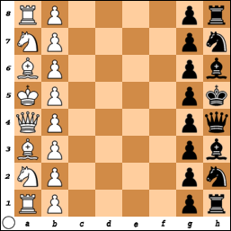

# Variants

There are several variants of chess. The following is not a complete list. These 
are arranged roughly in order from closest to traditional chess to farthest 
away.

## Three-check

First side to put the other in check thrice wins the game. Or you can win with a 
regular checkmate before giving three checks.

## Fog of War

At the beginning of the game, you can only see the half of the board with your 
pieces. As you move your pieces, your view of the board changes according to 
what spaces of the board your pieces can move to. Your opponent likewise has a 
limited view of the board. It is a one-check game. Therefore, castling is 
generally advantageous, much more so than in regular chess.

Also called "dark chess." Closely related to **Kriegspiel**, which was played 
long before anyone thought of using computers for chess. Kriegspiel was played 
with three boards

## King of the hill

Four squares in the center of the board, d4, e4, d5 and e5, are marked as a 
special area. If one side can get their king to one of those squares, they win 
the game. Or you can win with a regular checkmate, which might be the only way 
you can win if you're playing against an evenly matched opponent.

## Crazyhouse

Captures give the capturing side the ability to place a piece of the same kind 
on an empty square as a move later on. For example, if White captures a Black 
knight, White can later place a White knight on an empty square later.

Both sides are prohibited from placing pawns on rank 1 or rank 8 even if all 
those squares are empty. A White pawn placed on the seventh rank and a Black 
pawn placed on the second rank are just as eligible for promotion as pawns that 
made it all the way from their starting squares.

In this variant, the distinction between original pieces and promoted pieces is 
very important. Capturing a promoted queen, bishop, knight or rook entitles the 
capturing player to place a pawn, not what the captured pawn had promoted to.

For this reason, as a matter strategy, you should be bolder with promoted queens 
in this variants than with queens in regular chess, because if they're captured, 
the capturing player just gets a pawn to place.

Conversely, you should be much more careful with original queens, because if one 
of them is captured, you not only lose the queen's tactical advantage, your 
opponent gains a queen they can place on any empty square they want.

The notation for crazyhouse is the same as regular chess except for the use of 
the symbol '@' for placements.

Pawn placements are notated with '@' followed by the position where the pawn is 
placed. For example, a pawn placed at d7 is notated "@d7". This may be followed 
by + or # when appropriate.

Placements of other pieces are notated with the appropriate letter (one of Q, B, 
N or R) followed by '@' and the position. For example, a knight placed at h6 is 
notated N@h6. This may be followed by + or # when appropriate.

## Atomic

[FINISH WRITING]

## Antichess

[FINISH WRITING]

## Wrong corners

This variant arises when the person setting up the board minds the rule each 
queen should be on a square of her own color but neglects or ignores the rule 
that the corner at each player's left must be a dark-colored square.

If you fail to notice this before making your first move, I suppose your only 
choice is to keep going and try not to compound the mistake by castling your 
queen instead of your king.

## Variant for testing purposes

In all the variants explained so far, the initial board state is the same as in 
traditional chess, and the two sides are White and Black, and White goes first.

But in this testing variant, which I will only flesh out enough to help with 
testing regular chess play, the two sides are Dark Gray and Light Gray, and 
either may go first.

Also, instead of a king, each side gets an emperor; an empress instead of a 
queen, one pointy hat guy instead of two bishops; one horse instead of two 
knights; one tower instead of two rooks; and five pawns instead of eight.

However, this variant may be played with a standard set. The initial board state 
is somewhat asymmetrical:

FEN: 3qkbnr/3ppppp/8/8/8/8/PPPPP3/RNBQK3 w Qk - 0 1

And so one side may only castle queenside and the other only kingside. However, 
if there are no pieces between the emperor and the tower, castling is allowed 
even if the emperor is in check and even if he must pass through a threatened 
square, provided he ends up on a relatively safe square.

Furthermore, castling is also allowed if the emperor has moved from his original 
square but has since returned. The tower must not have moved prior to castling, 
however.

Pawns may promote to emperors but they may not stay pawns upon reaching the 
opponent's home row.

An emperor of one side may be captured, and the game continues if that side has 
other emperors, or any empresses.

A check to an emperor must be addressed, unless the only way to address it 
requires putting another emperor in check.

A threat to an empress of one side may be ignored if that side still has other 
empresses, or any emperors.

## Racing kings

[FINISH WRITING]

## Horde

[FINISH WRITING]
