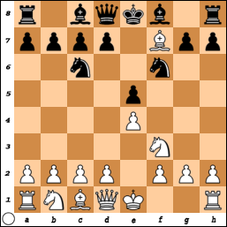
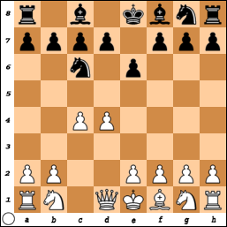
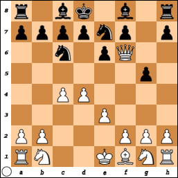

# Variants

There are several variants of chess. The following is not a complete list. These 
are arranged roughly in order from closest to traditional chess to farthest 
away.

## Variants that can be played on a regular board

Most variants can be played on a regular 8 &times; 8 checkerboard with a 
standard complement of standard pieces.

### Romantic chess

This variant by Micha&lstrok; Ryszard W&oacute;jcik, confusingly named after a 
style of chess play emphasizing reckless gambits, was invented in 2017, and to 
my knowledge can only be played on Apronus.com. Well, it can be played on a 
physical board, subject to a caveat about the number of available knights.

Because, you see, this variant differs from regular chess only in that pawns can 
only promote to knights. Then, theoretically, you need to have at least two 
extra knights, just as with regular chess it is advisable to have two extra 
queens.

But what winds up happening most of the time is that one side wins by checkmate 
long before any pawn can get close to promotion. At least that's what happens 
when I play this variant. There doesn't seem to be an easy setting on 
Apronus.com.

### Three-check

First side to put the other in check thrice wins the game. Or you can win with a 
regular checkmate before giving three checks.

In this variant, moves that would be very stupid in regular chess can sometimes 
be the ticket to winning. Consider this game:

1. e4 e5 
2. Nf3 Nc6 
3. Bc4 Nf6
4. Bxf7+ 

FEN: r1bqkb1r/pppp1Bpp/2n2n2/4p3/4P3/5N2/PPPP1PPP/RNBQK2R b KQkq - 0 4 +1+0

In regular chess, denying Black the abillity to castle is generally not 
considered a good enough reason to sacrifice a bishop so early in the game. But 
in this three-check scenario, it gives White the opportunity to give two more 
checks for the win.

4. ... Kxf7 
5. Ng5+ Kg6 
6. Qh5+

Although the three checks are consecutive in this example, they don't have to be 
for a player to win.

Note that Lichess annotates the third check with '#' rather than '+' even when 
it would not be checkmate in regular chess.

This variant presents no problem for playing on a physical board. However, it 
would be helpful to use some kind of token, like coins or bottle caps, to count 
how many times each player has checked the other. This variant is unlikely to 
need extra queens or extra knights.

### Fog of War

At the beginning of the game, you can only see the half of the board with your 
pieces. As you move your pieces, your view of the board changes according to 
what spaces of the board your pieces can move to.

Your opponent likewise has a limited view of the board. The only way to know 
what your opponent is doing is to correctly deduce what's going on from the 
information available to you. This becomes harder as the game progresses.

For example, say White plays the king's pawn opening, 1. e4. White gains a view 
of: the squares a6 and b5, because the kingside bishop can potentially move to 
one of those on White's second turn; the square e5, because the king's pawn can 
potentially move there next; and of h5, because the queen can potentially move 
there next.

White loses sight of e3, but there's no way Black can threaten that square for 
at least the next two turns. Maybe Black plays 1. ... e5, in which case White 
loses sight of e5, because now White can't play 2. e5.

If instead Black had played 1. ... d5, White would now become aware of the Black 
queen's pawn, because White could now play 2. exd5. In our scenario with 1. e4 
e5, however, White foolishly plays 2. Bb5 instead.

On the plus side, Black might fail to deduce from the loss of visibility of the 
b5 square that playing 2. ... d5 or 2. ... d6, both of which would be invalid 
moves in regular chess, are merely inadvisable in this variant. Then White would 
win by playing 3. Bxe8#, a move that would not be allowed in regular chess.

This is one of the few variants in which you can capture your opponent's king. 
If you can see your opponent's king on your turn, you should capture him. Then 
you win the game.

Therefore, castling is generally advantageous in Fog of War, much more so than 
in regular chess. Safely ensconced behind a shield of pawns with a rook at your 
king's side, the only way your opponent can learn your castling status might be 
with a potentially pointless sacrifice.

This variant is also called "dark chess." It is closely related to 
**Kriegspiel**, which was played long before anyone thought of using computers 
for chess. Kriegspiel was played with three boards and required an arbiter to 
keep track of what pieces are visible to each player. It must have been quite 
cumbersome to play.

### King of the hill

Four squares in the center of the board, d4, e4, d5 and e5, are marked as a 
special area. If one side can get his or her king to one of those squares, he or 
she wins the game. Or you can win with a regular checkmate, which might be the 
only way you can win if you're playing against an evenly matched opponent.

The king trying to get to the center FINISH WRITING

1. a3 d5 
2. e4 e5 
3. Bb5+ Nc6 
4. exd5 a6 
5. Be2 Kd7 
6. Nf3 Nf6 
7. O-O a5 
8. d4 Kd6 
9. dxe5+ Kc5 
10. Be3+ Nd4 
11. Qxd4# 1-0

On a physical board, the special area could be demarcated with yarn, or with a 
cellophane square cut to size to place over the four squares. Or the four 
squares could be painted in some way.

### Pawns only at first

Normally, we are advised to not move too many pawns in the opening. Like maybe 
only one pawn, preferably.

But in this variant, you can only move pawns at first, until any one of the 
following happens:

* A king is in check, or
* A pawn is promoted, or
* No pawn moves are available.

Once any of those happen, both players are subsequently free to move any of 
their pieces according to the rules of regular chess.

Just in case it needs to be said: captures by pawns count as pawn moves. But 
most likely pawns will only capture other pawns while the stricture applies.

With the move restriction lifted, castling is allowed subject to the same rules 
as in regular chess. And remember: in regular chess you can castle even if the 
castling rook is under threat, as long as the king is not under threat and does 
not move through a threatened square.

If castling occurs in this variant, it's likelier to be kingside, since 
queenside castling is likely to be inhibited by the opponent's queen. But 
without a pawn shield, castling on either side is probably inadvisable.

Obviously this variant gets the game to an endgame state very quickly, as the 
first non-pawn moves of the game are likely to involve both players losing their 
queens.

It wasn't clear to me if it can happen that there are no valid pawn moves for 
either side while the move stricture applies. That would stall the game, unless 
we add that to the list of conditions that allows for the move stricture to be 
removed.

I verified, thanks to Tavon Strange, that such stalling can occur in this 
variant. Also thanks to Christopher Woods for his help researching this variant.

The main difficulty for playing on a physical board might be if the first 
promotion is to a queen, since most likely no queens have been captured at that 
point.

### Crazyhouse

In this variant, captures give the capturing side the ability to place a piece 
of the same kind on an empty square as a move later on. The placed piece can be 
moved on a subsequent turn, or that piece may be captured by the opponent if the 
piece is placed on a square the piece could be captured (sometimes it might be 
strategically advantageous to place a piece to entice immediate capture).

For example, if White captures a Black knight, White can place a White knight on 
an empty square on White's next or later turn.

Both sides are prohibited from placing pawns on rank 1 or rank 8 even if all 
those squares are empty. A White pawn placed on the seventh rank and a Black 
pawn placed on the second rank are eligible for promotion if they can make it 
all the way to the eighth or first rank on a later turn, just the same as pawns 
that made it all the way from their starting squares.

In this variant, the distinction between original pieces and promoted pieces is 
very important. Capturing a promoted queen, bishop, knight or rook entitles the 
capturing player to place a pawn, not what the captured pawn had promoted to.

For this reason, as a matter strategy, you should be bolder with promoted queens 
in this variant than with queens in regular chess, because if they're captured, 
the capturing player just gets pawns to place.

Conversely, you should be much more careful with original queens, because if one 
of them is captured, you not only lose the queen's tactical advantage, your 
opponent gains a queen they can place on any empty square the opponent wants.

The notation for crazyhouse is the same as regular chess except for the use of 
the symbol '@' for placements.

Pawn placements are notated with '@' followed by the position where the pawn is 
placed. For example, a pawn placed at d7 is notated "@d7". This may be followed 
by + or # when appropriate.

Placements of other pieces are notated with the appropriate letter (one of Q, B, 
N or R) followed by '@' and the position. For example, a knight placed at h6 is 
notated N@h6. This would be followed by + or # when appropriate.

Just as in regular chess, castling under check is not allowed in crazyhouse. 
However, placements to get out of check are perfectly permissible, subject only 
to the rules of placements.

For example, White places a rook on f8, putting the Black king in check. But 
suppose Black has a bishop to place between the Black king and the White rook. 
That gets the Black king out of check. Now suppose the only pieces Black has 
available to place are pawns. This is unfortunate for Black, because crazyhouse 
does not allow pawn placements on the eighth rank, as noted earlier. That might 
be checkmate if Black has no way to get out of check under the rules of regular 
chess either.

This variant would be very cumbersome for playing on a physical board. At the 
very least, it would be necessary to have two chess sets from which to draw 
pieces to place.

It might help to have an arbiter to keep track of which pieces are promoted 
pawns. Perhaps the arbiter could also take care of replacing captured pieces 
with an equivalent piece of the capturing side ready for when that player wants 
to place one of them.

Another option might be to put a little cap of aluminum foil on promoted pieces, 
so that if they're captured, the capturing side knows the captured piece would 
be good for a pawn placement.

### Power-up by capture

To my knowledge, no one else has published anything about this 
crazyhouse-inspired chess variant, but I'm sure someone else has thought about 
it.

In this variant, "officer" pieces can gain abilities by capturing certain other 
pieces. Specifically:

* A king who captures any of an opponent's queen, bishops, knights or rooks 
gains the ability to move as that captured piece.
* A queen who captures an opponent's knight gains the ability to move like a 
knight. No special abilities are conferred from capturing a bishop or a rook 
because she already has their abilities.
* A bishop who captures an opponent's queen or rook gains the ability to move 
like a rook.
* A bishop who captures an opponent's knight gains the ability to move like a 
knight.
* A knight who captures any of an opponent's queen, bishops or rooks gains the 
ability to move as that captured piece.
* A rook that captures an opponent's queen or bishop gains the ability to move 
like a bishop.
* A rook that captures an opponent's knight gains the ability to move like a 
knight.

Pawns can't gain abilities in this manner. For example, a pawn who captures the 
opponent's knight doesn't gain the ability to move like a knight. However, if 
that pawn promotes to a queen and captures the opponent's other knight *after 
promotion*, that pawn promoted to queen can then move like a knight.

It should go without saying that abilities can't be combined in a single move. 
Just as a  regular queen must choose to move as a bishop or as a rook in a given 
move but not both, a queen with the ability to move like a knight must choose to 
move as a bishop, knight or rook in a given move.

This variant has more possibilities for stalemate than regular chess. For 
example, a knight-enhanced queen would be likelier than a regular queen to trap 
the opponent's king in such a way that the only safe option is for that king to 
not move at all.

#### Playing power-up by capture on a physical board

Although like Fog of War this variant is perhaps best played on computer, unlike 
Fog of War this variant is theoretically more amenable to being played on a 
physical board.

If nothing else, pieces with enhanced abilities can be indicated with Post-It 
notes. For example, a queen that captures a knight would get a Post-It note with 
the letter 'N' (for "knight") attached to her.

Or we could make a special chess set in which the queens have detachable crowns, 
the bishops have detachable miters, the knights have detachable manes and the 
rooks have detachable parapets.

Upon capturing an opponent's officer piece using a player's officer piece, the 
capturing player would remove the captured piece's crown, miter, mane or 
parapet, and place it on the capturing piece.

However, we would ask that players exercise judiciousness in taking such 
trophies. For example, if a queen captures an opponent's bishop or rook, there's 
no need to take the captured piece's miter or parapet, since the queen already 
has the ability to move as a bishop and as a rook.

Or that could be enforced by having the bishops, knights and rooks have simple 
tabs on which to put crowns, miters, manes or parapets, but the queen would have 
an N-shaped tab that can only accept a knight's mane, and the knight's mane 
would have a corresponding N-shaped hole.

The set would not only need to provide two extra queens, to account for 
promotions, but also two extra crowns. This is because if there's a pawn 
promotion and the captured queen is missing her crown, the extra crown would be 
given then.

### Atomic

This is another variant in which captures have special significance. When a 
capture occurs, it's not just the captured piece that is removed from the board. 
The capturing piece is also removed, as well as any non-pawn pieces that 
happened to be in the immediately neighboring squares.

Played on the computer, each capture is accompanied by the sound of an 
explosion. It radically changes the strategy of the game as players realize they 
can win with moves that would be the worst blunders in regular chess. Consider 
the following 8-move game. This was me playing White against Lichess level 2 
playing Black.

1. c4 e6 
2. d4 Nc6 
3. Bg5 Qf6 
4. Bxf6 

Black putting the queen on that square was as much a colossal blunder in this 
variant as in regular chess, since the sacrifice of a bishop for a queen is 
almost always evaluated as worthwhile. The difference here being that White 
immediately loses the capturing bishop, whereas in regular chess it would 
probably be deferred to Black playing 4. ... gxf7. That move is not available in 
this game, as you can see in this diagram.

So instead the game proceeded thus:

4. ... Nge7
5. e3 g6 
6. Qf3 Kd8 
7. Qf6 g5 

In regular chess, my next move in this board state would have been 8. Qxh8, with 
the hope of being able to play 9. Qxf8# on my next turn. But in this variant, 
that move would have been a waste, as that would have resulted in the pointless 
sacrifice of a queen. Instead, I play this capture for the kill:

8. Qxe7#

That move would be available in regular chess, but it would not be notated with 
'#' at the end. Lichess annotates the last move with the comment "Game ends by 
variant rule."

Games in this variant usually don't last to what would typically be the 
middlegame in regular chess. There are many more ways to win before it's at all 
possible to castle than there are in regular chess. I have won in just three 
moves quite a few times.

1. c4 d6 
2. Qa4+ Qd7 
3. Qxd7#

This is from another game I played against Lichess. I was very amazed to win so 
quickly against Lichess on level 4. I am amazed every time I win on Level 4 in 
this variant.

1. a3 Nf6 
2. e4 d5 
3. Bb5+ c6 
4. Nh3 e6 
5. Ng5 Bb4 
6. Nxf7# 1-0

And after I played that game, I somehow managed to win on level 5, though I had 
to work for it, with twenty moves.

1. a3 Nf6 
2. e4 h5 
3. Bc4 d5 
4. Bb5+ c6 
5. Ne2 Bg4 
6. f3 cxb5 
7. O-O g6 
8. fxg4 dxe4 
9. Nf4 Qb6+ 
10. d4 Qc6 
11. Rf3 Qc4 
12. Ne2 Bh6 
13. Bg5 Qxe2 
14. Nc3 e6 
15. Re1 Nc6 
16. d5 Ng4 
17. h4 Nd4 
18. dxe6+ Kf8 
19. Re8+ Kg7 
20. Rxh8# 1-0

The Clemenz opening can be very effective in atomic chess.

Because captures kill off both the captured piece and the capturing piece, some 
moves that would merely be checks in regular chess are checkmate in this 
variant, including checks which in regular chess could be resolved simply by 
capturing the threatening piece.

A king in atomic chess is therefore unable to capture any other piece, because 
if he did, he would explode. As a consequence of this, kings in atomic chess can 
be in very close proximity to each other, as in immediately neighboring squares, 
and neither king is in check.

PLACEHOLDER FOR Atomic Kings Close Quarters DIAGRAM

### Antichess

In regular chess and most variants, you generally want to have more pieces than 
your opponent, sacrificing pieces only for tactical advantage. Some players 
sometimes forget that the goal of chess is to trap the opponent's king, not 
capture all of the opponent's pieces.

But in antichess, you always want to have fewer pieces than your opponent, 
because the goal of the game is to have all your pieces captured.

To that end, captures are mandatory in antichess: if it's your turn and you can 
capture one of your opponent's pieces, then that's the only move you can make in 
antichess.

If, on the other hand, there are two or more captures available to you on your 
turn, you have a choice as to what move to make, but it must be a capture. In 
that situation, you generally want to choose the piece with the lowest point 
valuation.

The valuations are the same as in regular chess (that is, a queen is worth nine 
points, a rook five points, a bishop or a knight three points and a pawn one 
point), but kings are worth zero points.

So, for example, if you have a choice between capturing your opponent's queen or 
your opponent's pawn, you should probably choose the pawn.

Conversely, you want to offer your most valuable pieces for capture early on in 
the game. It can be tricky sometimes.

En passant is allowed in antichess, and it's even mandatory if there are no 
other possible captures for the player on whose turn the opportunity arises.

Castling is not allowed in antichess. It could make for a quick way to get your 
rooks out, maybe.

A pawn that reaches the opponent's home row is promoted the same as in regular 
chess, but with one more option: you can promote a pawn to a king. And in fact, 
that's usually the best choice.

In this variant, kings are actually worth less than pawns. Kings can be captured 
and the game continues if both sides still have other pieces on the board.

Sometimes it can even happen that both sides have just one piece each and the 
winner is determined by who can get captured while eluding having to capture.

This variant is also called "losing chess" or "suicide chess."

I routinely win on level 4 in this variant.

### Misplaced royals, or royals misplaced

This variant arises when the person setting up the board minds the rule each 
queen should be on a square of her own color but neglects or ignores the rule 
that the corner at each player's left must be a dark-colored square.

The result of this mix-up is that the kings and queens wind up on the wrong 
squares relative to each other. Queenside castling is still one square longer 
than kingside castling, but apparently occurs on the right rather than the left.

OR

If you fail to notice this before making your first move, I suppose your only 
choice is to keep going and try not to compound the mistake by castling your 
queen instead of your king.

As this variant is common among beginners, it might be necessary to announce all 
checks, explain castling and pretend there's no en passant.

### Variant for testing purposes

In all the variants explained so far, the initial board state is the same as in 
traditional chess, or very close to it. The two sides are White and Black, and 
White goes first.

But in this testing variant, which I will only flesh out enough to help with 
testing regular chess play, the two sides are Dark Gray and Light Gray, and 
either may go first.

Also, instead of a king, each side gets an emperor; an empress instead of a 
queen, one pointy hat guy instead of two bishops; one horse instead of two 
knights; one tower instead of two rooks; and five pawns instead of eight.

However, this variant may be played with a standard set. The initial board state 
is somewhat asymmetrical:

FEN: 3qkbnr/3ppppp/8/8/8/8/PPPPP3/RNBQK3 w Qk - 0 1

And so one side may only castle queenside and the other only kingside. However, 
if there are no pieces between the emperor and the tower, castling is allowed 
even if the emperor is in check and even if he must pass through a threatened 
square, provided he ends up on a relatively safe square.

Furthermore, castling is also allowed if the emperor has moved from his original 
square but has since returned. The tower must not have moved prior to castling, 
however.

Pawns may promote to emperors but they may not stay pawns upon reaching the 
opponent's home row.

An emperor of one side may be captured, and the game continues if that side has 
other emperors, or any empresses.

A check to an emperor must be addressed, unless the only way to address it 
requires putting another emperor in check.

A threat to an empress of one side may be ignored if that side still has other 
empresses, or any emperors.

### Horde

In this very creepy variant, Black starts out with the usual complement of 
pieces: king, queen, two bishops, two knights, two rooks and eight pawns. But 
White starts out with thirty-six pawns, no king, no queen, no bishops, no 
knights, no rooks.

However, the usual rules for pawn promotion still apply, so White can still 
obtain queens, bishops, knights or rooks. So White can win with a standard 
checkmate, but Black can only win by capturing all of White's pieces.

[TODO: Figure out which pawns can move two spaces forward on their first move]

[FINISH WRITING]

### Racing kings

Despite its strong creepiness, horde still bears a lot more similarity to 
regular chess than racing kings. There are no pawns at all in racing kings, and 
no checkmate either. You're not even allowed to put the opponent king in check.

FEN: 8/8/8/8/8/8/krbnNBRK/qrbnNBRQ w - - 0 1

The goal in this variant is to get your king to the finish line first. As in 
regular chess, White goes first, giving White a definite advantage on getting to 
the finish line first.

But Black can inhibit the White king's progress by placing pieces so that the 
White king would have to move into check to get closer to the finish line. As in 
regular chess, a king can't move into check. The only way would seem to be to 
capture that blockading piece.

FEN: 8/q7/3K4/1k6/8/8/1rbnNBR1/1rbnNBRQ w - - 8 5

[FINISH WRITING]

## Variants requiring a special board

### 4-player chess

Each of the four players gets the usual complement of eight pawns, two rooks, 
two knights, two bishops, a queen and a king. With some sets, two of the players 
get the traditional white and black pieces, and the other two players get two 
different colors. Some sets avoid white and black, and instead assign four 
different colors for the four players, such as for example red, yellow, green 
and blue.

Although you can put all the pieces on a regular board, it would be way too 
cramped. Therefore, the standard 8 &times; 8 board is augmented with four 3 
&times; 8 extensions, and the four players initially place their pieces so that 
there's a whole rank to traverse before being able to enter the central 8 
&times; 8 area.

### 3D chess

On *Star Trek* and *Star Trek: The Next Generation* we sometimes see a variant 
of chess played on an unusual structure with checkerboards at different levels. 
Presumably pieces that start on one level can move to other levels.

Captain Kirk (William Shatner) and Commander Spock (Leonard Nimoy) both 
apparently know the game well enough that they can use it as material for 
countersigns.

I don't know if anyone in real life has tried to develop rules for the game that 
make for satisfying game play without contradicting what we see on the show.
